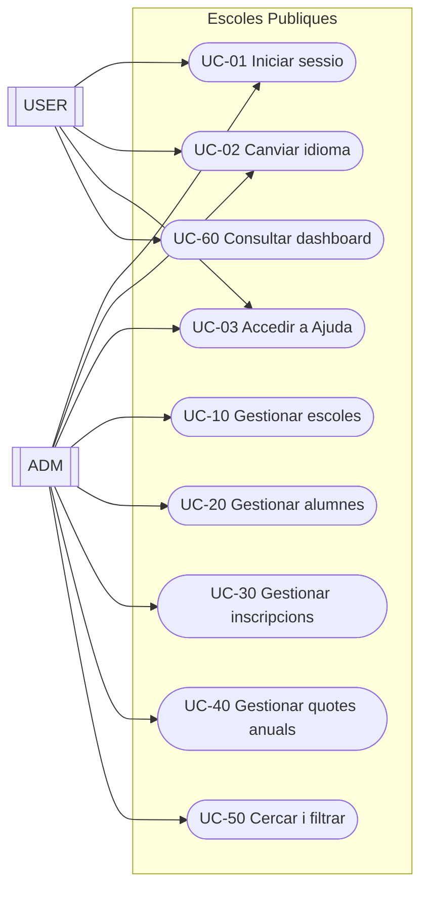
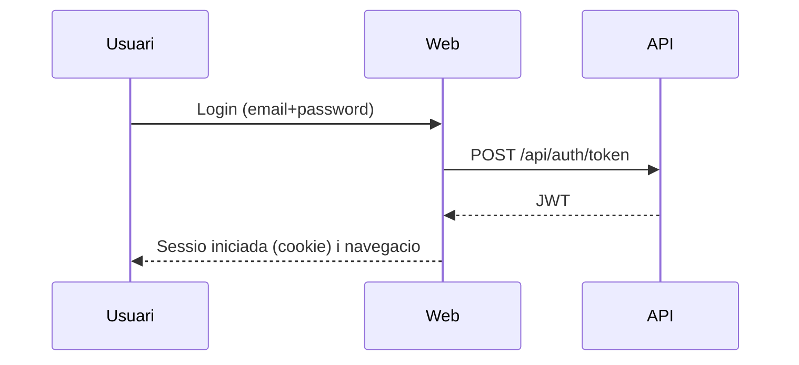
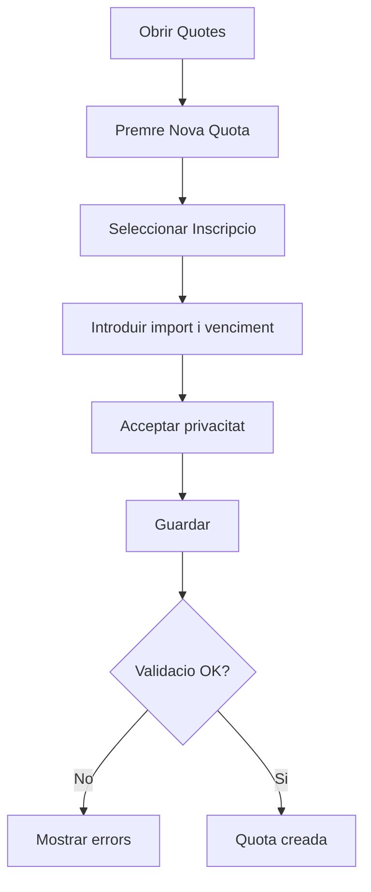

# Document funcional (CA)

## 1. Resum executiu
L'aplicacio "Escoles Publiques" dona suport a la gestio d'un entorn educatiu amb:
- escoles
- alumnes
- inscripcions (per any academic i curs)
- quotes anuals (vinculades a una inscripcio)
- ambits (scopes) per classificar escoles

El sistema es composa d'una web (interficie) i una API (serveis). La web consumeix l'API.

## 2. Abast
Inclou:
- CRUD d'escoles, alumnes, inscripcions i quotes anuals
- assignacio i filtratge per ambit (scope)
- cerca a inici (text + ambit)
- autenticacio i control d'acces per rols (`ADM`/`USER`)
- selector d'idioma i disseny responsive
- centre d'ajuda (manual d'usuari, funcional i tecnic)

Fora d'abast (a data d'aquest document):
- model de permisos mes enlla de `ADM`/`USER`
- integracions externes (correu, notificacions, etc.)
- importacions massives de dades oficials

## 3. Actors i rols
Actors:
- `ADM` (administrador)
- `USER` (usuari final)

Rols:
- `ADM`: acces complet a la gestio (escoles, alumnes, inscripcions, quotes, ambits)
- `USER`: acces limitat (dashboard i informacio relacionada)

## 4. Domini (entitats principals)
Entitats:
- `School` (Escola)
- `Student` (Alumne)
- `Enrollment` (Inscripcio)
- `AnnualFee` (Quota anual)
- `Scope` (Ambit)
- `User` (Usuari)

Relacions (alt nivell):
- una `School` te 0..N `Student`
- un `Student` te 0..N `Enrollment`
- un `Enrollment` te 0..N `AnnualFee`
- un `Scope` pot classificar 0..N `School`
- un `User` pot estar vinculat a 0..1 `Student` (relacio opcional 1:1)

## 5. Diagrames

### 5.1 Context del sistema
```mermaid
flowchart LR
  U[Usuari] -->|Navegador| W[Web (MVC/Razor)]
  W -->|HTTP + JWT| A[API (REST)]
  A -->|EF Core| DB[(PostgreSQL)]
```

### 5.2 Casos d'us (UML-style)


### 5.3 Flux de login (alt nivell)


### 5.4 Flux: crear quota anual (resum)


## 6. Cataleg de casos d'us

### UC-01 Iniciar sessio
Actors:
- `ADM`, `USER`

Precondicions:
- l'usuari disposa de credencials valides

Flux principal:
1. L'usuari obre la pantalla de login.
2. Introdueix email i contrasenya.
3. El sistema valida les credencials.
4. El sistema inicia sessio i redirigeix segons rol.

Errors habituals:
- credencials invalides: es mostra missatge d'error
- token invalid/caducat: el sistema força re-login

Postcondicions:
- sessio iniciada i menus/funcionalitats ajustades al rol

### UC-02 Canviar idioma
Actors:
- `ADM`, `USER`

Flux principal:
1. L'usuari selecciona un idioma al selector superior.
2. La pagina es recarrega amb el nou idioma.
3. La seleccio es persisteix (cookie).

Idiomes:
- actualment documentats: CA, ES, EN, DE
- previstos: FR, RU, ZH

### UC-03 Accedir a Ajuda
Actors:
- `ADM`, `USER`

Flux principal:
1. L'usuari prem el boto "Ajuda".
2. Selecciona un document: manual d'usuari, funcional o tecnic.
3. El sistema mostra el document en l'idioma actiu.

### UC-10 Gestionar escoles (ADM)
Actor:
- `ADM`

Funcions:
- llistar, cercar i ordenar
- crear, editar, eliminar
- marcar com a favorita
- assignar ambit (scope)

Regles:
- `Code` i `Name` obligatoris

### UC-20 Gestionar alumnes (ADM)
Actor:
- `ADM`

Funcions:
- llistar, cercar i ordenar
- crear, editar, eliminar
- vincular alumne amb usuari (email)

Regles:
- `User.Email` es unic
- relacio `User` <-> `Student` es 0..1 a 0..1 (opcional)

### UC-30 Gestionar inscripcions (ADM)
Actor:
- `ADM`

Funcions:
- crear, editar, eliminar
- definir any academic i estat

Regles:
- una inscripcio pertany a un alumne i a una escola

### UC-40 Gestionar quotes anuals (ADM)
Actor:
- `ADM`

Funcions:
- crear, editar, eliminar
- marcar com a pagada (data de pagament)

Regles:
- per desar: cal acceptar privacitat (checkbox)
- decimals: s'accepta `,` i `.`

### UC-50 Cercar i filtrar (ADM)
Actor:
- `ADM`

Flux principal:
1. A inici, l'usuari introdueix text de cerca (opcional).
2. Selecciona un ambit (opcional).
3. El sistema mostra resultats segons criteris.

### UC-60 Consultar dashboard (USER)
Actor:
- `USER`

Flux principal:
1. L'usuari accedeix al dashboard.
2. Consulta informacio relacionada amb el seu alumne (inscripcions/quotes).

## 7. Regles de negoci (resum)
Validacions i obligatorietats:
- Escola: `Code`, `Name`
- Usuari: `Email` unic
- Inscripcio: alumne, escola, any academic i estat
- Quota anual: inscripcio, import i venciment

Privacitat:
- alguns formularis requereixen acceptacio explicita per enviar dades

## 8. Requisits no funcionals (breu)
- multiidioma
- responsive (mobil/tablet)
- logs per suport
- persistencia: PostgreSQL

## 9. Criteris d'acceptacio (checklist)
- login admin i usuari funcionen
- CRUD d'escoles/alumnes/inscripcions/quotes funciona
- cerca i filtratge per ambit funciona
- import accepta decimals amb coma o punt
- idioma es persisteix i l'ajuda segueix l'idioma actiu

