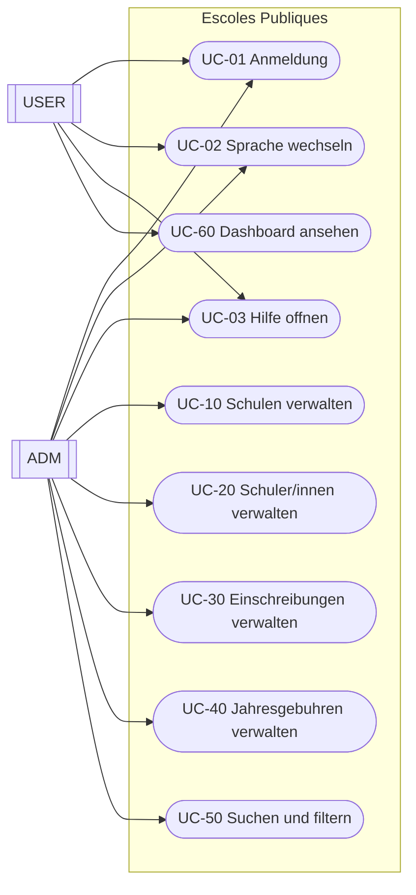
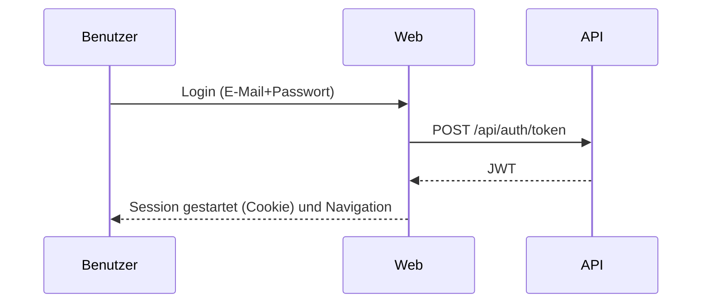

# Fachliches Dokument (DE)

## 1. Zusammenfassung
"Escoles Publiques" unterstutzt die Verwaltung von:
- Schulen
- Schuler/innen
- Einschreibungen (pro Schuljahr und Kurs)
- Jahresgebuhren (an eine Einschreibung gebunden)
- Bereiche (Scopes) zur Klassifikation von Schulen

Das System besteht aus einer Web-UI und einer API. Die Web-UI nutzt die API.

## 2. Umfang
Im Umfang:
- CRUD fur Schulen, Schuler/innen, Einschreibungen und Jahresgebuhren
- Bereichszuordnung und Filter (Scope)
- Suche auf der Startseite (Text + Bereich)
- Authentifizierung und Rollensteuerung (`ADM`/`USER`)
- Sprachauswahl und responsives UI
- Hilfe-Center (Benutzerhandbuch, fachlich, technisch)

Ausserhalb des Umfangs (zum Zeitpunkt dieses Dokuments):
- erweitertes Berechtigungsmodell uber `ADM`/`USER` hinaus
- externe Integrationen (E-Mail, Benachrichtigungen, usw.)
- Massenimporte aus offiziellen Datenquellen

## 3. Akteure und Rollen
Akteure:
- `ADM` (Administrator)
- `USER` (Endnutzer)

Rollen:
- `ADM`: voller Zugriff auf Verwaltungsfunktionen
- `USER`: eingeschrankter Zugriff (Dashboard und zugehorige Informationen)

## 4. Fachliches Modell (Hauptentitaten)
Entitaten:
- `School` (Schule)
- `Student` (Schuler/in)
- `Enrollment` (Einschreibung)
- `AnnualFee` (Jahresgebuhr)
- `Scope` (Bereich)
- `User` (Benutzer)

Beziehungen (High Level):
- eine `School` hat 0..N `Student`
- ein `Student` hat 0..N `Enrollment`
- eine `Enrollment` hat 0..N `AnnualFee`
- ein `Scope` klassifiziert 0..N `School`
- ein `User` kann 0..1 `Student` zugeordnet sein (optionales 1:1)

## 5. Diagramme

### 5.1 Systemkontext
```mermaid
flowchart LR
  U[Benutzer] -->|Browser| W[Web (MVC/Razor)]
  W -->|HTTP + JWT| A[API (REST)]
  A -->|EF Core| DB[(PostgreSQL)]
```

### 5.2 Anwendungsfalle (UML-style)


### 5.3 Login-Flow (High Level)


## 6. Katalog der Anwendungsfalle

### UC-01 Anmeldung
Akteure:
- `ADM`, `USER`

Hauptablauf:
1. Login-Seite offnen.
2. E-Mail und Passwort eingeben.
3. Validierung der Zugangsdaten.
4. Session startet und Weiterleitung je nach Rolle.

### UC-02 Sprache wechseln
1. Sprache in der oberen Leiste auswahlen.
2. Seite wird neu geladen.
3. Auswahl wird per Cookie gespeichert.

Sprachen:
- dokumentiert: CA, ES, EN, DE
- geplant: FR, RU, ZH

### UC-03 Hilfe offnen
1. Button "Hilfe" klicken.
2. Dokument auswahlen: Benutzerhandbuch, fachlich oder technisch.
3. Dokument wird in der aktiven Sprache angezeigt.

### UC-10 Schulen verwalten (ADM)
Enthalt: Liste/Suche/Sortierung, Erstellen/Bearbeiten/Loschen, Favoriten, Bereich.

### UC-20 Schuler/innen verwalten (ADM)
Enthalt: CRUD; Wiederverwendung eines Benutzers per E-Mail; optionaler 1:1 Link.

### UC-30 Einschreibungen verwalten (ADM)
Enthalt: CRUD; Schuljahr und Status.

### UC-40 Jahresgebuhren verwalten (ADM)
Enthalt: CRUD; als bezahlt markieren (Zahlungsdatum).

Regeln:
- einige Formulare verlangen Datenschutz-Checkbox
- Betrage akzeptieren Dezimal mit Komma oder Punkt

### UC-50 Suchen und filtern (ADM)
Textsuche und Filter nach Bereich auf der Startseite.

### UC-60 Dashboard ansehen (USER)
Anzeige von nutzerspezifischen Informationen (zugehorige Einschreibungen/Gebuhren).

## 7. Fachliche Regeln (Kurzfassung)
- Schule: Code und Name sind Pflicht
- Benutzer: E-Mail eindeutig
- Einschreibung: Schuler/in, Schule, Schuljahr und Status
- Jahresgebuhr: Einschreibung, Betrag und Falligkeit

## 8. Nicht-funktionale Anforderungen (kurz)
- Mehrsprachigkeit
- Responsive (Mobil/Tablet)
- Logging fur Betrieb/Support
- Persistenz: PostgreSQL

## 9. Abnahmekriterien (Checkliste)
- Login fur Admin und Benutzer funktioniert
- CRUD fur alle Entitaten funktioniert
- Suche und Bereichsfilter funktioniert
- Betrage akzeptieren `,` und `.`
- Sprache wird gespeichert und Hilfe folgt der aktiven Sprache

