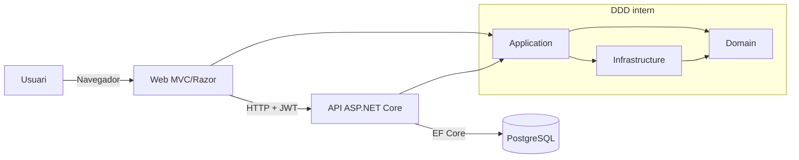
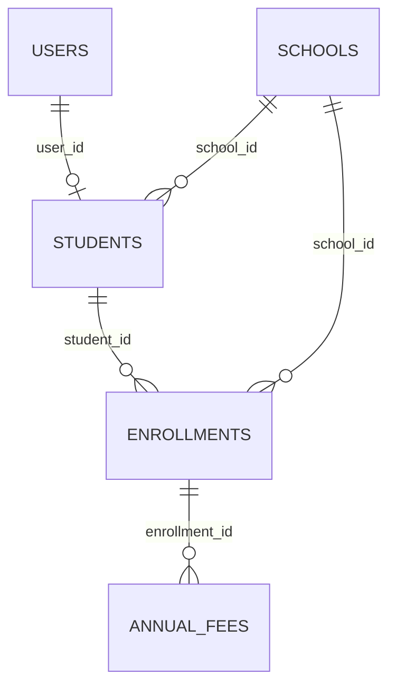

# Technisches Dokument (DE)

## 1. Einleitung
Dieses Dokument beschreibt im Detail, wie die Anwendung **Escoles Publiques** technisch aufgebaut ist.

Ziele:
- Architektur und DDD-Struktur erklaeren
- dokumentieren, wie Web und API aufgebaut wurden
- Nachvollziehbarkeit von Patterns, Bibliotheken und Entscheidungen sicherstellen
- Datenmodell, Beziehungen und Authentifizierungssystem beschreiben
- Querschnittsutilities erklaeren (Helpers, JS, CSS)

Testzugang (Demo-Umgebung):
- Benutzer: `admin@admin.adm`
- Passwort: `admin123`

## 2. Allgemeines Schema der App (Web + API + DDD)



Hauptablauf:
1. Login in der Web-App (`CookieAuth`)
2. Die Web-App fordert ein Token bei der API an (`POST /api/auth/token`)
3. Das JWT-Token wird in der Session gespeichert
4. Die Web-App konsumiert die API mit `Authorization: Bearer <token>`

## 3. DDD-Struktur (wie wir es organisiert haben)

Projekte und Verantwortlichkeiten:
- `src/Domain`
  - Domain-Entitaeten und Regeln
  - Repository-Interfaces (`I*Repository`)
  - Value Objects / Domain-Exceptions
- `src/Application`
  - Use Cases (`*Service`)
  - Application-Contracts (`I*Service`)
  - Queries (z. B. aggregierte Suche)
- `src/Infrastructure`
  - EF-Core-Persistenz
  - Repository-Implementierungen
  - Migrations
- `src/Api`
  - REST-Eingangsschicht (API-Controller)
  - JWT-Auth, Swagger, CORS, Seed
- `src/Web`
  - MVC/Razor-Eingangsschicht
  - UI, Lokalisierung, HTTP-Clients zur API

### 3.1 Erweiterter Strukturbaum der Loesung (technische Sicht)
```text
src/
├── Api/
│   ├── Controllers/
│   │   ├── AuthController.cs
│   │   ├── SchoolsController.cs
│   │   ├── StudentsController.cs
│   │   ├── EnrollmentsController.cs
│   │   ├── AnnualFeesController.cs
│   │   ├── ScopesController.cs
│   │   └── MaintenanceController.cs
│   ├── Services/
│   │   └── DbSeeder.cs
│   ├── Program.cs
│   └── appsettings.json
├── Application/
│   ├── DTOs/
│   │   ├── SearchResultsDtos.cs
│   │   └── SearchSourcesDtos.cs
│   ├── Interfaces/
│   │   ├── IAuthService.cs
│   │   ├── ISchoolService.cs
│   │   ├── IStudentService.cs
│   │   ├── IEnrollmentService.cs
│   │   ├── IAnnualFeeService.cs
│   │   ├── IUserService.cs
│   │   └── Search/
│   │       ├── ISearchResultsQuery.cs
│   │       └── ISearchSources.cs
│   └── UseCases/
│       ├── Services/
│       │   ├── AuthService.cs
│       │   ├── SchoolService.cs
│       │   ├── StudentService.cs
│       │   ├── EnrollmentService.cs
│       │   ├── AnnualFeeService.cs
│       │   └── UserService.cs
│       └── Queries/SearchResults/SearchResultsQuery.cs
├── Domain/
│   ├── Entities/
│   │   ├── User.cs
│   │   ├── School.cs
│   │   ├── Student.cs
│   │   ├── Enrollment.cs
│   │   ├── AnnualFee.cs
│   │   └── Scope.cs
│   ├── Interfaces/
│   │   ├── IUserRepository.cs
│   │   ├── ISchoolRepository.cs
│   │   ├── IStudentRepository.cs
│   │   ├── IEnrollmentRepository.cs
│   │   ├── IAnnualFeeRepository.cs
│   │   └── IScopeRepository.cs
│   └── DomainExceptions/
│       ├── DomainException.cs
│       ├── ValidationException.cs
│       ├── NotFoundException.cs
│       └── DuplicateEntityException.cs
├── Infrastructure/
│   ├── SchoolDbContext.cs
│   ├── Persistence/
│   │   ├── AppDbContextFactory.cs
│   │   └── Repositories/
│   │       ├── UserRepository.cs
│   │       ├── SchoolRepository.cs
│   │       ├── StudentRepository.cs
│   │       ├── EnrollmentRepository.cs
│   │       └── AnnualFeeRepository.cs
│   ├── ScopeRepository.cs
│   └── Migrations/
│       ├── 20260105023406_UpdateStudentUserRelationship.cs
│       ├── 20260213131000_AddSchoolIdToEnrollments.cs
│       └── SchoolDbContextModelSnapshot.cs
├── Web/
│   ├── Controllers/
│   │   ├── AuthController.cs
│   │   ├── HomeController.cs
│   │   ├── DashboardController.cs
│   │   ├── SchoolsController.cs
│   │   ├── StudentsController.cs
│   │   ├── EnrollmentsController.cs
│   │   ├── AnnualFeesController.cs
│   │   ├── ScopesController.cs
│   │   ├── SearchController.cs
│   │   ├── HelpController.cs
│   │   └── ManualController.cs
│   ├── Services/
│   │   └── Api/ (ApiAuthTokenHandler + clients API)
│   ├── ModelBinders/FlexibleDecimalModelBinder.cs
│   ├── Helpers/ModalConfigFactory.cs
│   ├── Hubs/SchoolHub.cs
│   ├── Views/ (Razor)
│   ├── Resources/ (resx per idiomes)
│   ├── HelpDocs/ (manual/funcional/tecnic per idioma)
│   ├── wwwroot/js/ (scripts UI)
│   ├── wwwroot/css/ (tema i estils)
│   └── Program.cs
└── UnitTest/
    ├── Controllers/
    ├── Services/
    ├── Infrastructure/
    ├── Validators/
    ├── ViewComponents/
    └── Hubs/
```

### 3.2 Datei-fuer-Datei-Erklaerung: `src/Domain`

`src/Domain/Entities/User.cs`
- Domain-User-Entitaet.
- Modelliert Identitaet, Passwort-Hash, Rolle und Aktivitaetsmetadaten.

`src/Domain/Entities/School.cs`
- Schul-Entitaet.
- Definiert Kernfelder (`Name`, `Code`, Stadt, Favorit, Scope).

`src/Domain/Entities/Student.cs`
- Schueler-Entitaet.
- Haelt die Beziehung zur Schule und optional zum Benutzer.

`src/Domain/Entities/Enrollment.cs`
- Einschreibungs-Entitaet.
- Repraesentiert den akademischen Status pro Kurs/Jahr.

`src/Domain/Entities/AnnualFee.cs`
- Jahresgebuehr-Entitaet.
- Enthaelt Betrag, Faelligkeit und Zahlungsstatus.

`src/Domain/Entities/Scope.cs`
- Klassifizierungs-Entitaet.
- Ermoeglicht die Kategorisierung von Schulen nach Bereich.

`src/Domain/Interfaces/IUserRepository.cs`
- Persistenzvertrag fuer Benutzer.
- Definiert Lese/Schreiboperationen ohne Bindung an EF Core.

`src/Domain/Interfaces/ISchoolRepository.cs`
- Persistenzvertrag fuer Schulen.
- Enthalten sind Suche/Listen und CRUD.

`src/Domain/Interfaces/IStudentRepository.cs`
- Persistenzvertrag fuer Schueler.
- Unterstuetzt Abfragen mit Beziehungen.

`src/Domain/Interfaces/IEnrollmentRepository.cs`
- Persistenzvertrag fuer Einschreibungen.
- Trennt Domain-Regeln von DB-Details.

`src/Domain/Interfaces/IAnnualFeeRepository.cs`
- Persistenzvertrag fuer Gebuehren.
- Bietet Operationen nach Zahlungsstatus.

`src/Domain/Interfaces/IScopeRepository.cs`
- Persistenzvertrag fuer Scopes.
- Verwaltet Katalog von Bereichen und Aktivierung.

`src/Domain/DomainExceptions/DomainException.cs`
- Basis fuer Domain-Exceptions.
- Vereinheitlicht die Behandlung fachlicher Fehler.

`src/Domain/DomainExceptions/ValidationException.cs`
- Fachlicher Validierungsfehler.
- Wird verwendet, wenn eine Business-Regel verletzt ist.

`src/Domain/DomainExceptions/NotFoundException.cs`
- Fehler bei nicht gefundener Entitaet.
- Vermeidet stille oder inkonsistente Rueckgaben.

`src/Domain/DomainExceptions/DuplicateEntityException.cs`
- Fachlicher Duplikatsfehler.
- Besonders nuetzlich fuer E-Mail/Unique-Codes.

### 3.3 Datei-fuer-Datei-Erklaerung: `src/Application`

`src/Application/Interfaces/IAuthService.cs`
- Vertrag des Login-Use-Case.
- Definiert Credential-Validierung und Ergebnisemission.

`src/Application/Interfaces/ISchoolService.cs`
- Vertrag der Anwendungslogik fuer Schulen.
- Orchestriert Validierungen und Repository-Aufrufe.

`src/Application/Interfaces/IStudentService.cs`
- Vertrag der Anwendungslogik fuer Schueler.
- Enthaelt Flows mit zugeordnetem Benutzer.

`src/Application/Interfaces/IEnrollmentService.cs`
- Vertrag der Anwendungslogik fuer Einschreibungen.
- Verwalten der Konsistenz Schueler-Schule-Jahr.

`src/Application/Interfaces/IAnnualFeeService.cs`
- Vertrag der Gebuehrenlogik.
- Regeln fuer Anlegen, Aktualisieren und Zahlungsstatus.

`src/Application/Interfaces/IUserService.cs`
- Vertrag der Benutzerlogik.
- Erstellt, validiert und fragt Systembenutzer ab.

`src/Application/Interfaces/Search/ISearchResultsQuery.cs`
- Vertrag fuer die uebergreifende Such-Query.
- Liefert aggregierte Ergebnisse pro Modul.

`src/Application/Interfaces/Search/ISearchSources.cs`
- Vertrag fuer Suchquellen.
- Trennt Datenursprung von der finalen Zusammenstellung.

`src/Application/UseCases/Services/AuthService.cs`
- Implementiert fachliches Login.
- Validiert Benutzer, Rolle und Passwort-Hash.

`src/Application/UseCases/Services/SchoolService.cs`
- Use Cases fuer Schulen.
- Wendet Regeln an, bevor an Repositories delegiert wird.

`src/Application/UseCases/Services/StudentService.cs`
- Use Cases fuer Schueler.
- Verwalten Transaktionen beim Erstellen von Benutzer + Schueler.

`src/Application/UseCases/Services/EnrollmentService.cs`
- Use Cases fuer Einschreibungen.
- Stellt gueltige Beziehungen zwischen Schueler und Schule sicher.

`src/Application/UseCases/Services/AnnualFeeService.cs`
- Use Cases fuer Jahresgebuehren.
- Zentralisiert Validierung von Betrag, Faelligkeit und Status.

`src/Application/UseCases/Services/UserService.cs`
- Use Cases fuer Benutzer.
- Kontrolliert E-Mail-Eindeutigkeit und Basisattribute.

`src/Application/UseCases/Queries/SearchResults/SearchResultsQuery.cs`
- Implementiert aggregierte Suche.
- Vereint Ergebnisse aus verschiedenen Quellen in einem gemeinsamen Format.

`src/Application/DTOs/SearchResultsDtos.cs`
- Transportmodelle fuer Suchergebnisse.
- Verhindert das direkte Exponieren von Domain-Entitaeten in UI/API.

`src/Application/DTOs/SearchSourcesDtos.cs`
- Transportmodelle fuer Suchquellen.
- Erleichtert die inkrementelle Ergebniszusammenstellung.

### 3.4 Datei-fuer-Datei-Erklaerung: `src/Infrastructure`

`src/Infrastructure/SchoolDbContext.cs`
- Haupt-DbContext von EF Core.
- Definiert Tabellenmapping und Konventionen (snake_case).

`src/Infrastructure/Persistence/AppDbContextFactory.cs`
- Factory fuer Design-Time (Migrations).
- Ermoeglicht `dotnet ef` ausserhalb von Web/API-Runtime.

`src/Infrastructure/Persistence/Repositories/UserRepository.cs`
- EF-Implementierung von `IUserRepository`.
- Abfragen nach E-Mail, CRUD und Basisfilter.

`src/Infrastructure/Persistence/Repositories/SchoolRepository.cs`
- EF-Implementierung von `ISchoolRepository`.
- Verwaltet Favoriten, Scopes und Listenabfragen.

`src/Infrastructure/Persistence/Repositories/StudentRepository.cs`
- EF-Implementierung von `IStudentRepository`.
- Inklusive Beziehungen `School` und `User` fuer reichhaltige Abfragen.

`src/Infrastructure/Persistence/Repositories/EnrollmentRepository.cs`
- EF-Implementierung von `IEnrollmentRepository`.
- Enthaelt benoetigte Navigationen fuer View und API.

`src/Infrastructure/Persistence/Repositories/AnnualFeeRepository.cs`
- EF-Implementierung von `IAnnualFeeRepository`.
- Deckt Operationen fuer Gebuehren und Zahlungsstatus ab.

`src/Infrastructure/Persistence/ScopeRepository.cs`
- Implementierung von `IScopeRepository`.
- Unterstuetzt die Pflege von Scopes.

`src/Infrastructure/Migrations/20260105023406_UpdateStudentUserRelationship.cs`
- Migration, die die Beziehung `students.user_id` anpasst.
- Konsolidiert Eindeutigkeit und FK-Verhalten.

`src/Infrastructure/Migrations/20260213131000_AddSchoolIdToEnrollments.cs`
- Migration, die `school_id` zu `enrollments` hinzufuegt.
- Verbessert Konsistenz und direkte Abfragen je Schule.

`src/Infrastructure/Migrations/SchoolDbContextModelSnapshot.cs`
- EF-Snapshot des aktuellen Modells.
- Basisreferenz fuer neue Migrations.

Hinweis:
- Es existieren Ordner `Scaffold` und `src/Infrastructure/src/...` aus Scaffold/Legacy.
- Sie sind nicht der Hauptpfad der aktuellen funktionalen Architektur, sollten aber im Blick bleiben, um Modell-Duplikate zu vermeiden.

### 3.5 Datei-fuer-Datei-Erklaerung: `src/Api`

`src/Api/Program.cs`
- Hauptkomposition der API.
- Konfiguriert DI, JWT, CORS, Swagger, EF und Middleware-Pipeline.

`src/Api/Controllers/AuthController.cs`
- Token-Endpoint (`POST /api/auth/token`).
- Validiert Credentials und gibt JWT aus.

`src/Api/Controllers/SchoolsController.cs`
- REST-CRUD fuer Schulen.
- Wendet `[Authorize]` an und gibt konsistente HTTP-Codes zurueck.

`src/Api/Controllers/StudentsController.cs`
- REST-CRUD fuer Schueler.
- Arbeitet mit Application-Services und DTOs.

`src/Api/Controllers/EnrollmentsController.cs`
- REST-CRUD fuer Einschreibungen.
- Haelt Konsistenz mit Schulen und Schuelern.

`src/Api/Controllers/AnnualFeesController.cs`
- REST-CRUD fuer Jahresgebuehren.
- Enthaelt Flows zum Markieren von Zahlungen.

`src/Api/Controllers/ScopesController.cs`
- CRUD/Abfrage von Scopes.
- Unterstuetzt funktionale Filterung der Web-App.

`src/Api/Controllers/MaintenanceController.cs`
- Interne Maintenance-Endpoints (kontrolliertes Seeding).
- Geschuetzt durch Rolle und Sicherheits-Header.

`src/Api/Services/DbSeeder.cs`
- Seeding von Initialdaten.
- Erstellt eine minimale Basis fuer Demo- oder Bootstrap-Umgebungen.

`src/Api/appsettings.json`
- Basiskonfiguration (JWT, Connection, Logging, CORS).
- Wird beim Deployment durch Umgebungsvariablen ergaenzt.

### 3.6 Datei-fuer-Datei-Erklaerung: `src/Web`

`src/Web/Program.cs`
- Haupteinstieg der MVC-Webapp.
- Konfiguriert Lokalisierung, Cookie-Auth, Session, API-Clients und Routen.

`src/Web/Controllers/AuthController.cs`
- Web-Login/Logout.
- Speichert JWT in der Session und startet authentifizierten Kontext.

`src/Web/Controllers/HomeController.cs`
- Startseite, Basis-Dashboard und oeffentlicher Inhalt.
- Haupteinstiegspunkt der Navigation.

`src/Web/Controllers/HomeController.Favorites.cs`
- Teilklassen fuer Favoriten-Operationen.
- Verkleinert den Haupt-Controller.

`src/Web/Controllers/DashboardController.cs`
- Dashboard-Ansicht je Rolle.
- Laedt aggregierte Komponenten des Benutzerkontexts.

`src/Web/Controllers/SchoolsController.cs`
- MVC-Seiten fuer Schulen (Liste, Anlegen, Details, Bearbeiten, Loeschen).
- Delegiert an API-Clients und wendet UI-Validierungen an.

`src/Web/Controllers/StudentsController.cs`
- MVC-Seiten fuer Schueler.
- Verwaltet optionale Verknuepfung mit Benutzern.

`src/Web/Controllers/EnrollmentsController.cs`
- MVC-Seiten fuer Einschreibungen.
- Steuert Auswahl von Schueler, Schule, Jahr und Status.

`src/Web/Controllers/AnnualFeesController.cs`
- MVC-Seiten fuer Gebuehren (inkl. Erstellungs-Modal).
- Integriert flexiblen Decimal-Binder und visuelle Validierung.

`src/Web/Controllers/ScopesController.cs`
- Pflege von Bereichen aus der UI.
- Liefert Daten fuer Filter und funktionale Klassifikation.

`src/Web/Controllers/SearchController.cs`
- Globale Suche.
- Baut Multi-Entitaet-Ergebnisse.

`src/Web/Controllers/HelpController.cs`
- Help Center (`/ajuda` und `/help`) ohne Auth.
- Rendert Markdown zu HTML und exportiert DOCX.

`src/Web/Controllers/ManualController.cs`
- Kompatibilitaet mit alten Manual-Routen.
- Weiterleitung zum einheitlichen Help Center.

`src/Web/Controllers/BaseController.cs`
- Gemeinsame Controller-Utilities (Lokalisierung, Feedback, etc.).
- Vermeidet querschnittliche Duplikation.

`src/Web/Services/Api/ApiAuthTokenHandler.cs`
- DelegatingHandler, der JWT bei jedem API-Call injiziert.
- Bei 401/403 wird die Session bereinigt und ausgeloggt.

`src/Web/Services/Api/AuthApiClient.cs`
- Typisierter Client fuer API-Login.
- Kapselt Token-Endpoint und Response-Behandlung.

`src/Web/Services/Api/SchoolsApiClient.cs`
- Typisierter CRUD-Client fuer Schulen.
- Kapselt Routen und Serialisierung.

`src/Web/Services/Api/StudentsApiClient.cs`
- Typisierter CRUD-Client fuer Schueler.
- Verwaltet Payloads und HTTP-Fehler.

`src/Web/Services/Api/EnrollmentsApiClient.cs`
- Typisierter CRUD-Client fuer Einschreibungen.
- Haelt konsistente Vertraege zur API.

`src/Web/Services/Api/AnnualFeesApiClient.cs`
- Typisierter Client fuer Jahresgebuehren.
- Unterstuetzt Zahlungsablaeufe.

`src/Web/Services/Api/ScopesApiClient.cs`
- Typisierter Client fuer Scopes.
- Verwendet in Pflege und Filtern.

`src/Web/ModelBinders/FlexibleDecimalModelBinder.cs`
- Custom Binder, der `,` und `.` in Dezimalen zulaesst.
- Vermeidet Kulturfehler bei Geldbetraegen.

`src/Web/Helpers/ModalConfigFactory.cs`
- Factory fuer Modal-Konfigurationen.
- Vereinheitlicht CRUD-Verhalten ueber Screens hinweg.

`src/Web/Hubs/SchoolHub.cs`
- SignalR-Hub fuer Echtzeit-Benachrichtigungen/Updates.
- Broadcast-Punkt fuer Datenaenderungen.

`src/Web/Views/Shared/_Layout.cshtml`
- Hauptlayout (Header, Sprachen, Menu, Footer).
- Integriert Help-Button und globale visuelle Konsistenz.

`src/Web/Views/Auth/Login.cshtml`
- Login-Screen.
- Enthaelt Sprachselector und Zugriff auf Help ohne Auth.

`src/Web/Views/Help/Index.cshtml`
- Index-Ansicht des Help Centers.
- Listet verfuegbare Dokumente nach aktiver Sprache.

`src/Web/Views/Help/Doc.cshtml`
- Dokument-Render der Hilfe.
- Enthaelt Button zum DOCX-Download.

`src/Web/Resources/**/*.resx`
- Lokalisierungsdateien fuer Views/Skripte.
- Schluessel fuer CA/ES/EN/DE/FR/RU/ZH-Unterstuetzung.

`src/Web/HelpDocs/{lang}/*.md`
- Markdown-Quellen fuer das Help Center.
- Werden mit `docs/{lang}` synchron gehalten.

`src/Web/wwwroot/js/generic-table.js`
- Client-seitiger Tabellenmotor (Filter, Sortierung, Pagination).

`src/Web/wwwroot/js/entity-modal.js`
- Lebenszyklus der Formular-Modals.
- Konsistente Validierung und asynchrones Submit.

`src/Web/wwwroot/js/i18n.js`
- Client-seitige Lokalisierungs-Utilities.
- Liest die vom Server injizierten Dictionaries.

`src/Web/wwwroot/js/signalr-connection.js`
- Verwaltung von SignalR-Verbindung und Reconnect.

`src/Web/wwwroot/css/davidgov-theme.css`
- Globales visuelles Theme (Header, Navigation, Basiskomponenten).

`src/Web/wwwroot/css/login.css`
- Styles fuer die Login-Seite.

`src/Web/wwwroot/css/generic-table.css`
- Wiederverwendbare Styles fuer Datentabellen.

`src/Web/wwwroot/css/user-dashboard.css`
- Styles fuer das User-Dashboard.

### 3.7 Datei-fuer-Datei-Erklaerung: `src/UnitTest`

`src/UnitTest/Controllers/*`
- Abdeckung des Verhaltens der Web-Controller.
- Validieren Routen, Responses, Redirects und Fehler.

`src/UnitTest/Services/*`
- Tests der Anwendungslogik und API-Clients.
- Sichern Business-Regeln und Exception-Handling.

`src/UnitTest/Infrastructure/*`
- Tests der Repositories und EF-Integration (in-memory/On-Test-Setup).

`src/UnitTest/Validators/*`
- Tests der ViewModel-Validierung.
- Pruefung von Fehlermeldungen und Grenzfaellen.

`src/UnitTest/ViewComponents/*`
- Tests von wiederverwendbaren UI-Komponenten.

`src/UnitTest/Hubs/*`
- Tests des SignalR-Hub-Verhaltens.

`src/UnitTest/Helpers/*`
- Test-Utilities (Fake-Handler, Factories, Mocks).

`src/UnitTest/UnitTest.csproj`
- Testprojekt (xUnit + Mocking/Assertion-Pakete).

Zentrale Abhaengigkeitsregel:
- `Domain` haengt von keiner anderen Schicht ab
- `Application` haengt von `Domain` ab
- `Infrastructure` implementiert Contracts aus `Domain`/`Application`
- `Web` und `Api` orchestrieren und fuehren DI aus

## 4. Wie wir das Web aufgebaut haben

Technische Basis:
- ASP.NET Core MVC + Razor Views (`src/Web/Views`)
- Cookie-Authentifizierung (`CookieAuth`)
- serverseitige Session fuer das API-JWT
- Lokalisierung ueber `resx` + Sprachselector im Header
- typed `HttpClient`-Clients zum Konsum der API

Besonders wichtig:
- MVC-Controller: `src/Web/Controllers/*`
- API-Auth-Handler: `src/Web/Services/Api/ApiAuthTokenHandler.cs`
- Flexibler Decimal-Binder: `src/Web/ModelBinders/FlexibleDecimalModelBinder.cs`
- Web-Hilfe (Handbuch/Funktional/Technisch): `src/Web/Controllers/HelpController.cs`

## 5. Wie wir die API aufgebaut haben (inkl. Swagger)

Technische Basis:
- ASP.NET Core Web API (`src/Api`)
- `JwtBearer`-Authentifizierung
- Autorisierung nach Rollen/Claims
- CORS je Umgebung konfigurierbar
- EF Core mit automatischen Migrations beim Startup

Swagger:
- Paket `Swashbuckle.AspNetCore`
- UI unter `/api`, wenn `Swagger__Enabled=true`
- OpenAPI-JSON unter `/swagger/v1/swagger.json`
- `Bearer`-Schema konfiguriert, um geschuetzte Endpoints zu testen

Beispiel fuer Login-Endpoint:
- `POST /api/auth/token` gibt JWT zurueck

## 6. Verwendete Patterns (mit Beispielen und Zeile-fuer-Zeile)

### 6.1 Repository + Service
Idee:
- Repository: Datenzugriff
- Application-Service: Regeln und Orchestrierung

Beispiel-Repository (`StudentRepository`):
```csharp
1  public async Task<IEnumerable<Student>> GetAllAsync()
2  {
3      return await _context.Students
4          .Include(s => s.School)
5          .Include(s => s.User)
6          .ToListAsync();
7  }
```
Lesung:
1. async Signatur
2. Methodenblock
3. Basisabfrage Schueler
4. eager-load Schule
5. eager-load Benutzer
6. Ausfuehrung in der DB
7. Ende der Methode

Beispiel-Service (`StudentService`):
```csharp
1  using var scope = new TransactionScope(TransactionScopeAsyncFlowOption.Enabled);
2  var createdUser = await _userService.CreateUserAsync(user, password);
3  student.UserId = createdUser.Id;
4  student.CreatedAt = DateTime.UtcNow;
5  var createdStudent = await _studentRepository.AddAsync(student);
6  scope.Complete();
7  return createdStudent;
```
Lesung:
1. Transaktion oeffnen
2. Zuerst Benutzer erstellen
3. FK dem Schueler zuweisen
4. Timestamp setzen
5. Schueler speichern
6. Transaktion bestaetigen
7. Ergebnis zurueckgeben

### 6.2 Internes API-Gateway via `HttpClient` + `DelegatingHandler`
Beispiel (`ApiAuthTokenHandler`):
```csharp
1  var token = _httpContextAccessor.HttpContext?.Session.GetString(SessionKeys.ApiToken);
2  if (!string.IsNullOrWhiteSpace(token) && request.Headers.Authorization == null)
3      request.Headers.Authorization = new AuthenticationHeaderValue("Bearer", token);
4  var response = await base.SendAsync(request, cancellationToken);
5  if (response.StatusCode == HttpStatusCode.Unauthorized || response.StatusCode == HttpStatusCode.Forbidden)
6  {
7      ctx.Session.Remove(SessionKeys.ApiToken);
8      await ctx.SignOutAsync("CookieAuth");
9      throw new UnauthorizedAccessException(...);
10 }
```
Lesung:
1. Token aus der Session lesen
2-3. Auth-Header anhaengen
4. HTTP-Pipeline fortsetzen
5. 401/403 abfangen
6-9. Session loeschen + Logout + kontrollierte Exception

### 6.3 Custom Model Binder (`,` und `.` aufloesen)
Beispiel (`FlexibleDecimalModelBinder`):
```csharp
1  var normalized = Normalize(raw);
2  if (decimal.TryParse(normalized, NumberStyles.Number, CultureInfo.InvariantCulture, out var value))
3      bindingContext.Result = ModelBindingResult.Success(value);
4  else
5      bindingContext.ModelState.TryAddModelError(...);
```
Lesung:
1. Benutzereingabe normalisieren
2. invariant parsen
3. Model valid
4-5. Validierungsfehler

### 6.4 Pattern "Fail Fast" beim Startup
In der API: Wenn es kein CORS in Produktion gibt, faellt die App beim Startup, um einen unsicheren Deploy zu verhindern.

## 7. Verwendete externe Bibliotheken

### 7.1 API
- `Microsoft.AspNetCore.Authentication.JwtBearer`
- `Npgsql.EntityFrameworkCore.PostgreSQL`
- `Swashbuckle.AspNetCore`

### 7.2 Application
- `AutoMapper`
- `AutoMapper.Extensions.Microsoft.DependencyInjection`

### 7.3 Infrastructure
- `Microsoft.EntityFrameworkCore`
- `Microsoft.EntityFrameworkCore.Design`
- `Npgsql.EntityFrameworkCore.PostgreSQL`

### 7.4 Web
- `FluentValidation.AspNetCore`
- `Markdig`
- `DocumentFormat.OpenXml` (DOCX-Export aus der Hilfe)
- `Serilog.AspNetCore`
- `Serilog.Sinks.File`

## 8. Datenbank (Tabellen, Felder, Indizes, Constraints)

Engine: PostgreSQL

### 8.1 `schools`
Felder:
- `id` bigint PK
- `name` text NOT NULL
- `code` text NOT NULL
- `city` text NULL
- `is_favorite` boolean NOT NULL
- `scope` text NULL (legacy)
- `created_at` timestamp NOT NULL

Indizes:
- PK auf `id`

Constraints:
- PK `PK_schools`

### 8.2 `scope_mnt`
Felder:
- `id` bigint PK
- `name` text NOT NULL
- `description` text NULL
- `is_active` boolean NOT NULL
- `created_at` timestamp NOT NULL
- `updated_at` timestamp NOT NULL

### 8.3 `users`
Felder:
- `id` bigint PK
- `first_name` text NOT NULL
- `last_name` text NOT NULL
- `email` text NOT NULL
- `password_hash` text NOT NULL
- `role` text NOT NULL
- `birth_date` date NULL
- `is_active` boolean NOT NULL
- `created_at` timestamp NOT NULL
- `updated_at` timestamp NOT NULL
- `last_login_at` timestamp NULL

Indizes:
- `IX_users_email` UNIQUE

### 8.4 `students`
Felder:
- `id` bigint PK
- `school_id` bigint NOT NULL
- `user_id` bigint NULL
- `created_at` timestamp NOT NULL

Indizes:
- `IX_students_school_id`
- `IX_students_user_id` UNIQUE

FK:
- `fk_students_schools_school_id` (`school_id` -> `schools.id`) ON DELETE CASCADE
- `fk_students_users_user_id` (`user_id` -> `users.id`) ohne cascade

### 8.5 `enrollments`
Felder:
- `id` bigint PK
- `student_id` bigint NOT NULL
- `academic_year` text NOT NULL
- `course_name` text NULL
- `status` text NOT NULL
- `enrolled_at` timestamp NOT NULL
- `school_id` bigint NOT NULL

Indizes:
- `IX_enrollments_student_id`
- `ix_enrollments_school_id`

FK:
- `fk_enrollments_students_student_id` ON DELETE CASCADE
- `fk_enrollments_schools_school_id` ON DELETE RESTRICT

### 8.6 `annual_fees`
Felder:
- `id` bigint PK
- `enrollment_id` bigint NOT NULL
- `amount` numeric NOT NULL
- `currency` text NOT NULL
- `due_date` date NOT NULL
- `paid_at` timestamp NULL
- `payment_ref` text NULL

Indizes:
- `IX_annual_fees_enrollment_id`

FK:
- `fk_annualfees_enrollments_enrollment_id` ON DELETE CASCADE

### 8.7 `__EFMigrationsHistory`
Interne EF-Core-Tabelle zur Nachverfolgung angewandter Migrations.

## 9. Relationales Schema



## 10. Verwendetes Login-System

In der Web-App:
- Cookie-Auth (`CookieAuth`)
- serverseitige Session fuer das API-Token
- Login-Formular unter `/Auth/Login`

In der API:
- Credential-Validierung
- signiertes JWT (`Jwt__Key`, `Jwt__Issuer`, `Jwt__Audience`)

Lebenszyklus:
1. Benutzer loggt sich in der Web-App ein
2. Web-App fordert JWT von der API an
3. Token wird in der Session gespeichert
4. Handler fuegt es allen Requests hinzu
5. 401/403 => automatischer Logout

## 11. Helpers (was sie tun)

`src/Web/Helpers/ModalConfigFactory.cs`
- zentralisiert die Konfiguration von CRUD-Modals
- vermeidet Duplikate zwischen Controllern/Views

Querschnitts-Helpers ausserhalb des Ordners "Helpers":
- `NormalizePg(...)` in `Program.cs` (Web und API): passt `postgres://...` an eine gueltige Npgsql-Connection-String an
- `ToSnakeCase(...)` in `SchoolDbContext`: globale Namenskonvention

## 12. JavaScript und CSS (was abgedeckt ist)

### 12.1 JS (`src/Web/wwwroot/js`)
- `entity-modal.js`: generisches Modal-Verhalten
- `generic-table.js`: client-seitige Suche/Sortierung/Pagination
- `signalr-connection.js`: SignalR-Verbindung fuer Updates
- `save-cancel-buttons.js`: konsistentes Formular-UX
- `i18n.js`: client-seitiger Lookup lokalisierter Texte
- modulspezifische Scripts (`schools-details.js`, `students-create.js`, etc.)

### 12.2 CSS (`src/Web/wwwroot/css`)
- `davidgov-theme.css`: globales Layout, Header, Navigation, Farben
- `login.css`: Style der Login-Seite
- `search-results.css`: Suchergebnisse
- `generic-table.css`: wiederverwendbare Tabellenstile
- `user-dashboard.css`: Styles fuer das USER-Dashboard

## 13. Weitere technische Punkte

- Logging: Serilog in Datei + Konsole
- Lokalisierung: `Resources/*.resx` pro View
- Web-Hilfe: Markdown->HTML Rendering mit Markdig + DOCX-Export
- Deployment: Docker + Render
- Build: `dotnet build` ueber modulare Loesung
