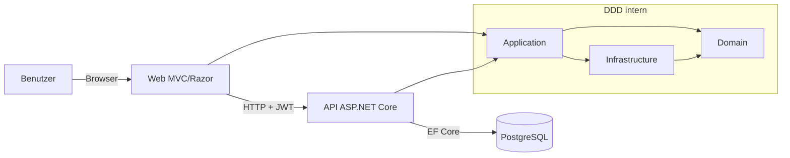
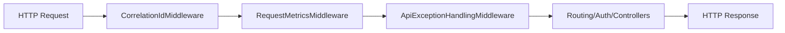
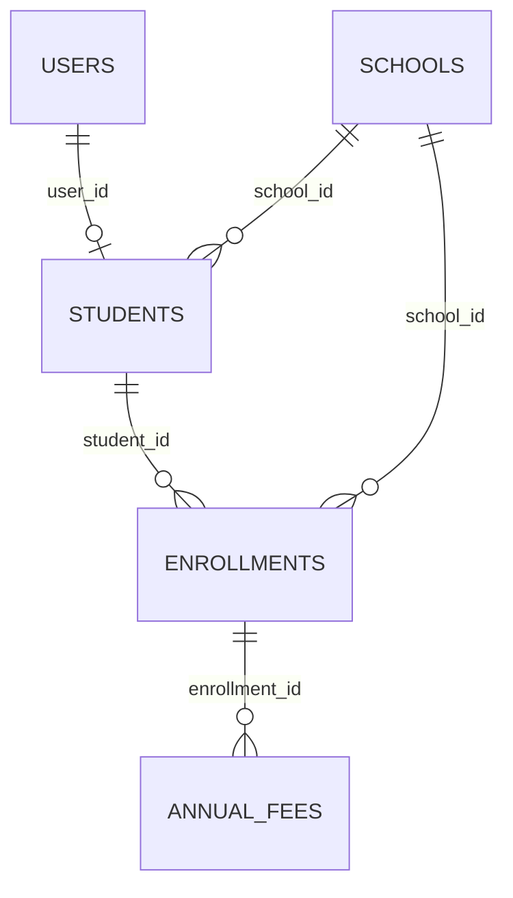

# Technisches Dokument (DE)

## 1. Einleitung
Dieses Dokument beschreibt die technische Umsetzung von **Escoles Publiques**.

Ziele:
- Architektur und DDD-Grenzen erklaeren
- Web- und API-Implementierung dokumentieren
- Patterns, Bibliotheken und Entscheidungen nachvollziehbar machen
- Datenmodell, Relationen und Authentifizierung beschreiben
- Querschnitts-Utilities (Helpers, JS, CSS) dokumentieren

Demo-Zugang:
- Benutzer: `admin@admin.adm`
- Passwort: `admin123`

## 2. Gesamtarchitektur (Web + API + DDD)


```mermaid
flowchart LR
  U[Benutzer] -->|Browser| W[Web MVC/Razor]
  W -->|HTTP + JWT| A[API ASP.NET Core]
  A -->|EF Core| DB[(PostgreSQL)]

  subgraph DDD[DDD intern]
    D[Domain]
    AP[Application]
    I[Infrastructure]
  end

  W --> AP
  A --> AP
  AP --> D
  I --> D
  AP --> I
```

Hauptfluss:
1. Login in der Web-App (`CookieAuth`).
2. Web fordert JWT von der API an (`POST /api/auth/token`).
3. JWT wird in der Session gespeichert.
4. Web ruft API mit `Authorization: Bearer <token>` auf.

## 3. DDD-Struktur

Projekte und Verantwortung:
- `src/Domain`: Entitaeten, Domain-Regeln, Repository-Contracts, Value Objects, Domain-Exceptions.
- `src/Application`: Use Cases, Service-Orchestrierung, CQRS Commands/Queries/Handlers.
- `src/Infrastructure`: EF-Core-Persistenz, Repository-Implementierungen, Migrations.
- `src/Api`: REST-Einstieg, JWT, CORS, Swagger, Middleware-Pipeline.
- `src/Web`: MVC/Razor-Einstieg, Lokalisierung, API-Clients, UI-Assets.

### 3.1 Erweiterter Solution-Baum (technische Sicht)

```text
src/
├── Api/
│   ├── Controllers/
│   ├── Services/
│   │   ├── CorrelationIdMiddleware.cs
│   │   ├── RequestMetricsMiddleware.cs
│   │   ├── ApiExceptionHandlingMiddleware.cs
│   │   └── DbSeeder.cs
│   └── Program.cs
├── Application/
│   ├── Interfaces/
│   ├── UseCases/
│   │   ├── Services/
│   │   ├── Schools/Commands/
│   │   └── Schools/Queries/
│   └── DTOs/
├── Domain/
│   ├── Entities/
│   ├── Interfaces/
│   ├── ValueObjects/
│   └── DomainExceptions/
├── Infrastructure/
│   ├── SchoolDbContext.cs
│   ├── Persistence/Repositories/
│   └── Migrations/
├── Web/
│   ├── Controllers/
│   ├── Services/Api/
│   ├── Services/Search/
│   ├── Helpers/ModalConfigFactory.cs
│   ├── ModelBinders/FlexibleDecimalModelBinder.cs
│   ├── Hubs/SchoolHub.cs
│   ├── Views/
│   ├── Resources/
│   ├── HelpDocs/
│   ├── wwwroot/js/
│   ├── wwwroot/css/
│   └── Program.cs
└── UnitTest/
    ├── Controllers/
    ├── Services/
    ├── Infrastructure/
    ├── Validators/
    └── Helpers/
```

## 4. Web-Schicht
- ASP.NET Core MVC + Razor Views.
- Cookie-Auth + serverseitige Session fuer API-JWT.
- Typed `HttpClient`-Clients fuer API-Aufrufe.
- Lokalisierung mit `.resx` und Sprachumschalter.
- SignalR fuer Echtzeit-Updates.

## 5. API-Schicht (inkl. Swagger)
- ASP.NET Core Web API.
- JWT-Bearer-Authentifizierung.
- Rollen-/Claim-basierte Autorisierung.
- CORS-Policy je Umgebung.
- EF-Core-Migrations beim Startup.

Swagger:
- Paket: `Swashbuckle.AspNetCore`
- UI: `/api` bei `Swagger__Enabled=true`
- OpenAPI JSON: `/swagger/v1/swagger.json`
- Security-Schema: `Bearer`

## 6. API-Middleware-Pipeline (reale Reihenfolge)
1. `CorrelationIdMiddleware`
2. `RequestMetricsMiddleware`
3. `ApiExceptionHandlingMiddleware`
4. `UseHttpsRedirection`
5. `UseRouting`
6. `UseCors("DefaultCors")`
7. `UseAuthentication`
8. `UseAuthorization`
9. `MapControllers`


```mermaid
flowchart LR
  R[HTTP Request] --> C[CorrelationIdMiddleware]
  C --> M[RequestMetricsMiddleware]
  M --> E[ApiExceptionHandlingMiddleware]
  E --> X[Routing/Auth/Controllers]
  X --> S[HTTP Response]
```

Middleware im Detail:
- `CorrelationIdMiddleware`: propagiert oder erzeugt `X-Correlation-ID`, setzt `TraceIdentifier`.
- `RequestMetricsMiddleware`: misst Zaehler und Latenz (`api_requests_total`, `api_request_duration_ms`).
- `ApiExceptionHandlingMiddleware`: mappt Exceptions auf `ProblemDetails` (`400/401/404/409/500`) mit `errorCode`, `traceId`, `timestamp`.

## 7. Verwendete Patterns
- Repository Pattern (`Infrastructure/Persistence/Repositories/*`).
- Service Layer Pattern (`Application/UseCases/Services/*`).
- Lightweight CQRS fuer das `School`-Aggregat.
- Strategy Pattern fuer Suchquellen (`ISchoolSearchSource`, `IStudentSearchSource`, usw.).
- Builder Pattern (`SearchResultsBuilder`).
- Factory Pattern (`ModalConfigFactory`).
- Fail-Fast beim Startup (z. B. CORS-Pruefung in Produktion).
- Global Exception Mapping ueber Middleware.

## 8. Bibliotheken und Frameworks
API:
- `Microsoft.AspNetCore.Authentication.JwtBearer`
- `Npgsql.EntityFrameworkCore.PostgreSQL`
- `Swashbuckle.AspNetCore`

Application:
- `AutoMapper`
- `AutoMapper.Extensions.Microsoft.DependencyInjection`

Web:
- `FluentValidation.AspNetCore`
- `Markdig`
- `DocumentFormat.OpenXml`
- `Serilog.AspNetCore`
- `Serilog.Sinks.File`

## 9. Datenmodell
Engine: PostgreSQL.

Kern-Tabellen:
- `schools`
- `scope_mnt`
- `users`
- `students`
- `enrollments`
- `annual_fees`
- `__EFMigrationsHistory`


```mermaid
erDiagram
  USERS ||--o| STUDENTS : "user_id"
  SCHOOLS ||--o{ STUDENTS : "school_id"
  STUDENTS ||--o{ ENROLLMENTS : "student_id"
  SCHOOLS ||--o{ ENROLLMENTS : "school_id"
  ENROLLMENTS ||--o{ ANNUAL_FEES : "enrollment_id"
```

## 10. Authentifizierungs-Lebenszyklus
Web:
- Login mit Cookie-Auth.
- API-JWT in Session gespeichert.

API:
- validiert Credentials.
- stellt signiertes JWT aus.

Ablauf:
1. Web-Login.
2. API-Token anfordern.
3. in Session speichern.
4. Token in jeden Request injizieren.
5. bei 401/403 -> erzwungener Logout.

## 11. Helpers und Utilities
- `ModalConfigFactory`: zentrale Konfiguration fuer CRUD-Modals.
- `ApiAuthTokenHandler` (`DelegatingHandler`): JWT-Injektion und Unauthorized-Behandlung.
- `ApiResponseHelper`: zentrale HTTP-Response-Validierung.
- `NormalizePg(...)` in `Program.cs` (Web/API): wandelt `postgres://...` in eine gueltige Npgsql-Connection-String.
- `ToSnakeCase(...)` in `SchoolDbContext`: globale Naming-Konvention fuer DB.

Interne Helper-Methoden im Exception-Middleware:
- `CreateProblem(...)`
- `EnrichProblem(...)`
- `WriteProblem(...)`

## 12. JavaScript- und CSS-Umfang
JavaScript (`src/Web/wwwroot/js`):
- `entity-modal.js`, `generic-table.js`, `signalr-connection.js`, `save-cancel-buttons.js`, `i18n.js` sowie modulbezogene Scripts.

CSS (`src/Web/wwwroot/css`):
- `davidgov-theme.css`, `login.css`, `search-results.css`, `generic-table.css`, `user-dashboard.css`.

## 13. Teststrategie
- Unit-Tests fuer domain/application/controllers/helpers.
- Integrationsabdeckung fuer kritische Flows.
- Architekturtests fuer DDD-Dependency-Grenzen.

## 14. Operative Hinweise
- Docker-first lokaler Workflow.
- strukturiertes Logging mit Serilog.
- mehrsprachiges Help Center (Markdown -> HTML + DOCX).
- Docs und Code in derselben PR synchron halten.
