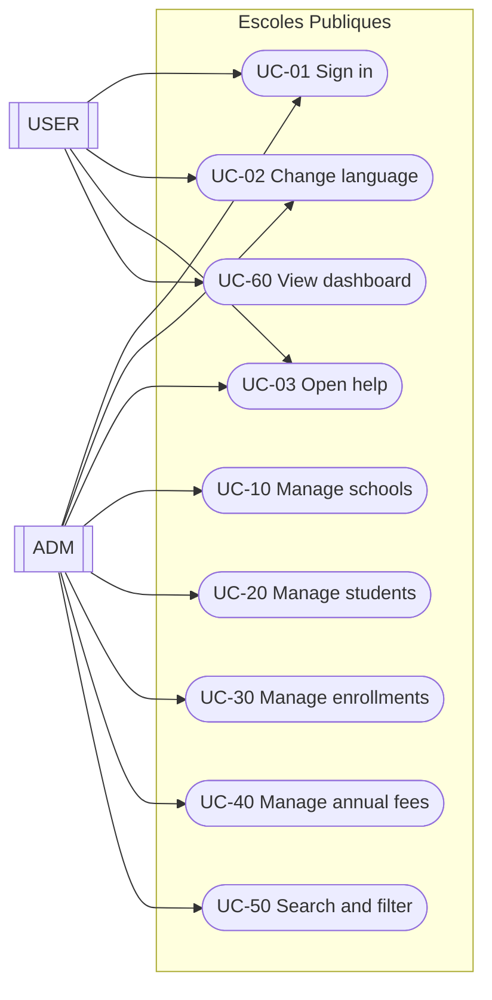
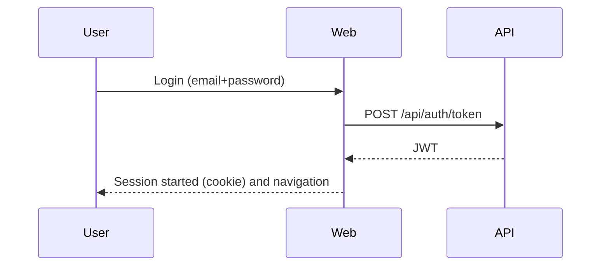

# Functional document (EN)

## 1. Executive summary
"Escoles Publiques" supports managing:
- schools
- students
- enrollments (by academic year and course)
- annual fees (linked to an enrollment)
- scopes used to classify schools

The system is split into a Web UI and an API. The Web consumes the API.

## 2. Scope
In scope:
- CRUD for schools, students, enrollments and annual fees
- scope assignment and filtering
- home search (text + scope)
- authentication and role-based access (`ADM`/`USER`)
- language selector and responsive UI
- help center (user manual, functional, technical)

Out of scope (at the time of writing):
- advanced permission model beyond `ADM`/`USER`
- external integrations (email/push notifications)
- massive imports from official datasets

## 3. Actors and roles
Actors:
- `ADM` (administrator)
- `USER` (end user)

Roles:
- `ADM`: full access to management features
- `USER`: limited access (dashboard and related information)

## 4. Domain (main entities)
Entities:
- `School`
- `Student`
- `Enrollment`
- `AnnualFee`
- `Scope`
- `User`

High-level relationships:
- a `School` has 0..N `Student`
- a `Student` has 0..N `Enrollment`
- an `Enrollment` has 0..N `AnnualFee`
- a `Scope` classifies 0..N `School`
- a `User` can be linked to 0..1 `Student` (optional 1:1)

## 5. Diagrams

### 5.1 System context
```mermaid
flowchart LR
  U[User] -->|Browser| W[Web (MVC/Razor)]
  W -->|HTTP + JWT| A[API (REST)]
  A -->|EF Core| DB[(PostgreSQL)]
```

### 5.2 Use cases (UML-style)


### 5.3 Login flow (high level)


## 6. Use case catalog

### UC-01 Sign in
Actors:
- `ADM`, `USER`

Main flow:
1. Open login page.
2. Enter email and password.
3. System validates credentials.
4. Session starts and user is redirected based on role.

### UC-02 Change language
1. Select a language in the top bar.
2. Page reloads.
3. Selection is persisted via cookie.

Languages:
- documented: CA, ES, EN, DE
- planned: FR, RU, ZH

### UC-03 Open help
1. Click the "Help" button.
2. Select a document: user manual, functional or technical.
3. System shows the document in the active language.

### UC-10 Manage schools (ADM)
Includes: list/search/sort, create/edit/delete, favorites, scope assignment.

### UC-20 Manage students (ADM)
Includes: CRUD; reuse user by email; optional 1:1 user<->student link.

### UC-30 Manage enrollments (ADM)
Includes: CRUD; academic year and status.

### UC-40 Manage annual fees (ADM)
Includes: CRUD; mark as paid (stores payment date).

Rules:
- some forms require accepting privacy checkbox
- amount supports decimals with comma or dot

### UC-50 Search and filter (ADM)
Text search and scope filtering from the home page.

### UC-60 View dashboard (USER)
View user-specific information (related enrollments/fees).

## 7. Business rules (summary)
- School: code and name are required
- User: email must be unique
- Enrollment: student, school, academic year and status
- Annual fee: enrollment, amount and due date

## 8. Non-functional requirements (brief)
- multi-language UI
- responsive (mobile/tablet)
- operational logs for troubleshooting
- persistence: PostgreSQL

## 9. Acceptance criteria (checklist)
- admin and user login works
- CRUD works for all entities
- search and scope filter works
- amounts accept `,` and `.`
- language is persisted and help follows active language

