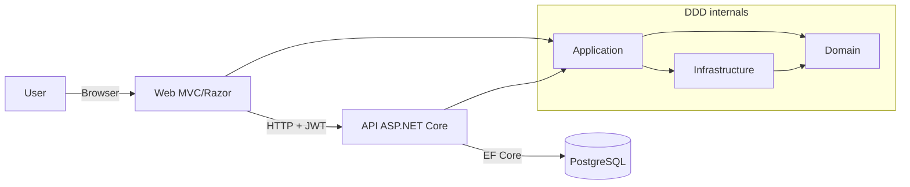

# Technical document (EN)

## 1. Introduction
This document describes the technical design of **Escoles Publiques**.

Objectives:
- explain architecture and DDD boundaries
- document Web and API setup
- describe data model and authentication
- document cross-cutting concerns (errors, observability, testing)

Demo credentials:
- user: `admin@admin.adm`
- password: `admin123`

## 2. Overall architecture (Web + API + DDD)

Main flow:
1. User logs into Web (cookie auth)
2. Web requests JWT from API (`POST /api/auth/token`)
3. Token is stored in session
4. Web calls API with `Authorization: Bearer <token>`

## 3. DDD project structure
- `src/Domain`: entities, value objects, domain exceptions, repository contracts
- `src/Application`: use cases, services, CQRS handlers
- `src/Infrastructure`: EF Core, repositories, migrations
- `src/Api`: REST controllers, JWT, CORS, swagger, middleware
- `src/Web`: MVC UI, localization, API clients

## 4. Domain model
Core entities:
- `School`
- `Student`
- `Enrollment`
- `AnnualFee`
- `Scope`
- `User`

Key relationships:
- School 1..N Students
- Student 1..N Enrollments
- Enrollment 1..N AnnualFees
- Scope 1..N Schools
- User 0..1 Student

## 5. Authentication and authorization
- Web uses cookie authentication for interactive sessions.
- API uses JWT bearer authentication.
- Role model: `ADM` and `USER`.
- Unauthorized flows trigger logout and re-authentication.

## 6. Error handling contract
API returns `application/problem+json` with:
- `errorCode`
- `traceId`
- `timestamp`
- `fieldErrors` (for validation)

Standard mappings:
- validation -> 400
- duplicate entity -> 409
- not found -> 404
- unauthorized -> 401
- unhandled -> 500

## 7. Value Objects and invariants
Business invariants are enforced through domain value objects:
- `SchoolCode`
- `EmailAddress`
- `MoneyAmount`

Benefits:
- centralized validation
- consistent data quality
- fewer defensive checks in controllers

## 8. CQRS (lightweight)
Schools module separates write and read paths:
- Commands: create/update/delete
- Queries: get by id/get all/get by code

This keeps responsibilities clear and testable.

## 9. Observability
Implemented cross-cutting middleware:
- `CorrelationIdMiddleware` (`X-Correlation-ID`)
- `RequestMetricsMiddleware` (count + latency)
- global exception middleware

Logging is structured and trace-aware.

## 10. Persistence
- PostgreSQL + EF Core
- migrations in `Infrastructure`
- repository pattern
- snake_case naming in database mappings

## 11. Frontend/Web layer
- Razor views and MVC controllers
- localization with `.resx`
- SignalR for real-time updates
- reusable JS/CSS components

## 12. Testing strategy
- unit tests for domain, application, controllers, helpers
- integration tests for key flows
- risk-based critical flow suite
- coverage gates in CI

## 13. CI/CD quality gates
Coverage thresholds are enforced per layer:
- Domain
- Application
- Infrastructure
- Web
- Api

Build and tests must pass before merge.

## 14. Operational notes
- Docker-first local workflow
- launch/debug profiles focused on Docker attach
- help center supports multilingual markdown and DOCX export
- recommendation: keep docs and code updated in the same PR
