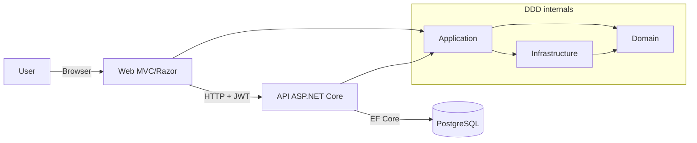
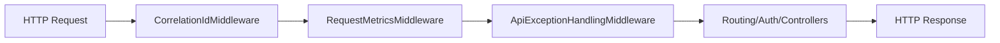
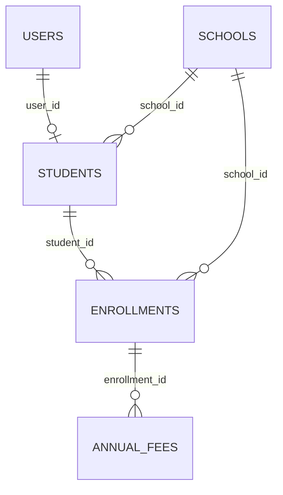

# Technical Document (EN)

## 1. Introduction
This document describes the technical design of **Escoles Publiques**.

Objectives:
- explain architecture and DDD boundaries
- document how Web and API are implemented
- provide traceability of patterns, libraries, and technical decisions
- describe data model, relationships, and authentication
- document cross-cutting utilities (helpers, JS, CSS)

Demo credentials:
- user: `admin@admin.adm`
- password: `admin123`

## 2. High-level Architecture (Web + API + DDD)



Main flow:
1. User signs in on Web (`CookieAuth`).
2. Web requests JWT from API (`POST /api/auth/token`).
3. JWT is stored in server session.
4. Web calls API with `Authorization: Bearer <token>`.

## 3. DDD Structure

Projects and responsibilities:
- `src/Domain`: entities, domain rules, repository contracts, value objects, domain exceptions.
- `src/Application`: use cases, service orchestration, CQRS commands/queries/handlers.
- `src/Infrastructure`: EF Core persistence, repository implementations, migrations.
- `src/Api`: REST entrypoint, JWT, CORS, Swagger, middleware pipeline.
- `src/Web`: MVC/Razor entrypoint, localization, API clients, UI assets.

### 3.1 Expanded Solution Tree (technical view)

```text
src/
├── Api/
│   ├── Controllers/
│   ├── Services/
│   │   ├── CorrelationIdMiddleware.cs
│   │   ├── RequestMetricsMiddleware.cs
│   │   ├── ApiExceptionHandlingMiddleware.cs
│   │   └── DbSeeder.cs
│   └── Program.cs
├── Application/
│   ├── Interfaces/
│   ├── UseCases/
│   │   ├── Services/
│   │   ├── Schools/Commands/
│   │   └── Schools/Queries/
│   └── DTOs/
├── Domain/
│   ├── Entities/
│   ├── Interfaces/
│   ├── ValueObjects/
│   └── DomainExceptions/
├── Infrastructure/
│   ├── SchoolDbContext.cs
│   ├── Persistence/Repositories/
│   └── Migrations/
├── Web/
│   ├── Controllers/
│   ├── Services/Api/
│   ├── Services/Search/
│   ├── Helpers/ModalConfigFactory.cs
│   ├── ModelBinders/FlexibleDecimalModelBinder.cs
│   ├── Hubs/SchoolHub.cs
│   ├── Views/
│   ├── Resources/
│   ├── HelpDocs/
│   ├── wwwroot/js/
│   ├── wwwroot/css/
│   └── Program.cs
└── UnitTest/
    ├── Controllers/
    ├── Services/
    ├── Infrastructure/
    ├── Validators/
    └── Helpers/
```

## 4. Web Layer
- ASP.NET Core MVC + Razor Views.
- Cookie auth + server session for API JWT.
- Typed `HttpClient` clients for API.
- Localization via `.resx` and culture selector.
- SignalR hub for real-time updates.

## 5. API Layer (including Swagger)
- ASP.NET Core Web API.
- JWT bearer auth.
- role/claim authorization.
- environment-based CORS policy.
- EF Core migrations applied at startup.

Swagger:
- package: `Swashbuckle.AspNetCore`
- UI: `/api` when `Swagger__Enabled=true`
- OpenAPI JSON: `/swagger/v1/swagger.json`
- security scheme: `Bearer`

## 6. API Middleware Pipeline (actual order)
1. `CorrelationIdMiddleware`
2. `RequestMetricsMiddleware`
3. `ApiExceptionHandlingMiddleware`
4. `UseHttpsRedirection`
5. `UseRouting`
6. `UseCors("DefaultCors")`
7. `UseAuthentication`
8. `UseAuthorization`
9. `MapControllers`



Middleware details:
- `CorrelationIdMiddleware`: propagates or generates `X-Correlation-ID`; sets `TraceIdentifier`.
- `RequestMetricsMiddleware`: records total requests and latency (`api_requests_total`, `api_request_duration_ms`).
- `ApiExceptionHandlingMiddleware`: maps exceptions to `ProblemDetails` (`400/401/404/409/500`) with `errorCode`, `traceId`, `timestamp`.

## 7. Patterns Used
- Repository Pattern (`Infrastructure/Persistence/Repositories/*`).
- Service Layer Pattern (`Application/UseCases/Services/*`).
- Lightweight CQRS for `School` aggregate.
- Strategy Pattern in search sources (`ISchoolSearchSource`, `IStudentSearchSource`, etc.).
- Builder Pattern (`SearchResultsBuilder`).
- Factory Pattern (`ModalConfigFactory`).
- Fail-Fast startup checks (e.g., CORS config in production).
- Global Exception Mapping through middleware.

## 8. Libraries and Frameworks
API:
- `Microsoft.AspNetCore.Authentication.JwtBearer`
- `Npgsql.EntityFrameworkCore.PostgreSQL`
- `Swashbuckle.AspNetCore`

Application:
- `AutoMapper`
- `AutoMapper.Extensions.Microsoft.DependencyInjection`

Web:
- `FluentValidation.AspNetCore`
- `Markdig`
- `DocumentFormat.OpenXml`
- `Serilog.AspNetCore`
- `Serilog.Sinks.File`

## 9. Database Model
Engine: PostgreSQL.

Core tables:
- `schools`
- `scope_mnt`
- `users`
- `students`
- `enrollments`
- `annual_fees`
- `__EFMigrationsHistory`



## 10. Authentication Lifecycle
Web:
- user signs in with cookie auth.
- API JWT stored in session.

API:
- validates credentials.
- issues signed JWT.

Lifecycle:
1. Web login.
2. API token request.
3. session store.
4. token injection per request.
5. on 401/403 -> forced logout.

## 11. Helpers and Utilities
- `ModalConfigFactory`: centralized CRUD modal configuration.
- `ApiAuthTokenHandler` (`DelegatingHandler`): JWT injection and unauthorized handling.
- `ApiResponseHelper`: centralized HTTP success/unauthorized handling.
- `NormalizePg(...)` in `Program.cs` (Web/API): converts `postgres://...` to Npgsql connection string.
- `ToSnakeCase(...)` in `SchoolDbContext`: global database naming convention.

Internal helper methods in exception middleware:
- `CreateProblem(...)`
- `EnrichProblem(...)`
- `WriteProblem(...)`

## 12. JavaScript and CSS Scope
JavaScript (`src/Web/wwwroot/js`):
- `entity-modal.js`, `generic-table.js`, `signalr-connection.js`, `save-cancel-buttons.js`, `i18n.js`, and module-specific scripts.

CSS (`src/Web/wwwroot/css`):
- `davidgov-theme.css`, `login.css`, `search-results.css`, `generic-table.css`, `user-dashboard.css`.

## 13. Testing Strategy
- unit tests for domain/application/controllers/helpers.
- integration coverage for critical flows.
- architecture boundary tests for DDD dependency rules.

## 14. Operational Notes
- Docker-first local workflow.
- structured logging with Serilog.
- multilingual help center (Markdown -> HTML + DOCX export).
- keep docs and code synchronized in the same PR.
