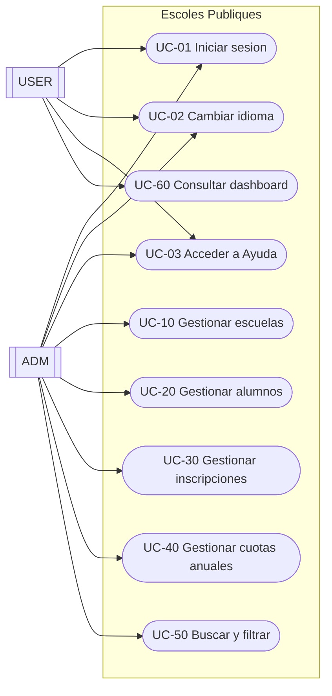
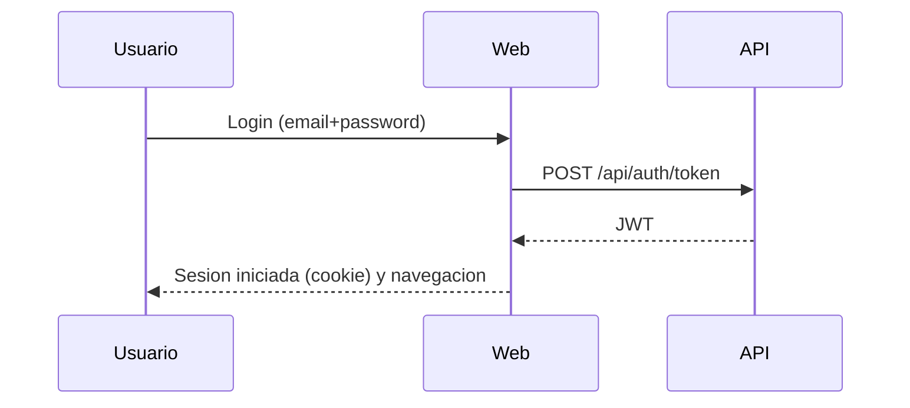

# Documento funcional (ES)

## 1. Resumen ejecutivo
La aplicacion "Escoles Publiques" da soporte a la gestion de:
- escuelas
- alumnos
- inscripciones (por ano academico y curso)
- cuotas anuales (vinculadas a una inscripcion)
- ambitos (scopes) para clasificar escuelas

El sistema se compone de una web (interfaz) y una API (servicios). La web consume la API.

## 2. Alcance
Incluye:
- CRUD de escuelas, alumnos, inscripciones y cuotas anuales
- asignacion y filtrado por ambito (scope)
- busqueda en inicio (texto + ambito)
- autenticacion y control de acceso por roles (`ADM`/`USER`)
- selector de idioma y diseno responsive
- centro de ayuda (manual de usuario, funcional y tecnico)

Fuera de alcance (a fecha de este documento):
- permisos avanzados mas alla de `ADM`/`USER`
- integraciones externas (correo, notificaciones, etc.)
- importaciones masivas de datos oficiales

## 3. Actores y roles
Actores:
- `ADM` (administrador)
- `USER` (usuario final)

Roles:
- `ADM`: acceso completo a la gestion (escuelas, alumnos, inscripciones, cuotas, ambitos)
- `USER`: acceso limitado (dashboard e informacion relacionada)

## 4. Dominio (entidades principales)
Entidades:
- `School` (Escuela)
- `Student` (Alumno)
- `Enrollment` (Inscripcion)
- `AnnualFee` (Cuota anual)
- `Scope` (Ambito)
- `User` (Usuario)

Relaciones (alto nivel):
- una `School` tiene 0..N `Student`
- un `Student` tiene 0..N `Enrollment`
- un `Enrollment` tiene 0..N `AnnualFee`
- un `Scope` puede clasificar 0..N `School`
- un `User` puede estar vinculado a 0..1 `Student` (relacion opcional 1:1)

## 5. Diagramas

### 5.1 Contexto del sistema
```mermaid
flowchart LR
  U[Usuario] -->|Navegador| W[Web (MVC/Razor)]
  W -->|HTTP + JWT| A[API (REST)]
  A -->|EF Core| DB[(PostgreSQL)]
```

### 5.2 Casos de uso (UML-style)


### 5.3 Flujo de login (alto nivel)


## 6. Catalogo de casos de uso

### UC-01 Iniciar sesion
Actores:
- `ADM`, `USER`

Flujo principal:
1. Abrir pantalla de login.
2. Introducir email y contrasena.
3. Validacion de credenciales.
4. Inicio de sesion y redireccion segun rol.

### UC-02 Cambiar idioma
1. Seleccionar idioma en la barra superior.
2. La pagina se recarga.
3. La seleccion se guarda (cookie).

Idiomas:
- documentados: CA, ES, EN, DE
- previstos: FR, RU, ZH

### UC-03 Acceder a Ayuda
1. Pulsar el boton "Ayuda".
2. Seleccionar documento: manual de usuario, funcional o tecnico.
3. El sistema muestra el documento en el idioma activo.

### UC-10 Gestionar escuelas (ADM)
Incluye: listar/buscar/ordenar, crear/editar/eliminar, favoritas, ambito.

### UC-20 Gestionar alumnos (ADM)
Incluye: CRUD; reutilizacion de usuario por email; relacion opcional 1:1 usuario<->alumno.

### UC-30 Gestionar inscripciones (ADM)
Incluye: CRUD; ano academico y estado.

### UC-40 Gestionar cuotas anuales (ADM)
Incluye: CRUD; marcar como pagada (fecha).

Reglas:
- algunos formularios requieren aceptar privacidad (checkbox)
- decimales con `,` o `.`

### UC-50 Buscar y filtrar (ADM)
Busqueda por texto y filtrado por ambito (inicio).

### UC-60 Consultar dashboard (USER)
Consulta de informacion propia (inscripciones/cuotas relacionadas).

## 7. Reglas de negocio (resumen)
- Escuela: `Code` y `Name` obligatorios
- Usuario: `Email` unico
- Inscripcion: alumno, escuela, ano academico y estado
- Cuota anual: inscripcion, importe y vencimiento

## 8. Requisitos no funcionales (breve)
- multiidioma
- responsive (movil/tablet)
- logs para soporte
- persistencia: PostgreSQL

## 9. Criterios de aceptacion (checklist)
- login admin y usuario funciona
- CRUD completo
- busqueda y filtro por ambito funciona
- importes aceptan `,` y `.`
- idioma se persiste y la ayuda sigue el idioma activo

