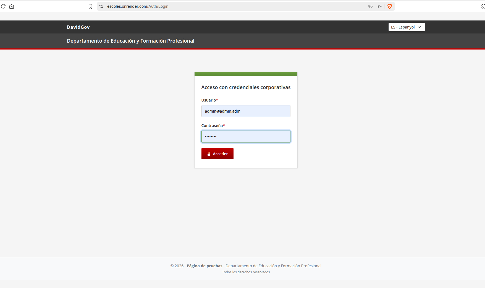
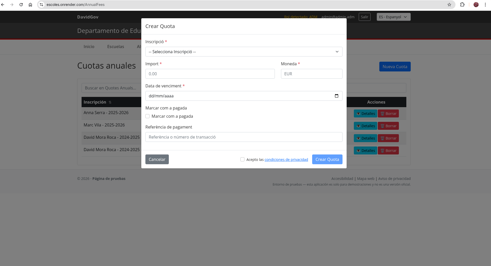

# Manual de usuario (ES)

## 1. Introduccion
Este manual explica el uso de la web.

Publico:
- administradores (`ADM`)
- usuarios finales (`USER`) (acceso limitado)

### 1.1 Proteccion de datos (importante)
- No uses datos reales en capturas/documentacion.
- Para capturas, usa datos de prueba y difumina/pixeliza lo sensible.
- Este repositorio no debe contener capturas con datos reales.

## 2. Inicio de sesion
1. Abre la pantalla de login.
2. Introduce email y contrasena.
3. Pulsa "Acceder".

Capturas:

## 3. Navegacion
Menu (ADM):
- Inicio, Escuelas, Alumnos, Inscripciones, Cuotas

Idioma:
- selector superior (se guarda por cookie).

## 4. Escuelas (ADM)
- listar/buscar/ordenar
- crear/editar/borrar
- favoritas y ambito

## 5. Alumnos (ADM)
- crear/editar/borrar
- reutilizacion por email

## 6. Inscripciones (ADM)
- crear/editar/borrar (ano academico, curso, estado)

## 7. Cuotas anuales (ADM)
Crear:
1. Ve a "Cuotas".
2. Pulsa "Nueva cuota" (modal).
3. Selecciona una inscripcion, introduce importe y vencimiento.
4. Acepta checkbox de privacidad y guarda.

Decimales:
- `1000,25` o `1000.25`

Capturas:

## Anexo: Indice de capturas (orden)
1. `docs/codex_images_real/es/login-admin.png`
2. `docs/codex_images_real/es/inici-top.png`
3. `docs/codex_images_real/es/inici-down.png`
4. `docs/codex_images_real/es/escoles.png`
5. `docs/codex_images_real/es/escoles-crear.png`
6. `docs/codex_images_real/es/escoles-detall.png`
7. `docs/codex_images_real/es/escoles-edit.png`
8. `docs/codex_images_real/es/estudiants.png`
9. `docs/codex_images_real/es/inscripcions.png`
10. `docs/codex_images_real/es/quotes-anuals.png`
11. `docs/codex_images_real/es/quotes-anuals-crear.png`
12. `docs/codex_images_real/es/quotes-anuals-edit.png`

## 8. FAQ
- No autorizado: la sesion ha expirado, vuelve a iniciar sesion.
- Campos obligatorios: completa los campos requeridos.
