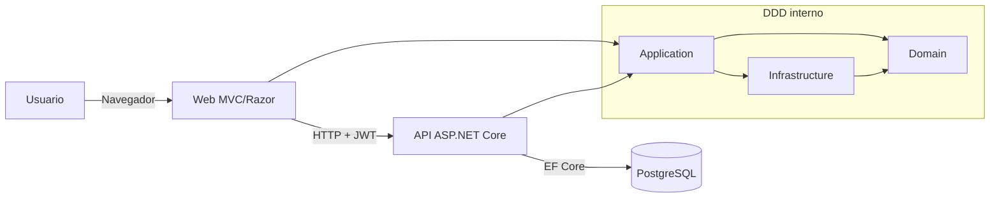
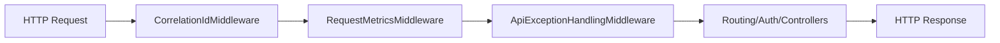
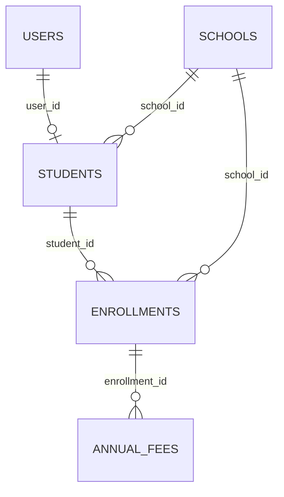

# Documento técnico (ES)

## 1. Introducción
Este documento describe el diseño técnico de **Escoles Publiques**.

Objetivos:
- explicar arquitectura y límites DDD
- documentar cómo se implementan Web y API
- dejar trazabilidad de patrones, librerías y decisiones técnicas
- describir modelo de datos, relaciones y autenticación
- documentar utilidades transversales (helpers, JS, CSS)

Credenciales de demo:
- usuario: `admin@admin.adm`
- contraseña: `admin123`

## 2. Arquitectura general (Web + API + DDD)



Flujo principal:
1. Login en Web (`CookieAuth`).
2. Web pide JWT a API (`POST /api/auth/token`).
3. JWT se guarda en sesión.
4. Web llama API con `Authorization: Bearer <token>`.

## 3. Estructura DDD

Proyectos y responsabilidades:
- `src/Domain`: entidades, reglas de dominio, contratos de repositorio, value objects, excepciones.
- `src/Application`: casos de uso, orquestación de servicios, comandos/queries/handlers CQRS.
- `src/Infrastructure`: persistencia EF Core, repositorios, migraciones.
- `src/Api`: entrada REST, JWT, CORS, Swagger, pipeline de middleware.
- `src/Web`: entrada MVC/Razor, localización, clientes API, assets UI.

### 3.1 Árbol ampliado de la solución (vista técnica)

```text
src/
├── Api/
│   ├── Controllers/
│   ├── Services/
│   │   ├── CorrelationIdMiddleware.cs
│   │   ├── RequestMetricsMiddleware.cs
│   │   ├── ApiExceptionHandlingMiddleware.cs
│   │   └── DbSeeder.cs
│   └── Program.cs
├── Application/
│   ├── Interfaces/
│   ├── UseCases/
│   │   ├── Services/
│   │   ├── Schools/Commands/
│   │   └── Schools/Queries/
│   └── DTOs/
├── Domain/
│   ├── Entities/
│   ├── Interfaces/
│   ├── ValueObjects/
│   └── DomainExceptions/
├── Infrastructure/
│   ├── SchoolDbContext.cs
│   ├── Persistence/Repositories/
│   └── Migrations/
├── Web/
│   ├── Controllers/
│   ├── Services/Api/
│   ├── Services/Search/
│   ├── Helpers/ModalConfigFactory.cs
│   ├── ModelBinders/FlexibleDecimalModelBinder.cs
│   ├── Hubs/SchoolHub.cs
│   ├── Views/
│   ├── Resources/
│   ├── HelpDocs/
│   ├── wwwroot/js/
│   ├── wwwroot/css/
│   └── Program.cs
└── UnitTest/
    ├── Controllers/
    ├── Services/
    ├── Infrastructure/
    ├── Validators/
    └── Helpers/
```

## 4. Capa Web
- ASP.NET Core MVC + Razor Views.
- Cookie auth + sesión server-side para JWT API.
- Clientes typed `HttpClient` hacia API.
- Localización con `.resx` y selector de idioma.
- SignalR para actualizaciones en tiempo real.

## 5. Capa API (incluyendo Swagger)
- ASP.NET Core Web API.
- autenticación JWT bearer.
- autorización por rol/claims.
- política CORS por entorno.
- migraciones EF Core al inicio.

Swagger:
- paquete: `Swashbuckle.AspNetCore`
- UI: `/api` cuando `Swagger__Enabled=true`
- OpenAPI JSON: `/swagger/v1/swagger.json`
- esquema de seguridad: `Bearer`

## 6. Pipeline middleware API (orden real)
1. `CorrelationIdMiddleware`
2. `RequestMetricsMiddleware`
3. `ApiExceptionHandlingMiddleware`
4. `UseHttpsRedirection`
5. `UseRouting`
6. `UseCors("DefaultCors")`
7. `UseAuthentication`
8. `UseAuthorization`
9. `MapControllers`



Detalle middleware:
- `CorrelationIdMiddleware`: propaga o genera `X-Correlation-ID` y fija `TraceIdentifier`.
- `RequestMetricsMiddleware`: registra contador total y latencia (`api_requests_total`, `api_request_duration_ms`).
- `ApiExceptionHandlingMiddleware`: mapea excepciones a `ProblemDetails` (`400/401/404/409/500`) con `errorCode`, `traceId`, `timestamp`.

## 7. Patrones usados
- Repository Pattern (`Infrastructure/Persistence/Repositories/*`).
- Service Layer Pattern (`Application/UseCases/Services/*`).
- CQRS ligero para el agregado `School`.
- Strategy Pattern en fuentes de búsqueda (`ISchoolSearchSource`, `IStudentSearchSource`, etc.).
- Builder Pattern (`SearchResultsBuilder`).
- Factory Pattern (`ModalConfigFactory`).
- Fail-Fast en startup (ej. CORS en producción).
- Global Exception Mapping con middleware.

## 8. Librerías y frameworks
API:
- `Microsoft.AspNetCore.Authentication.JwtBearer`
- `Npgsql.EntityFrameworkCore.PostgreSQL`
- `Swashbuckle.AspNetCore`

Application:
- `AutoMapper`
- `AutoMapper.Extensions.Microsoft.DependencyInjection`

Web:
- `FluentValidation.AspNetCore`
- `Markdig`
- `DocumentFormat.OpenXml`
- `Serilog.AspNetCore`
- `Serilog.Sinks.File`

## 9. Modelo de base de datos
Motor: PostgreSQL.

Tablas núcleo:
- `schools`
- `scope_mnt`
- `users`
- `students`
- `enrollments`
- `annual_fees`
- `__EFMigrationsHistory`



## 10. Ciclo de autenticación
Web:
- login con cookie auth.
- JWT API guardado en sesión.

API:
- valida credenciales.
- emite JWT firmado.

Ciclo:
1. login en Web.
2. petición de token API.
3. guardado en sesión.
4. inyección del token por request.
5. ante 401/403 -> logout forzado.

## 11. Helpers y utilidades
- `ModalConfigFactory`: configuración centralizada de modales CRUD.
- `ApiAuthTokenHandler` (`DelegatingHandler`): inyección JWT y gestión unauthorized.
- `ApiResponseHelper`: validación centralizada de respuestas HTTP.
- `NormalizePg(...)` en `Program.cs` (Web/API): convierte `postgres://...` a connection string Npgsql.
- `ToSnakeCase(...)` en `SchoolDbContext`: convención global de nombres en BD.

Helpers internos del middleware de errores:
- `CreateProblem(...)`
- `EnrichProblem(...)`
- `WriteProblem(...)`

## 12. Alcance JavaScript y CSS
JavaScript (`src/Web/wwwroot/js`):
- `entity-modal.js`, `generic-table.js`, `signalr-connection.js`, `save-cancel-buttons.js`, `i18n.js`, y scripts por módulo.

CSS (`src/Web/wwwroot/css`):
- `davidgov-theme.css`, `login.css`, `search-results.css`, `generic-table.css`, `user-dashboard.css`.

## 13. Estrategia de testing
- unit tests para domain/application/controllers/helpers.
- integración para flujos críticos.
- tests de arquitectura para reglas de dependencia DDD.

## 14. Notas operativas
- workflow local Docker-first.
- logging estructurado con Serilog.
- centro de ayuda multidioma (Markdown -> HTML + DOCX).
- mantener docs y código sincronizados en la misma PR.
