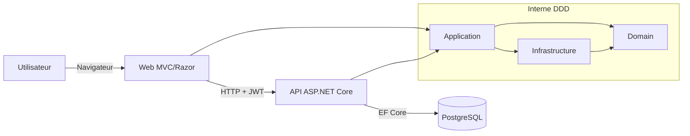

# Document technique (FR)

## 1. Introduction
Ce document décrit le design technique de **Escoles Publiques**.

Objectifs :
- expliquer l'architecture et les limites DDD
- documenter la configuration Web et API
- décrire le modèle de données et l'authentification
- documenter les aspects transverses (erreurs, observabilité, tests)

Identifiants de démonstration :
- utilisateur : `admin@admin.adm`
- mot de passe : `admin123`

## 2. Architecture globale (Web + API + DDD)

```mermaid
flowchart LR
  U[Utilisateur] -->|Navigateur| W[Web MVC/Razor]
  W -->|HTTP + JWT| A[API ASP.NET Core]
  A -->|EF Core| DB[(PostgreSQL)]

  subgraph DDD[Interne DDD]
    D[Domain]
    AP[Application]
    I[Infrastructure]
  end

  W --> AP
  A --> AP
  AP --> D
  AP --> I
  I --> D
```

Flux principal :
1. L'utilisateur se connecte sur le Web (cookie auth)
2. Le Web demande un JWT à l'API (`POST /api/auth/token`)
3. Le token est stocké en session
4. Le Web appelle l'API avec `Authorization: Bearer <token>`

## 3. Structure DDD des projets
- `src/Domain` : entités, value objects, exceptions de domaine, contrats de repository
- `src/Application` : cas d'usage, services, handlers CQRS
- `src/Infrastructure` : EF Core, repositories, migrations
- `src/Api` : contrôleurs REST, JWT, CORS, swagger, middleware
- `src/Web` : UI MVC, localisation, clients API

## 4. Modèle de domaine
Entités principales :
- `School`
- `Student`
- `Enrollment`
- `AnnualFee`
- `Scope`
- `User`

Relations clés :
- School 1..N Students
- Student 1..N Enrollments
- Enrollment 1..N AnnualFees
- Scope 1..N Schools
- User 0..1 Student

## 5. Authentification et autorisation
- Le Web utilise l'authentification par cookie.
- L'API utilise JWT bearer.
- Rôles : `ADM` et `USER`.
- Les accès non autorisés provoquent logout + re-login.

## 6. Contrat d'erreur
L'API renvoie `application/problem+json` avec :
- `errorCode`
- `traceId`
- `timestamp`
- `fieldErrors` (validation)

Mappings standards :
- validation -> 400
- doublon -> 409
- introuvable -> 404
- non autorisé -> 401
- erreur non gérée -> 500

## 7. Value Objects et invariants
Invariants métiers appliqués via :
- `SchoolCode`
- `EmailAddress`
- `MoneyAmount`

Bénéfices :
- validation centralisée
- qualité de données cohérente
- moins de logique défensive dans les contrôleurs

## 8. CQRS (léger)
Le module Schools sépare lecture et écriture :
- Commands : create/update/delete
- Queries : get by id/list/get by code

Les responsabilités restent claires et testables.

## 9. Observabilité
Middleware transverse :
- `CorrelationIdMiddleware` (`X-Correlation-ID`)
- `RequestMetricsMiddleware` (compteur + latence)
- middleware global d'exceptions

Logging structuré et traçable.

## 10. Persistance
- PostgreSQL + EF Core
- migrations dans `Infrastructure`
- pattern repository
- convention snake_case dans les mappings

## 11. Couche Web
- vues Razor et contrôleurs MVC
- localisation `.resx`
- SignalR temps réel
- composants JS/CSS réutilisables

## 12. Stratégie de test
- tests unitaires domaine, application, contrôleurs, helpers
- tests d'intégration sur flux critiques
- suite risk-based
- coverage gates en CI

## 13. Gates CI/CD
Seuils de couverture par couche :
- Domain
- Application
- Infrastructure
- Web
- Api

Build et tests doivent être verts avant merge.

## 14. Notes opérationnelles
- workflow local orienté Docker
- debug simplifié avec Docker attach
- centre d'aide markdown multilingue + export DOCX
- recommandation : mettre à jour code et docs dans la même PR
