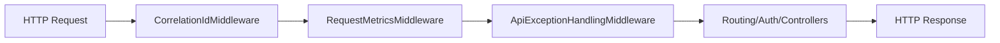
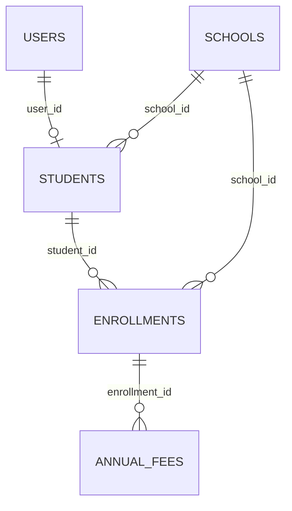

# Document technique (FR)

## 1. Introduction
Ce document décrit la conception technique de **Escoles Publiques**.

Objectifs :
- expliquer l'architecture et les frontières DDD
- documenter l'implémentation Web et API
- tracer les patterns, bibliothèques et décisions techniques
- décrire le modèle de données, les relations et l'authentification
- documenter les utilitaires transverses (helpers, JS, CSS)

Identifiants de démo :
- utilisateur : `admin@admin.adm`
- mot de passe : `admin123`

## 2. Architecture globale (Web + API + DDD)


```mermaid
flowchart LR
  U[Utilisateur] -->|Navigateur| W[Web MVC/Razor]
  W -->|HTTP + JWT| A[API ASP.NET Core]
  A -->|EF Core| DB[(PostgreSQL)]

  subgraph DDD[DDD interne]
    D[Domain]
    AP[Application]
    I[Infrastructure]
  end

  W --> AP
  A --> AP
  AP --> D
  I --> D
  AP --> I
```

Flux principal :
1. Login sur le Web (`CookieAuth`).
2. Le Web demande un JWT à l'API (`POST /api/auth/token`).
3. Le JWT est stocké en session serveur.
4. Le Web appelle l'API avec `Authorization: Bearer <token>`.

## 3. Structure DDD

Projets et responsabilités :
- `src/Domain` : entités, règles de domaine, contrats repository, value objects, exceptions domaine.
- `src/Application` : use cases, orchestration de services, commandes/queries/handlers CQRS.
- `src/Infrastructure` : persistance EF Core, implémentations repository, migrations.
- `src/Api` : entrée REST, JWT, CORS, Swagger, pipeline middleware.
- `src/Web` : entrée MVC/Razor, localisation, clients API, assets UI.

### 3.1 Arbre élargi de la solution (vue technique)

```text
src/
├── Api/
│   ├── Controllers/
│   ├── Services/
│   │   ├── CorrelationIdMiddleware.cs
│   │   ├── RequestMetricsMiddleware.cs
│   │   ├── ApiExceptionHandlingMiddleware.cs
│   │   └── DbSeeder.cs
│   └── Program.cs
├── Application/
│   ├── Interfaces/
│   ├── UseCases/
│   │   ├── Services/
│   │   ├── Schools/Commands/
│   │   └── Schools/Queries/
│   └── DTOs/
├── Domain/
│   ├── Entities/
│   ├── Interfaces/
│   ├── ValueObjects/
│   └── DomainExceptions/
├── Infrastructure/
│   ├── SchoolDbContext.cs
│   ├── Persistence/Repositories/
│   └── Migrations/
├── Web/
│   ├── Controllers/
│   ├── Services/Api/
│   ├── Services/Search/
│   ├── Helpers/ModalConfigFactory.cs
│   ├── ModelBinders/FlexibleDecimalModelBinder.cs
│   ├── Hubs/SchoolHub.cs
│   ├── Views/
│   ├── Resources/
│   ├── HelpDocs/
│   ├── wwwroot/js/
│   ├── wwwroot/css/
│   └── Program.cs
└── UnitTest/
    ├── Controllers/
    ├── Services/
    ├── Infrastructure/
    ├── Validators/
    └── Helpers/
```

## 4. Couche Web
- ASP.NET Core MVC + Razor Views.
- Cookie auth + session serveur pour JWT API.
- Clients typed `HttpClient` vers l'API.
- Localisation via `.resx` + sélecteur de langue.
- SignalR pour mises à jour temps réel.

## 5. Couche API (avec Swagger)
- ASP.NET Core Web API.
- authentification JWT bearer.
- autorisation par rôles/claims.
- politique CORS selon environnement.
- migrations EF Core appliquées au démarrage.

Swagger :
- package : `Swashbuckle.AspNetCore`
- UI : `/api` si `Swagger__Enabled=true`
- OpenAPI JSON : `/swagger/v1/swagger.json`
- schéma de sécurité : `Bearer`

## 6. Pipeline middleware API (ordre réel)
1. `CorrelationIdMiddleware`
2. `RequestMetricsMiddleware`
3. `ApiExceptionHandlingMiddleware`
4. `UseHttpsRedirection`
5. `UseRouting`
6. `UseCors("DefaultCors")`
7. `UseAuthentication`
8. `UseAuthorization`
9. `MapControllers`


```mermaid
flowchart LR
  R[HTTP Request] --> C[CorrelationIdMiddleware]
  C --> M[RequestMetricsMiddleware]
  M --> E[ApiExceptionHandlingMiddleware]
  E --> X[Routing/Auth/Controllers]
  X --> S[HTTP Response]
```

Détail middleware :
- `CorrelationIdMiddleware` : propage ou génère `X-Correlation-ID`, renseigne `TraceIdentifier`.
- `RequestMetricsMiddleware` : enregistre compteur + latence (`api_requests_total`, `api_request_duration_ms`).
- `ApiExceptionHandlingMiddleware` : mappe les exceptions vers `ProblemDetails` (`400/401/404/409/500`) avec `errorCode`, `traceId`, `timestamp`.

## 7. Patterns utilisés
- Repository Pattern (`Infrastructure/Persistence/Repositories/*`).
- Service Layer Pattern (`Application/UseCases/Services/*`).
- CQRS léger pour l'agrégat `School`.
- Strategy Pattern pour les sources de recherche (`ISchoolSearchSource`, `IStudentSearchSource`, etc.).
- Builder Pattern (`SearchResultsBuilder`).
- Factory Pattern (`ModalConfigFactory`).
- Fail-Fast au startup (ex : CORS en production).
- Global Exception Mapping via middleware.

## 8. Bibliothèques et frameworks
API :
- `Microsoft.AspNetCore.Authentication.JwtBearer`
- `Npgsql.EntityFrameworkCore.PostgreSQL`
- `Swashbuckle.AspNetCore`

Application :
- `AutoMapper`
- `AutoMapper.Extensions.Microsoft.DependencyInjection`

Web :
- `FluentValidation.AspNetCore`
- `Markdig`
- `DocumentFormat.OpenXml`
- `Serilog.AspNetCore`
- `Serilog.Sinks.File`

## 9. Modèle de données
Moteur : PostgreSQL.

Tables principales :
- `schools`
- `scope_mnt`
- `users`
- `students`
- `enrollments`
- `annual_fees`
- `__EFMigrationsHistory`


```mermaid
erDiagram
  USERS ||--o| STUDENTS : "user_id"
  SCHOOLS ||--o{ STUDENTS : "school_id"
  STUDENTS ||--o{ ENROLLMENTS : "student_id"
  SCHOOLS ||--o{ ENROLLMENTS : "school_id"
  ENROLLMENTS ||--o{ ANNUAL_FEES : "enrollment_id"
```

## 10. Cycle d'authentification
Web :
- login via cookie auth.
- JWT API stocké en session.

API :
- validation des identifiants.
- émission de JWT signé.

Cycle :
1. login Web.
2. demande de token API.
3. stockage en session.
4. injection du token par requête.
5. en cas de 401/403 -> logout forcé.

## 11. Helpers et utilitaires
- `ModalConfigFactory` : configuration centralisée des modales CRUD.
- `ApiAuthTokenHandler` (`DelegatingHandler`) : injection JWT + gestion unauthorized.
- `ApiResponseHelper` : validation centralisée des réponses HTTP.
- `NormalizePg(...)` dans `Program.cs` (Web/API) : convertit `postgres://...` en connection string Npgsql.
- `ToSnakeCase(...)` dans `SchoolDbContext` : convention globale de nommage BD.

Helpers internes du middleware d'erreurs :
- `CreateProblem(...)`
- `EnrichProblem(...)`
- `WriteProblem(...)`

## 12. Portée JavaScript et CSS
JavaScript (`src/Web/wwwroot/js`) :
- `entity-modal.js`, `generic-table.js`, `signalr-connection.js`, `save-cancel-buttons.js`, `i18n.js`, scripts par module.

CSS (`src/Web/wwwroot/css`) :
- `davidgov-theme.css`, `login.css`, `search-results.css`, `generic-table.css`, `user-dashboard.css`.

## 13. Stratégie de test
- tests unitaires domain/application/controllers/helpers.
- couverture d'intégration sur flux critiques.
- tests d'architecture sur les dépendances DDD.

## 14. Notes opérationnelles
- workflow local Docker-first.
- logging structuré avec Serilog.
- centre d'aide multilingue (Markdown -> HTML + DOCX).
- maintenir docs et code synchronisés dans la même PR.
