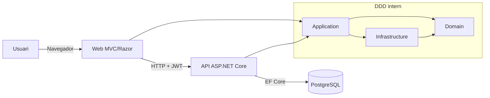
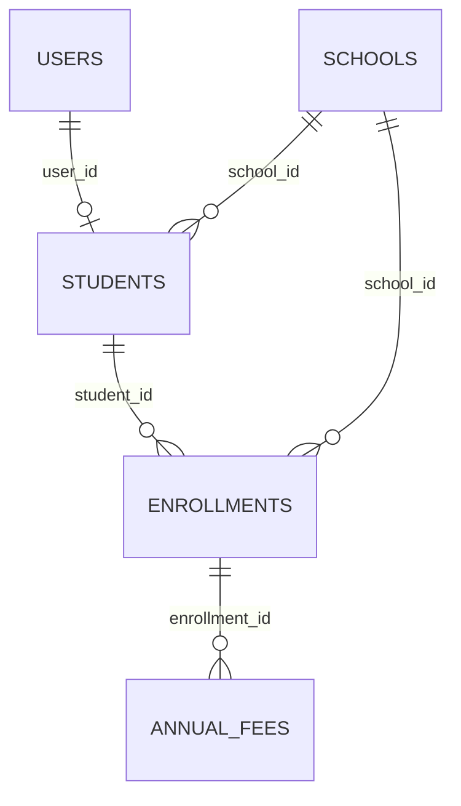

# Document tecnic (CA)

## 1. Introduccio
Aquest document descriu en profunditat com esta construida l'aplicacio **Escoles Publiques** a nivell tecnic.

Objectius:
- explicar arquitectura i estructura DDD
- documentar com hem muntat Web i API
- deixar traçabilitat de patrons, llibreries i decisions
- descriure model de dades, relacions i sistema d'autenticacio
- explicar utilitats transversals (helpers, JS, CSS)

Credencials de prova (entorn demo):
- usuari: `admin@admin.adm`
- contrasenya: `admin123`

## 2. Esquema general de l'app (Web + API + DDD)



Flux funcional principal:
1. Login a Web (`CookieAuth`)
2. Web demana token a API (`POST /api/auth/token`)
3. Token JWT es desa a sessio
4. Web consumeix API amb `Authorization: Bearer <token>`

## 3. Estructura DDD (com ho hem organitzat)

Projectes i responsabilitats:
- `src/Domain`
  - entitats i regles de domini
  - interfaces de repositori (`I*Repository`)
  - value objects / excepcions de domini
- `src/Application`
  - casos d'us (`*Service`)
  - contracts d'aplicacio (`I*Service`)
  - queries (p. ex. cerca agregada)
- `src/Infrastructure`
  - persistencia EF Core
  - implementacions de repositori
  - migrations
- `src/Api`
  - capa d'entrada REST (controllers API)
  - auth JWT, Swagger, CORS, seed
- `src/Web`
  - capa d'entrada MVC/Razor
  - UI, localitzacio, clients HTTP cap a API

### 3.1 Arbre ampliat de la solucio (vista tecnica)
```text
src/
├── Api/
│   ├── Controllers/
│   │   ├── AuthController.cs
│   │   ├── SchoolsController.cs
│   │   ├── StudentsController.cs
│   │   ├── EnrollmentsController.cs
│   │   ├── AnnualFeesController.cs
│   │   ├── ScopesController.cs
│   │   └── MaintenanceController.cs
│   ├── Services/
│   │   └── DbSeeder.cs
│   ├── Program.cs
│   └── appsettings.json
├── Application/
│   ├── DTOs/
│   │   ├── SearchResultsDtos.cs
│   │   └── SearchSourcesDtos.cs
│   ├── Interfaces/
│   │   ├── IAuthService.cs
│   │   ├── ISchoolService.cs
│   │   ├── IStudentService.cs
│   │   ├── IEnrollmentService.cs
│   │   ├── IAnnualFeeService.cs
│   │   ├── IUserService.cs
│   │   └── Search/
│   │       ├── ISearchResultsQuery.cs
│   │       └── ISearchSources.cs
│   └── UseCases/
│       ├── Services/
│       │   ├── AuthService.cs
│       │   ├── SchoolService.cs
│       │   ├── StudentService.cs
│       │   ├── EnrollmentService.cs
│       │   ├── AnnualFeeService.cs
│       │   └── UserService.cs
│       └── Queries/SearchResults/SearchResultsQuery.cs
├── Domain/
│   ├── Entities/
│   │   ├── User.cs
│   │   ├── School.cs
│   │   ├── Student.cs
│   │   ├── Enrollment.cs
│   │   ├── AnnualFee.cs
│   │   └── Scope.cs
│   ├── Interfaces/
│   │   ├── IUserRepository.cs
│   │   ├── ISchoolRepository.cs
│   │   ├── IStudentRepository.cs
│   │   ├── IEnrollmentRepository.cs
│   │   ├── IAnnualFeeRepository.cs
│   │   └── IScopeRepository.cs
│   └── DomainExceptions/
│       ├── DomainException.cs
│       ├── ValidationException.cs
│       ├── NotFoundException.cs
│       └── DuplicateEntityException.cs
├── Infrastructure/
│   ├── SchoolDbContext.cs
│   ├── Persistence/
│   │   ├── AppDbContextFactory.cs
│   │   └── Repositories/
│   │       ├── UserRepository.cs
│   │       ├── SchoolRepository.cs
│   │       ├── StudentRepository.cs
│   │       ├── EnrollmentRepository.cs
│   │       └── AnnualFeeRepository.cs
│   ├── ScopeRepository.cs
│   └── Migrations/
│       ├── 20260105023406_UpdateStudentUserRelationship.cs
│       ├── 20260213131000_AddSchoolIdToEnrollments.cs
│       └── SchoolDbContextModelSnapshot.cs
├── Web/
│   ├── Controllers/
│   │   ├── AuthController.cs
│   │   ├── HomeController.cs
│   │   ├── DashboardController.cs
│   │   ├── SchoolsController.cs
│   │   ├── StudentsController.cs
│   │   ├── EnrollmentsController.cs
│   │   ├── AnnualFeesController.cs
│   │   ├── ScopesController.cs
│   │   ├── SearchController.cs
│   │   ├── HelpController.cs
│   │   └── ManualController.cs
│   ├── Services/
│   │   └── Api/ (ApiAuthTokenHandler + clients API)
│   ├── ModelBinders/FlexibleDecimalModelBinder.cs
│   ├── Helpers/ModalConfigFactory.cs
│   ├── Hubs/SchoolHub.cs
│   ├── Views/ (Razor)
│   ├── Resources/ (resx per idiomes)
│   ├── HelpDocs/ (manual/funcional/tecnic per idioma)
│   ├── wwwroot/js/ (scripts UI)
│   ├── wwwroot/css/ (tema i estils)
│   └── Program.cs
└── UnitTest/
    ├── Controllers/
    ├── Services/
    ├── Infrastructure/
    ├── Validators/
    ├── ViewComponents/
    └── Hubs/
```

### 3.2 Explicacio fitxer a fitxer: `src/Domain`

`src/Domain/Entities/User.cs`
- Entitat d'usuari de domini.
- Modela identitat, credencial hash, rol i metadades d'activitat.

`src/Domain/Entities/School.cs`
- Entitat escola.
- Defineix camps troncals (`Name`, `Code`, ciutat, favorit, scope).

`src/Domain/Entities/Student.cs`
- Entitat alumne.
- Manté relacio amb escola i, opcionalment, amb usuari.

`src/Domain/Entities/Enrollment.cs`
- Entitat d'inscripcio.
- Representa l'estat academic de l'alumne per curs/any.

`src/Domain/Entities/AnnualFee.cs`
- Entitat quota anual.
- Conté import, venciment i estat de pagament.

`src/Domain/Entities/Scope.cs`
- Entitat de classificacio.
- Permet categoritzar escoles per ambit.

`src/Domain/Interfaces/IUserRepository.cs`
- Contracte de persistencia d'usuaris.
- Defineix lectura/escriptura sense lligar-ho a EF Core.

`src/Domain/Interfaces/ISchoolRepository.cs`
- Contracte de persistencia d'escoles.
- Inclou operacions de cerca/llistat i CRUD.

`src/Domain/Interfaces/IStudentRepository.cs`
- Contracte de persistencia d'alumnes.
- Dona suport a consultes amb relacions.

`src/Domain/Interfaces/IEnrollmentRepository.cs`
- Contracte de persistencia d'inscripcions.
- Separa regles de domini de detalls de BD.

`src/Domain/Interfaces/IAnnualFeeRepository.cs`
- Contracte de persistencia de quotes.
- Proporciona operacions per estat de pagament.

`src/Domain/Interfaces/IScopeRepository.cs`
- Contracte de persistencia de scopes.
- Gestiona cataleg d'ambits i activacio.

`src/Domain/DomainExceptions/DomainException.cs`
- Base d'excepcions de domini.
- Unifica tractament d'errors funcionals.

`src/Domain/DomainExceptions/ValidationException.cs`
- Error de validacio funcional.
- S'utilitza quan una regla de negoci no es compleix.

`src/Domain/DomainExceptions/NotFoundException.cs`
- Error d'entitat no trobada.
- Evita retorns silenciosos o inconsistents.

`src/Domain/DomainExceptions/DuplicateEntityException.cs`
- Error de duplicat funcional.
- Especialment util per email/codis unics.

### 3.3 Explicacio fitxer a fitxer: `src/Application`

`src/Application/Interfaces/IAuthService.cs`
- Contracte del cas d'us de login.
- Defineix validacio credencial + emissio de resultat.

`src/Application/Interfaces/ISchoolService.cs`
- Contracte de logica d'aplicacio d'escoles.
- Orquestra validacions i repository calls.

`src/Application/Interfaces/IStudentService.cs`
- Contracte de logica d'alumnes.
- Inclou fluxos amb usuari associat.

`src/Application/Interfaces/IEnrollmentService.cs`
- Contracte de logica d'inscripcions.
- Gestiona coherencia alumne-escola-curs.

`src/Application/Interfaces/IAnnualFeeService.cs`
- Contracte de logica de quotes.
- Regeix alta, actualitzacio i marcat de pagament.

`src/Application/Interfaces/IUserService.cs`
- Contracte de logica d'usuaris.
- Crea, valida i consulta usuaris de sistema.

`src/Application/Interfaces/Search/ISearchResultsQuery.cs`
- Contracte de query transversal de cerca.
- Retorna resultats agregats per moduls.

`src/Application/Interfaces/Search/ISearchSources.cs`
- Contracte de fonts de cerca.
- Separa origen de dades de la composicio final.

`src/Application/UseCases/Services/AuthService.cs`
- Implementa login de negoci.
- Valida usuari, rol i hash de contrasenya.

`src/Application/UseCases/Services/SchoolService.cs`
- Casos d'us d'escoles.
- Aplica regles abans de delegar a repositori.

`src/Application/UseCases/Services/StudentService.cs`
- Casos d'us d'alumnes.
- Gestiona transaccions quan crea usuari + alumne.

`src/Application/UseCases/Services/EnrollmentService.cs`
- Casos d'us d'inscripcions.
- Garantitza relacions valides amb alumne i escola.

`src/Application/UseCases/Services/AnnualFeeService.cs`
- Casos d'us de quotes.
- Centralitza validacio d'import, venciment i estat.

`src/Application/UseCases/Services/UserService.cs`
- Casos d'us d'usuaris.
- Controla unicitat d'email i atributs basics.

`src/Application/UseCases/Queries/SearchResults/SearchResultsQuery.cs`
- Implementa cerca agregada.
- Uneix resultats de diferents fonts amb format comu.

`src/Application/DTOs/SearchResultsDtos.cs`
- Models de transport de resultats de cerca.
- Evita exposar entitats de domini directament a UI/API.

`src/Application/DTOs/SearchSourcesDtos.cs`
- Models de transport de fonts de cerca.
- Facilita composicio incremental de resultats.

### 3.4 Explicacio fitxer a fitxer: `src/Infrastructure`

`src/Infrastructure/SchoolDbContext.cs`
- DbContext principal EF Core.
- Defineix mapeig de taules i convencions (snake_case).

`src/Infrastructure/Persistence/AppDbContextFactory.cs`
- Factory per disseny-time (migrations).
- Permet `dotnet ef` fora de runtime Web/API.

`src/Infrastructure/Persistence/Repositories/UserRepository.cs`
- Implementacio EF de `IUserRepository`.
- Consulta per email, CRUD i filtres basics.

`src/Infrastructure/Persistence/Repositories/SchoolRepository.cs`
- Implementacio EF de `ISchoolRepository`.
- Gestiona preferits, scopes i consultes de llistat.

`src/Infrastructure/Persistence/Repositories/StudentRepository.cs`
- Implementacio EF de `IStudentRepository`.
- Inclou relacions `School` i `User` per lectura rica.

`src/Infrastructure/Persistence/Repositories/EnrollmentRepository.cs`
- Implementacio EF de `IEnrollmentRepository`.
- Inclou navegacions necessaries per vista i API.

`src/Infrastructure/Persistence/Repositories/AnnualFeeRepository.cs`
- Implementacio EF de `IAnnualFeeRepository`.
- Resol operacions de quotes i estats de pagament.

`src/Infrastructure/Persistence/ScopeRepository.cs`
- Implementacio de `IScopeRepository`.
- Dona suport al manteniment de scopes.

`src/Infrastructure/Migrations/20260105023406_UpdateStudentUserRelationship.cs`
- Migracio que ajusta relacio `students.user_id`.
- Consolida unicitat i comportament de FK.

`src/Infrastructure/Migrations/20260213131000_AddSchoolIdToEnrollments.cs`
- Migracio que incorpora `school_id` a `enrollments`.
- Millora coherencia i consultes directes per escola.

`src/Infrastructure/Migrations/SchoolDbContextModelSnapshot.cs`
- Snapshot EF del model actual.
- Referencia base per generar noves migrations.

Nota:
- Existeixen carpetes `Scaffold` i `src/Infrastructure/src/...` d'origen scaffold/legacy.
- No son el cami principal de l'arquitectura funcional actual, pero cal tenir-les controlades per evitar duplicacions de model.

### 3.5 Explicacio fitxer a fitxer: `src/Api`

`src/Api/Program.cs`
- Composicio principal API.
- Configura DI, JWT, CORS, Swagger, EF i middleware pipeline.

`src/Api/Controllers/AuthController.cs`
- Endpoint de token (`POST /api/auth/token`).
- Valida credencials i retorna JWT.

`src/Api/Controllers/SchoolsController.cs`
- CRUD REST d'escoles.
- Aplica `[Authorize]` i retorna codis HTTP consistents.

`src/Api/Controllers/StudentsController.cs`
- CRUD REST d'alumnes.
- Treballa amb serveis d'aplicacio i DTOs.

`src/Api/Controllers/EnrollmentsController.cs`
- CRUD REST d'inscripcions.
- Manté coherencia amb escoles i alumnes.

`src/Api/Controllers/AnnualFeesController.cs`
- CRUD REST de quotes anuals.
- Inclou fluxos de marcat de pagament.

`src/Api/Controllers/ScopesController.cs`
- CRUD/consulta de scopes.
- Dona suport al filtratge funcional de la web.

`src/Api/Controllers/MaintenanceController.cs`
- Endpoints de manteniment intern (seed controlat).
- Protegit amb rol i header de seguretat.

`src/Api/Services/DbSeeder.cs`
- Seed de dades inicials.
- Crea base minima per entorns demo o bootstrap.

`src/Api/appsettings.json`
- Configuracio base (JWT, connexio, logging, CORS).
- Es complementa amb variables d'entorn a deploy.

### 3.6 Explicacio fitxer a fitxer: `src/Web`

`src/Web/Program.cs`
- Entrada principal de la web MVC.
- Configura localitzacio, cookie auth, sessio, clients API i rutes.

`src/Web/Controllers/AuthController.cs`
- Login/logout web.
- Desa JWT en sessio i arrenca context autenticat.

`src/Web/Controllers/HomeController.cs`
- Pagina inici, dashboard base i contingut public.
- Punt d'entrada principal de navegacio.

`src/Web/Controllers/HomeController.Favorites.cs`
- Partials d'operacions de favorits separats en partial class.
- Redueix mida del controller principal.

`src/Web/Controllers/DashboardController.cs`
- Vista de dashboard per rols.
- Carrega components agregats de context usuari.

`src/Web/Controllers/SchoolsController.cs`
- Pantalles MVC d'escoles (llistat, alta, detall, edicio, baixa).
- Delega a clients API i aplica validacions UI.

`src/Web/Controllers/StudentsController.cs`
- Pantalles MVC d'alumnes.
- Gestiona vincle opcional amb usuaris.

`src/Web/Controllers/EnrollmentsController.cs`
- Pantalles MVC d'inscripcions.
- Controla seleccio d'alumne, escola, any i estat.

`src/Web/Controllers/AnnualFeesController.cs`
- Pantalles MVC de quotes (incloent modal de creacio).
- Integra binder decimal flexible i validacio visual.

`src/Web/Controllers/ScopesController.cs`
- Manteniment d'ambits des de UI.
- Dona servei a filtres i classificacio funcional.

`src/Web/Controllers/SearchController.cs`
- Cerca global.
- Construeix resultats multi-entitat.

`src/Web/Controllers/HelpController.cs`
- Centre d'ajuda (`/ajuda` i `/help`) sense auth.
- Renderitza Markdown a HTML i exporta DOCX.

`src/Web/Controllers/ManualController.cs`
- Compatibilitat amb rutes antigues de manual.
- Redireccio cap al centre d'ajuda unificat.

`src/Web/Controllers/BaseController.cs`
- Utilitats comunes de controllers (localitzacio, feedback, etc.).
- Evita duplicacio transversal.

`src/Web/Services/Api/ApiAuthTokenHandler.cs`
- DelegatingHandler que injecta JWT a cada crida API.
- Si rep 401/403, fa neteja de sessio i logout.

`src/Web/Services/Api/AuthApiClient.cs`
- Client tipat per login API.
- Encapsula endpoint de token i tractament de resposta.

`src/Web/Services/Api/SchoolsApiClient.cs`
- Client tipat de CRUD escoles.
- Aillament de rutes i serialitzacio.

`src/Web/Services/Api/StudentsApiClient.cs`
- Client tipat de CRUD alumnes.
- Gestiona payloads i errors HTTP.

`src/Web/Services/Api/EnrollmentsApiClient.cs`
- Client tipat de CRUD inscripcions.
- Manté contractes coherents amb API.

`src/Web/Services/Api/AnnualFeesApiClient.cs`
- Client tipat de quotes anuals.
- Dona suport a fluxos de pagament.

`src/Web/Services/Api/ScopesApiClient.cs`
- Client tipat de scopes.
- Utilitzat en manteniment i filtres.

`src/Web/ModelBinders/FlexibleDecimalModelBinder.cs`
- Binder personalitzat per admetre `,` i `.` en decimals.
- Evita errors culturals a imports monetaris.

`src/Web/Helpers/ModalConfigFactory.cs`
- Fabrica de configuracio de modals.
- Uniformitza comportament CRUD en diferents pantalles.

`src/Web/Hubs/SchoolHub.cs`
- Hub SignalR per notificacions/actualitzacions en temps real.
- Punt de broadcast per canvis de dades.

`src/Web/Views/Shared/_Layout.cshtml`
- Layout principal (header, idiomes, menu, peu).
- Integra boto Ajuda i coherencia visual global.

`src/Web/Views/Auth/Login.cshtml`
- Pantalla de login.
- Inclou selector idioma i accés a Ajuda sense autenticacio.

`src/Web/Views/Help/Index.cshtml`
- Vista index del centre d'ajuda.
- Llista documents disponibles segons idioma actiu.

`src/Web/Views/Help/Doc.cshtml`
- Render de document ajuda.
- Inclou boto de descarrega DOCX.

`src/Web/Resources/**/*.resx`
- Fitxers de localitzacio per vistes/scripts.
- Clau per suport multiidioma CA/ES/EN/DE/FR/RU/ZH.

`src/Web/HelpDocs/{lang}/*.md`
- Fonts Markdown que es mostren al centre d'ajuda.
- S'alineen amb `docs/{lang}` per mantenir consistencia.

`src/Web/wwwroot/js/generic-table.js`
- Motor client-side de taules (filtres, ordenacio, paginacio).

`src/Web/wwwroot/js/entity-modal.js`
- Cicle de vida de modals de formulari.
- Validacio i submit asincron coherent.

`src/Web/wwwroot/js/i18n.js`
- Utilitats de localitzacio client-side.
- Lectura de diccionaris injectats per servidor.

`src/Web/wwwroot/js/signalr-connection.js`
- Gestio de connexio SignalR i reconexio.

`src/Web/wwwroot/css/davidgov-theme.css`
- Tema visual global (header, navegacio, components base).

`src/Web/wwwroot/css/login.css`
- Estils especifics de login.

`src/Web/wwwroot/css/generic-table.css`
- Estils reutilitzables per taules de dades.

`src/Web/wwwroot/css/user-dashboard.css`
- Estils especifics de dashboard d'usuari.

### 3.7 Explicacio fitxer a fitxer: `src/UnitTest`

`src/UnitTest/Controllers/*`
- Cobertura de comportament de controllers web.
- Validen rutes, respostes, redirects i errors.

`src/UnitTest/Services/*`
- Tests de logica d'aplicacio i clients API.
- Asseguren regles de negoci i control d'excepcions.

`src/UnitTest/Infrastructure/*`
- Tests de repositoris i integracio EF (in-memory/on test setup).

`src/UnitTest/Validators/*`
- Tests de validacio de ViewModels.
- Comprovacio de missatges d'error i casos frontera.

`src/UnitTest/ViewComponents/*`
- Tests de components reutilitzables de UI.

`src/UnitTest/Hubs/*`
- Tests de comportament de SignalR hubs.

`src/UnitTest/Helpers/*`
- Utilitats de test (handlers fake, factories, mocks).

`src/UnitTest/UnitTest.csproj`
- Projecte de test (xUnit + paquets de mocking/assertions).

Regla clau de dependencies:
- `Domain` no depen de cap altra capa
- `Application` depen de `Domain`
- `Infrastructure` implementa contracts de `Domain`/`Application`
- `Web` i `Api` orquestren i fan DI

## 4. Com hem muntat la Web

Base tecnica:
- ASP.NET Core MVC + Razor Views (`src/Web/Views`)
- autenticacio per cookie (`CookieAuth`)
- sessio server-side per guardar el JWT de l'API
- localitzacio per `resx` + selector d'idioma a capcalera
- clients typed `HttpClient` per consumir API

Peces destacades:
- Controllers MVC: `src/Web/Controllers/*`
- Handler auth API: `src/Web/Services/Api/ApiAuthTokenHandler.cs`
- Binder decimal flexible: `src/Web/ModelBinders/FlexibleDecimalModelBinder.cs`
- Ajuda web (manual/funcional/tecnic): `src/Web/Controllers/HelpController.cs`

## 5. Com hem muntat la API (incloent Swagger)

Base tecnica:
- ASP.NET Core Web API (`src/Api`)
- autenticacio `JwtBearer`
- autoritzacio per rol/claims
- CORS configurable per entorn
- EF Core amb migrations auto a startup

Swagger:
- paquet `Swashbuckle.AspNetCore`
- UI a `/api` quan `Swagger__Enabled=true`
- JSON OpenAPI a `/swagger/v1/swagger.json`
- esquema `Bearer` configurat per provar endpoints protegits

Exemple d'endpoint de login:
- `POST /api/auth/token` retorna JWT

## 6. Patrons utilitzats (amb exemples i lectura line-by-line)

### 6.1 Repository + Service
Idea:
- repositori: accés a dades
- servei aplicacio: regles i orquestracio

Exemple repositori (`StudentRepository`):
```csharp
1  public async Task<IEnumerable<Student>> GetAllAsync()
2  {
3      return await _context.Students
4          .Include(s => s.School)
5          .Include(s => s.User)
6          .ToListAsync();
7  }
```
Lectura:
1. signatura async
2. bloc mètode
3. query base d'alumnes
4. eager-load escola
5. eager-load usuari
6. executa a DB
7. fi mètode

Exemple servei (`StudentService`):
```csharp
1  using var scope = new TransactionScope(TransactionScopeAsyncFlowOption.Enabled);
2  var createdUser = await _userService.CreateUserAsync(user, password);
3  student.UserId = createdUser.Id;
4  student.CreatedAt = DateTime.UtcNow;
5  var createdStudent = await _studentRepository.AddAsync(student);
6  scope.Complete();
7  return createdStudent;
```
Lectura:
1. obre transaccio
2. crea usuari primer
3. assigna FK a alumne
4. set timestamp
5. desa alumne
6. confirma transaccio
7. retorna resultat

### 6.2 API Gateway intern via `HttpClient` + `DelegatingHandler`
Exemple (`ApiAuthTokenHandler`):
```csharp
1  var token = _httpContextAccessor.HttpContext?.Session.GetString(SessionKeys.ApiToken);
2  if (!string.IsNullOrWhiteSpace(token) && request.Headers.Authorization == null)
3      request.Headers.Authorization = new AuthenticationHeaderValue("Bearer", token);
4  var response = await base.SendAsync(request, cancellationToken);
5  if (response.StatusCode == HttpStatusCode.Unauthorized || response.StatusCode == HttpStatusCode.Forbidden)
6  {
7      ctx.Session.Remove(SessionKeys.ApiToken);
8      await ctx.SignOutAsync("CookieAuth");
9      throw new UnauthorizedAccessException(...);
10 }
```
Lectura:
1. llegeix token de sessio
2-3. adjunta capcalera auth
4. continua pipeline HTTP
5. captura 401/403
6-9. neteja sessio + logout + excepcio controlada

### 6.3 Model Binder personalitzat (resoldre `,` i `.`)
Exemple (`FlexibleDecimalModelBinder`):
```csharp
1  var normalized = Normalize(raw);
2  if (decimal.TryParse(normalized, NumberStyles.Number, CultureInfo.InvariantCulture, out var value))
3      bindingContext.Result = ModelBindingResult.Success(value);
4  else
5      bindingContext.ModelState.TryAddModelError(...);
```
Lectura:
1. normalitza entrada usuari
2. parse invariant
3. model valid
4-5. error de validacio

### 6.4 Pattern "Fail Fast" en startup
A API, si no hi ha CORS a produccio -> l'app falla a startup per evitar desplegament insegur.

## 7. Llibreries externes usades

### 7.1 API
- `Microsoft.AspNetCore.Authentication.JwtBearer`
- `Npgsql.EntityFrameworkCore.PostgreSQL`
- `Swashbuckle.AspNetCore`

### 7.2 Application
- `AutoMapper`
- `AutoMapper.Extensions.Microsoft.DependencyInjection`

### 7.3 Infrastructure
- `Microsoft.EntityFrameworkCore`
- `Microsoft.EntityFrameworkCore.Design`
- `Npgsql.EntityFrameworkCore.PostgreSQL`

### 7.4 Web
- `FluentValidation.AspNetCore`
- `Markdig`
- `DocumentFormat.OpenXml` (export DOCX des d'ajuda)
- `Serilog.AspNetCore`
- `Serilog.Sinks.File`

## 8. Base de dades (taules, camps, indexos, constraints)

Motor: PostgreSQL

### 8.1 `schools`
Camps:
- `id` bigint PK
- `name` text NOT NULL
- `code` text NOT NULL
- `city` text NULL
- `is_favorite` boolean NOT NULL
- `scope` text NULL (legacy)
- `created_at` timestamp NOT NULL

Indexos:
- PK sobre `id`

Constraints:
- PK `PK_schools`

### 8.2 `scope_mnt`
Camps:
- `id` bigint PK
- `name` text NOT NULL
- `description` text NULL
- `is_active` boolean NOT NULL
- `created_at` timestamp NOT NULL
- `updated_at` timestamp NOT NULL

### 8.3 `users`
Camps:
- `id` bigint PK
- `first_name` text NOT NULL
- `last_name` text NOT NULL
- `email` text NOT NULL
- `password_hash` text NOT NULL
- `role` text NOT NULL
- `birth_date` date NULL
- `is_active` boolean NOT NULL
- `created_at` timestamp NOT NULL
- `updated_at` timestamp NOT NULL
- `last_login_at` timestamp NULL

Indexos:
- `IX_users_email` UNIQUE

### 8.4 `students`
Camps:
- `id` bigint PK
- `school_id` bigint NOT NULL
- `user_id` bigint NULL
- `created_at` timestamp NOT NULL

Indexos:
- `IX_students_school_id`
- `IX_students_user_id` UNIQUE

FK:
- `fk_students_schools_school_id` (`school_id` -> `schools.id`) ON DELETE CASCADE
- `fk_students_users_user_id` (`user_id` -> `users.id`) sense cascade

### 8.5 `enrollments`
Camps:
- `id` bigint PK
- `student_id` bigint NOT NULL
- `academic_year` text NOT NULL
- `course_name` text NULL
- `status` text NOT NULL
- `enrolled_at` timestamp NOT NULL
- `school_id` bigint NOT NULL

Indexos:
- `IX_enrollments_student_id`
- `ix_enrollments_school_id`

FK:
- `fk_enrollments_students_student_id` ON DELETE CASCADE
- `fk_enrollments_schools_school_id` ON DELETE RESTRICT

### 8.6 `annual_fees`
Camps:
- `id` bigint PK
- `enrollment_id` bigint NOT NULL
- `amount` numeric NOT NULL
- `currency` text NOT NULL
- `due_date` date NOT NULL
- `paid_at` timestamp NULL
- `payment_ref` text NULL

Indexos:
- `IX_annual_fees_enrollment_id`

FK:
- `fk_annualfees_enrollments_enrollment_id` ON DELETE CASCADE

### 8.7 `__EFMigrationsHistory`
Taula interna d'EF Core per traçar migrations aplicades.

## 9. Esquema relacional



## 10. Sistema de login utilitzat

A Web:
- cookie auth (`CookieAuth`)
- sessio server-side per token API
- login form a `/Auth/Login`

A API:
- validacio credencials
- emissio JWT signat (`Jwt__Key`, `Jwt__Issuer`, `Jwt__Audience`)

Cicle de vida:
1. usuari fa login a Web
2. Web demana JWT a API
3. token guardat en sessio
4. handler l'inclou a totes les peticions
5. 401/403 => logout automatic

## 11. Helpers (què fan)

`src/Web/Helpers/ModalConfigFactory.cs`
- centralitza configuracio de modals CRUD
- evita duplicacio de configuracio entre controllers/vistes

Helpers transversals no encapsulats en carpeta "Helpers":
- `NormalizePg(...)` a `Program.cs` (Web i API): adapta URL `postgres://...` a connection string Npgsql valida
- `ToSnakeCase(...)` a `SchoolDbContext`: convencio global de noms

## 12. JavaScript i CSS (què cobreixen)

### 12.1 JS (`src/Web/wwwroot/js`)
- `entity-modal.js`: comportament generic de modals
- `generic-table.js`: cerca/ordenacio/paginacio client-side
- `signalr-connection.js`: connexio SignalR per actualitzacions
- `save-cancel-buttons.js`: UX consistent de formularis
- `i18n.js`: lookup client-side de textos localitzats
- scripts específics per mòdul (`schools-details.js`, `students-create.js`, etc.)

### 12.2 CSS (`src/Web/wwwroot/css`)
- `davidgov-theme.css`: layout global, header, navegacio, colors
- `login.css`: estil pantalla login
- `search-results.css`: resultats de cerca
- `generic-table.css`: estil reutilitzable de taules
- `user-dashboard.css`: estils dashboard rol USER

## 13. Altres punts tecnics rellevants

- Logging: Serilog a fitxer + consola
- Localitzacio: `Resources/*.resx` per vista
- Ajuda web: render Markdown->HTML amb Markdig + export DOCX
- Desplegament: Docker + Render
- Build: `dotnet build` sobre solucio modular
