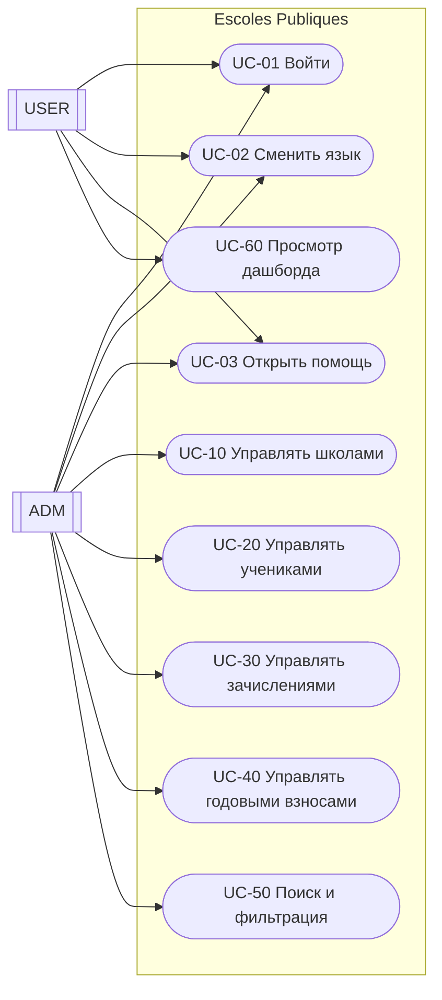
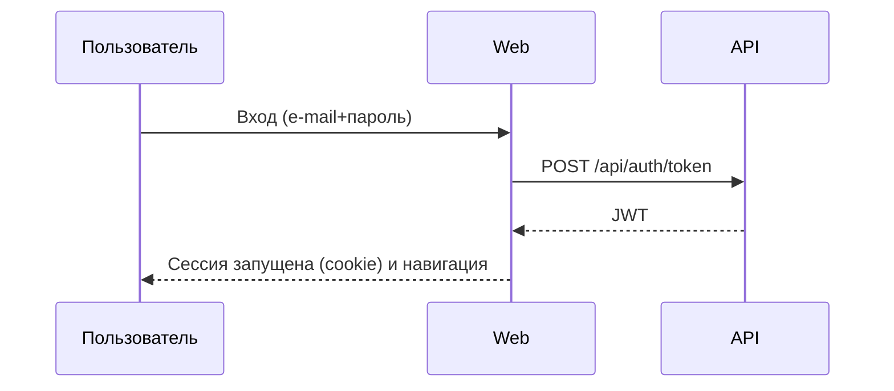

# Функциональный документ (RU)

## 1. Краткое описание
«Escoles Publiques» поддерживает управление:
- школами
- учениками
- зачислениями (по учебному году и курсу)
- годовыми взносами (связанными с зачислением)
- областями (scope) для классификации школ

Система разделена на Web UI и API. Веб-часть использует API.

## 2. Область охвата
В области охвата:
- CRUD для школ, учеников, зачислений и годовых взносов
- назначение и фильтрация по области
- поиск на главной (текст + область)
- аутентификация и доступ по ролям (`ADM`/`USER`)
- переключение языка и адаптивный интерфейс
- центр помощи (руководство пользователя, функциональный, технический)

Вне области охвата (на момент написания):
- расширенная модель прав сверх `ADM`/`USER`
- внешние интеграции (e-mail/push-уведомления)
- массовый импорт из официальных наборов данных

## 3. Акторы и роли
Акторы:
- `ADM` (администратор)
- `USER` (конечный пользователь)

Роли:
- `ADM`: полный доступ к функциям управления
- `USER`: ограниченный доступ (дашборд и связанная информация)

## 4. Домен (основные сущности)
Сущности:
- `School`
- `Student`
- `Enrollment`
- `AnnualFee`
- `Scope`
- `User`

Связи верхнего уровня:
- у `School` есть 0..N `Student`
- у `Student` есть 0..N `Enrollment`
- у `Enrollment` есть 0..N `AnnualFee`
- `Scope` классифицирует 0..N `School`
- `User` может быть связан с 0..1 `Student` (опционально 1:1)

## 5. Диаграммы

### 5.1 Контекст системы
```mermaid
flowchart LR
  U[Пользователь] -->|Браузер| W[Web (MVC/Razor)]
  W -->|HTTP + JWT| A[API (REST)]
  A -->|EF Core| DB[(PostgreSQL)]
```

### 5.2 Сценарии использования (стиль UML)


### 5.3 Поток входа (высокий уровень)


## 6. Каталог сценариев

### UC-01 Вход
Акторы:
- `ADM`, `USER`

Основной поток:
1. Открыть страницу входа.
2. Ввести e-mail и пароль.
3. Система проверяет учетные данные.
4. Сессия запускается, пользователь перенаправляется по роли.

### UC-02 Смена языка
1. Выбрать язык в верхней панели.
2. Страница перезагружается.
3. Выбор сохраняется в cookie.

Языки:
- документированы: CA, ES, EN, DE, FR, RU, ZH

### UC-03 Открыть помощь
1. Нажать кнопку «Помощь».
2. Выбрать документ: руководство пользователя, функциональный или технический.
3. Система показывает документ на активном языке.

### UC-10 Управление школами (ADM)
Включает: список/поиск/сортировку, создание/редактирование/удаление, избранное, назначение области.

### UC-20 Управление учениками (ADM)
Включает: CRUD; повторное использование пользователя по e-mail; опциональная связь 1:1 user<->student.

### UC-30 Управление зачислениями (ADM)
Включает: CRUD; учебный год и статус.

### UC-40 Управление годовыми взносами (ADM)
Включает: CRUD; отметку «оплачено» (сохраняется дата оплаты).

Правила:
- некоторые формы требуют подтверждения чекбокса конфиденциальности
- сумма поддерживает десятичные с запятой или точкой

### UC-50 Поиск и фильтрация (ADM)
Текстовый поиск и фильтрация по области на главной странице.

### UC-60 Просмотр дашборда (USER)
Просмотр информации пользователя (связанные зачисления/взносы).

## 7. Бизнес-правила (кратко)
- Школа: код и название обязательны
- Пользователь: e-mail должен быть уникальным
- Зачисление: ученик, школа, учебный год и статус
- Годовой взнос: зачисление, сумма и дата платежа

## 8. Нефункциональные требования (кратко)
- многоязычный интерфейс
- адаптивность (mobile/tablet)
- операционные логи для диагностики
- хранилище: PostgreSQL

## 9. Критерии приемки (чеклист)
- работает вход для admin и user
- CRUD работает для всех сущностей
- работает поиск и фильтр по области
- суммы принимают `,` и `.`
- язык сохраняется, помощь соответствует активному языку
