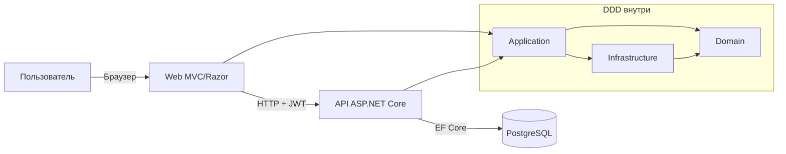

# Технический документ (RU)

## 1. Введение
Этот документ описывает технический дизайн **Escoles Publiques**.

Цели:
- объяснить архитектуру и границы DDD
- задокументировать настройку Web и API
- описать модель данных и аутентификацию
- описать сквозные аспекты (ошибки, наблюдаемость, тесты)

Демо-учетные данные:
- пользователь: `admin@admin.adm`
- пароль: `admin123`

## 2. Общая архитектура (Web + API + DDD)

Основной поток:
1. Пользователь входит в Web (cookie auth)
2. Web запрашивает JWT у API (`POST /api/auth/token`)
3. Токен сохраняется в сессии
4. Web вызывает API с `Authorization: Bearer <token>`

## 3. Структура DDD-проектов
- `src/Domain`: сущности, value objects, доменные исключения, контракты репозиториев
- `src/Application`: use cases, сервисы, CQRS handlers
- `src/Infrastructure`: EF Core, репозитории, миграции
- `src/Api`: REST-контроллеры, JWT, CORS, swagger, middleware
- `src/Web`: MVC UI, локализация, API-клиенты

## 4. Доменная модель
Основные сущности:
- `School`
- `Student`
- `Enrollment`
- `AnnualFee`
- `Scope`
- `User`

Ключевые связи:
- School 1..N Students
- Student 1..N Enrollments
- Enrollment 1..N AnnualFees
- Scope 1..N Schools
- User 0..1 Student

## 5. Аутентификация и авторизация
- Web использует cookie-аутентификацию.
- API использует JWT bearer.
- Роли: `ADM` и `USER`.
- При неавторизованном доступе выполняется logout и повторный вход.

## 6. Контракт ошибок
API возвращает `application/problem+json` с полями:
- `errorCode`
- `traceId`
- `timestamp`
- `fieldErrors` (для валидации)

Стандартные коды:
- validation -> 400
- duplicate -> 409
- not found -> 404
- unauthorized -> 401
- unhandled -> 500

## 7. Value Objects и инварианты
Инварианты обеспечиваются через:
- `SchoolCode`
- `EmailAddress`
- `MoneyAmount`

Преимущества:
- централизованная валидация
- консистентность данных
- меньше защитной логики в контроллерах

## 8. CQRS (легковесный)
Модуль Schools разделяет запись и чтение:
- Commands: create/update/delete
- Queries: get by id/list/get by code

Это упрощает тестирование и сопровождение.

## 9. Наблюдаемость
Сквозной middleware:
- `CorrelationIdMiddleware` (`X-Correlation-ID`)
- `RequestMetricsMiddleware` (счетчик + latency)
- глобальный middleware исключений

Логи структурированы и привязаны к trace.

## 10. Персистентность
- PostgreSQL + EF Core
- миграции в `Infrastructure`
- паттерн repository
- snake_case для маппинга БД

## 11. Web-слой
- Razor views и MVC контроллеры
- локализация `.resx`
- SignalR для real-time
- переиспользуемые JS/CSS компоненты

## 12. Стратегия тестирования
- unit-тесты для domain/application/controllers/helpers
- integration-тесты ключевых потоков
- risk-based critical suite
- coverage gates в CI

## 13. Gates в CI/CD
Порог покрытия по слоям:
- Domain
- Application
- Infrastructure
- Web
- Api

Перед merge build и tests должны быть зелеными.

## 14. Эксплуатационные заметки
- локальный workflow ориентирован на Docker
- debug-профили упрощены до Docker attach
- help center: multilingual markdown + DOCX export
- рекомендация: обновлять код и документацию в одном PR
