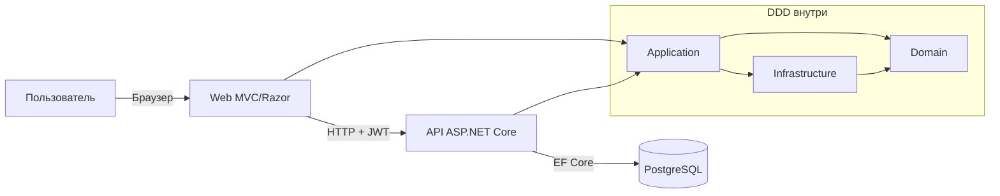
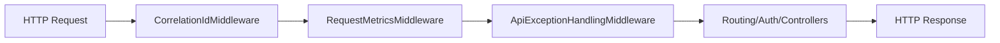
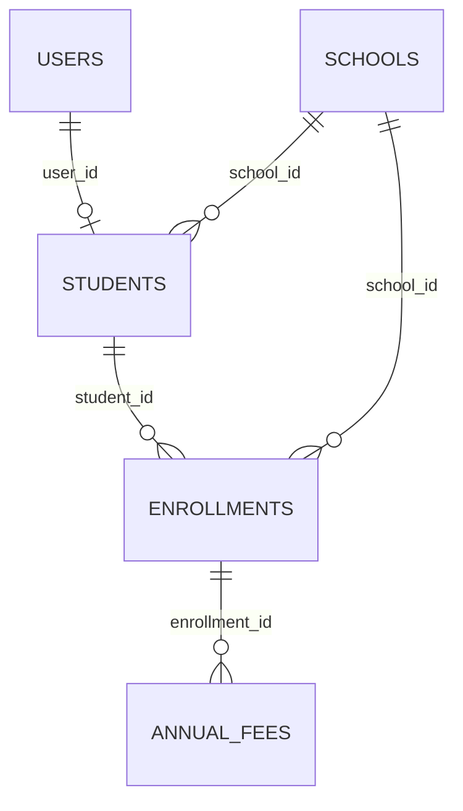

# Технический документ (RU)

## 1. Введение
Документ описывает техническую реализацию **Escoles Publiques**.

Цели:
- объяснить архитектуру и границы DDD
- задокументировать реализацию Web и API
- зафиксировать используемые паттерны, библиотеки и решения
- описать модель данных, связи и аутентификацию
- описать сквозные утилиты (helpers, JS, CSS)

Демо-доступ:
- пользователь: `admin@admin.adm`
- пароль: `admin123`

## 2. Общая архитектура (Web + API + DDD)



Основной поток:
1. Вход в Web (`CookieAuth`).
2. Web запрашивает JWT у API (`POST /api/auth/token`).
3. JWT сохраняется в серверной сессии.
4. Web вызывает API с `Authorization: Bearer <token>`.

## 3. DDD-структура

Проекты и зоны ответственности:
- `src/Domain`: сущности, правила домена, контракты репозиториев, value objects, доменные исключения.
- `src/Application`: use cases, оркестрация сервисов, CQRS commands/queries/handlers.
- `src/Infrastructure`: EF Core persistence, реализации репозиториев, миграции.
- `src/Api`: REST-вход, JWT, CORS, Swagger, middleware pipeline.
- `src/Web`: MVC/Razor-вход, локализация, API-клиенты, UI assets.

### 3.1 Расширенное дерево решения (технический вид)

```text
src/
├── Api/
│   ├── Controllers/
│   ├── Services/
│   │   ├── CorrelationIdMiddleware.cs
│   │   ├── RequestMetricsMiddleware.cs
│   │   ├── ApiExceptionHandlingMiddleware.cs
│   │   └── DbSeeder.cs
│   └── Program.cs
├── Application/
│   ├── Interfaces/
│   ├── UseCases/
│   │   ├── Services/
│   │   ├── Schools/Commands/
│   │   └── Schools/Queries/
│   └── DTOs/
├── Domain/
│   ├── Entities/
│   ├── Interfaces/
│   ├── ValueObjects/
│   └── DomainExceptions/
├── Infrastructure/
│   ├── SchoolDbContext.cs
│   ├── Persistence/Repositories/
│   └── Migrations/
├── Web/
│   ├── Controllers/
│   ├── Services/Api/
│   ├── Services/Search/
│   ├── Helpers/ModalConfigFactory.cs
│   ├── ModelBinders/FlexibleDecimalModelBinder.cs
│   ├── Hubs/SchoolHub.cs
│   ├── Views/
│   ├── Resources/
│   ├── HelpDocs/
│   ├── wwwroot/js/
│   ├── wwwroot/css/
│   └── Program.cs
└── UnitTest/
    ├── Controllers/
    ├── Services/
    ├── Infrastructure/
    ├── Validators/
    └── Helpers/
```

## 4. Web-слой
- ASP.NET Core MVC + Razor Views.
- cookie auth + server-side session для API JWT.
- typed `HttpClient` клиенты к API.
- локализация через `.resx` и переключатель языка.
- SignalR для обновлений в реальном времени.

## 5. API-слой (включая Swagger)
- ASP.NET Core Web API.
- JWT bearer authentication.
- авторизация по ролям/claims.
- CORS по окружению.
- EF Core migrations на старте.

Swagger:
- пакет: `Swashbuckle.AspNetCore`
- UI: `/api` при `Swagger__Enabled=true`
- OpenAPI JSON: `/swagger/v1/swagger.json`
- security scheme: `Bearer`

## 6. Pipeline middleware API (реальный порядок)
1. `CorrelationIdMiddleware`
2. `RequestMetricsMiddleware`
3. `ApiExceptionHandlingMiddleware`
4. `UseHttpsRedirection`
5. `UseRouting`
6. `UseCors("DefaultCors")`
7. `UseAuthentication`
8. `UseAuthorization`
9. `MapControllers`



Детали middleware:
- `CorrelationIdMiddleware`: прокидывает/генерирует `X-Correlation-ID`, задаёт `TraceIdentifier`.
- `RequestMetricsMiddleware`: пишет счётчик и latency (`api_requests_total`, `api_request_duration_ms`).
- `ApiExceptionHandlingMiddleware`: маппит исключения в `ProblemDetails` (`400/401/404/409/500`) с `errorCode`, `traceId`, `timestamp`.

## 7. Используемые паттерны
- Repository Pattern (`Infrastructure/Persistence/Repositories/*`).
- Service Layer Pattern (`Application/UseCases/Services/*`).
- Lightweight CQRS для агрегата `School`.
- Strategy Pattern в источниках поиска (`ISchoolSearchSource`, `IStudentSearchSource`, и т.д.).
- Builder Pattern (`SearchResultsBuilder`).
- Factory Pattern (`ModalConfigFactory`).
- Fail-Fast в startup (например, CORS для production).
- Global Exception Mapping через middleware.

## 8. Библиотеки и фреймворки
API:
- `Microsoft.AspNetCore.Authentication.JwtBearer`
- `Npgsql.EntityFrameworkCore.PostgreSQL`
- `Swashbuckle.AspNetCore`

Application:
- `AutoMapper`
- `AutoMapper.Extensions.Microsoft.DependencyInjection`

Web:
- `FluentValidation.AspNetCore`
- `Markdig`
- `DocumentFormat.OpenXml`
- `Serilog.AspNetCore`
- `Serilog.Sinks.File`

## 9. Модель базы данных
СУБД: PostgreSQL.

Ключевые таблицы:
- `schools`
- `scope_mnt`
- `users`
- `students`
- `enrollments`
- `annual_fees`
- `__EFMigrationsHistory`



## 10. Жизненный цикл аутентификации
Web:
- login через cookie auth.
- JWT API хранится в session.

API:
- проверка credentials.
- выпуск подписанного JWT.

Цикл:
1. login в Web.
2. запрос токена API.
3. сохранение в session.
4. инъекция токена в каждый запрос.
5. при 401/403 -> принудительный logout.

## 11. Helpers и утилиты
- `ModalConfigFactory`: централизованная конфигурация CRUD modal.
- `ApiAuthTokenHandler` (`DelegatingHandler`): JWT injection + unauthorized handling.
- `ApiResponseHelper`: централизованная проверка HTTP response.
- `NormalizePg(...)` в `Program.cs` (Web/API): преобразование `postgres://...` в Npgsql connection string.
- `ToSnakeCase(...)` в `SchoolDbContext`: глобальная naming-конвенция БД.

Внутренние helper-методы middleware ошибок:
- `CreateProblem(...)`
- `EnrichProblem(...)`
- `WriteProblem(...)`

## 12. Зона JavaScript и CSS
JavaScript (`src/Web/wwwroot/js`):
- `entity-modal.js`, `generic-table.js`, `signalr-connection.js`, `save-cancel-buttons.js`, `i18n.js`, модульные скрипты.

CSS (`src/Web/wwwroot/css`):
- `davidgov-theme.css`, `login.css`, `search-results.css`, `generic-table.css`, `user-dashboard.css`.

## 13. Стратегия тестирования
- unit tests для domain/application/controllers/helpers.
- интеграционные проверки критических потоков.
- архитектурные тесты на DDD dependency boundaries.

## 14. Операционные заметки
- Docker-first локальный workflow.
- структурированный logging через Serilog.
- мультиязычный help center (Markdown -> HTML + DOCX).
- синхронизировать docs и code в одном PR.
