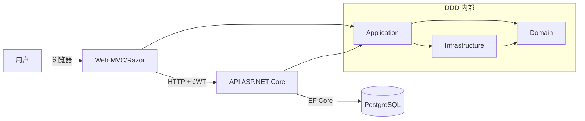
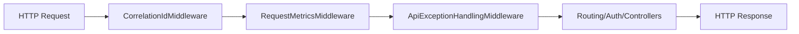
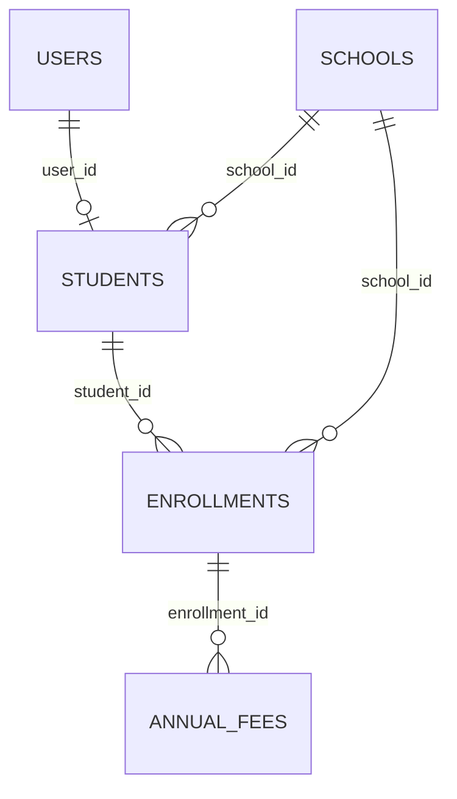

# 技术文档 (ZH)

## 1. 介绍
本文档说明 **Escoles Publiques** 的技术实现。

目标：
- 说明架构与 DDD 边界
- 记录 Web 与 API 的实现方式
- 追踪使用的模式、库与技术决策
- 描述数据模型、关系与认证机制
- 说明横切工具（helpers、JS、CSS）

演示账号：
- 用户：`admin@admin.adm`
- 密码：`admin123`

## 2. 总体架构（Web + API + DDD）



主流程：
1. 用户在 Web 登录（`CookieAuth`）。
2. Web 向 API 请求 JWT（`POST /api/auth/token`）。
3. JWT 存入服务器会话。
4. Web 使用 `Authorization: Bearer <token>` 调用 API。

## 3. DDD 结构

项目与职责：
- `src/Domain`：实体、领域规则、仓储契约、值对象、领域异常。
- `src/Application`：用例、服务编排、CQRS commands/queries/handlers。
- `src/Infrastructure`：EF Core 持久化、仓储实现、迁移。
- `src/Api`：REST 入口、JWT、CORS、Swagger、中间件管线。
- `src/Web`：MVC/Razor 入口、本地化、API 客户端、前端资源。

### 3.1 解决方案扩展树（技术视图）

```text
src/
├── Api/
│   ├── Controllers/
│   ├── Services/
│   │   ├── CorrelationIdMiddleware.cs
│   │   ├── RequestMetricsMiddleware.cs
│   │   ├── ApiExceptionHandlingMiddleware.cs
│   │   └── DbSeeder.cs
│   └── Program.cs
├── Application/
│   ├── Interfaces/
│   ├── UseCases/
│   │   ├── Services/
│   │   ├── Schools/Commands/
│   │   └── Schools/Queries/
│   └── DTOs/
├── Domain/
│   ├── Entities/
│   ├── Interfaces/
│   ├── ValueObjects/
│   └── DomainExceptions/
├── Infrastructure/
│   ├── SchoolDbContext.cs
│   ├── Persistence/Repositories/
│   └── Migrations/
├── Web/
│   ├── Controllers/
│   ├── Services/Api/
│   ├── Services/Search/
│   ├── Helpers/ModalConfigFactory.cs
│   ├── ModelBinders/FlexibleDecimalModelBinder.cs
│   ├── Hubs/SchoolHub.cs
│   ├── Views/
│   ├── Resources/
│   ├── HelpDocs/
│   ├── wwwroot/js/
│   ├── wwwroot/css/
│   └── Program.cs
└── UnitTest/
    ├── Controllers/
    ├── Services/
    ├── Infrastructure/
    ├── Validators/
    └── Helpers/
```

## 4. Web 层
- ASP.NET Core MVC + Razor Views。
- cookie auth + server session 保存 API JWT。
- 通过 typed `HttpClient` 调用 API。
- 使用 `.resx` 本地化与语言切换。
- 使用 SignalR 进行实时更新。

## 5. API 层（含 Swagger）
- ASP.NET Core Web API。
- JWT bearer 认证。
- 基于角色/claims 授权。
- 按环境配置 CORS。
- 启动时应用 EF Core migrations。

Swagger：
- 包：`Swashbuckle.AspNetCore`
- UI：`/api`（当 `Swagger__Enabled=true`）
- OpenAPI JSON：`/swagger/v1/swagger.json`
- 安全方案：`Bearer`

## 6. API 中间件管线（真实顺序）
1. `CorrelationIdMiddleware`
2. `RequestMetricsMiddleware`
3. `ApiExceptionHandlingMiddleware`
4. `UseHttpsRedirection`
5. `UseRouting`
6. `UseCors("DefaultCors")`
7. `UseAuthentication`
8. `UseAuthorization`
9. `MapControllers`



中间件说明：
- `CorrelationIdMiddleware`：透传或生成 `X-Correlation-ID`，设置 `TraceIdentifier`。
- `RequestMetricsMiddleware`：记录请求总数与耗时（`api_requests_total`、`api_request_duration_ms`）。
- `ApiExceptionHandlingMiddleware`：将异常映射为 `ProblemDetails`（`400/401/404/409/500`），并包含 `errorCode`、`traceId`、`timestamp`。

## 7. 使用的设计模式
- Repository Pattern（`Infrastructure/Persistence/Repositories/*`）。
- Service Layer Pattern（`Application/UseCases/Services/*`）。
- 面向 `School` 聚合的轻量 CQRS。
- 搜索来源中的 Strategy Pattern（`ISchoolSearchSource`、`IStudentSearchSource` 等）。
- Builder Pattern（`SearchResultsBuilder`）。
- Factory Pattern（`ModalConfigFactory`）。
- 启动阶段 Fail-Fast（如生产 CORS 校验）。
- 通过 middleware 的全局异常映射。

## 8. 库与框架
API：
- `Microsoft.AspNetCore.Authentication.JwtBearer`
- `Npgsql.EntityFrameworkCore.PostgreSQL`
- `Swashbuckle.AspNetCore`

Application：
- `AutoMapper`
- `AutoMapper.Extensions.Microsoft.DependencyInjection`

Web：
- `FluentValidation.AspNetCore`
- `Markdig`
- `DocumentFormat.OpenXml`
- `Serilog.AspNetCore`
- `Serilog.Sinks.File`

## 9. 数据库模型
引擎：PostgreSQL。

核心表：
- `schools`
- `scope_mnt`
- `users`
- `students`
- `enrollments`
- `annual_fees`
- `__EFMigrationsHistory`



## 10. 认证生命周期
Web：
- 使用 cookie auth 登录。
- API JWT 存在 session 中。

API：
- 校验凭证。
- 发行签名 JWT。

流程：
1. Web 登录。
2. 请求 API token。
3. 存入 session。
4. 每次请求注入 token。
5. 遇到 401/403 -> 强制登出。

## 11. Helpers 与技术工具
- `ModalConfigFactory`：集中化 CRUD 模态框配置。
- `ApiAuthTokenHandler`（`DelegatingHandler`）：JWT 注入与 unauthorized 处理。
- `ApiResponseHelper`：集中化 HTTP 响应校验。
- `NormalizePg(...)`（Web/API 的 `Program.cs`）：将 `postgres://...` 转换为 Npgsql connection string。
- `ToSnakeCase(...)`（`SchoolDbContext`）：统一数据库命名约定。

错误中间件的内部 helper：
- `CreateProblem(...)`
- `EnrichProblem(...)`
- `WriteProblem(...)`

## 12. JavaScript 与 CSS 范围
JavaScript（`src/Web/wwwroot/js`）：
- `entity-modal.js`、`generic-table.js`、`signalr-connection.js`、`save-cancel-buttons.js`、`i18n.js` 及模块脚本。

CSS（`src/Web/wwwroot/css`）：
- `davidgov-theme.css`、`login.css`、`search-results.css`、`generic-table.css`、`user-dashboard.css`。

## 13. 测试策略
- domain/application/controllers/helpers 的单元测试。
- 关键流程的集成覆盖。
- DDD 依赖边界的架构测试。

## 14. 运维说明
- Docker-first 本地工作流。
- 使用 Serilog 结构化日志。
- 多语言帮助中心（Markdown -> HTML + DOCX）。
- 文档与代码在同一 PR 中同步更新。
