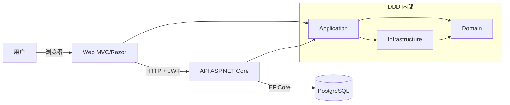

# 技术文档 (ZH)

## 1. 介绍
本文档说明 **Escoles Publiques** 的技术设计。

目标：
- 说明系统架构与 DDD 边界
- 记录 Web 与 API 的配置方式
- 描述数据模型与认证机制
- 说明横切能力（错误处理、可观测性、测试）

演示账号：
- 用户：`admin@admin.adm`
- 密码：`admin123`

## 2. 总体架构（Web + API + DDD）

主流程：
1. 用户在 Web 登录（cookie auth）
2. Web 向 API 请求 JWT（`POST /api/auth/token`）
3. Token 存入会话
4. Web 使用 `Authorization: Bearer <token>` 调用 API

## 3. DDD 项目结构
- `src/Domain`：实体、值对象、领域异常、仓储契约
- `src/Application`：用例、服务、CQRS handlers
- `src/Infrastructure`：EF Core、仓储实现、迁移
- `src/Api`：REST 控制器、JWT、CORS、swagger、中间件
- `src/Web`：MVC 界面、本地化、API 客户端

## 4. 领域模型
核心实体：
- `School`
- `Student`
- `Enrollment`
- `AnnualFee`
- `Scope`
- `User`

关键关系：
- School 1..N Students
- Student 1..N Enrollments
- Enrollment 1..N AnnualFees
- Scope 1..N Schools
- User 0..1 Student

## 5. 认证与授权
- Web 使用 Cookie 认证。
- API 使用 JWT Bearer 认证。
- 角色模型：`ADM` 与 `USER`。
- 未授权访问会触发登出并重新登录。

## 6. 错误契约
API 返回 `application/problem+json`，包含：
- `errorCode`
- `traceId`
- `timestamp`
- `fieldErrors`（验证错误）

标准映射：
- validation -> 400
- duplicate entity -> 409
- not found -> 404
- unauthorized -> 401
- unhandled -> 500

## 7. 值对象与不变式
通过以下值对象保证业务不变式：
- `SchoolCode`
- `EmailAddress`
- `MoneyAmount`

收益：
- 验证集中化
- 数据一致性更好
- 控制器中防御性逻辑更少

## 8. CQRS（轻量）
Schools 模块将读写分离：
- Commands：create/update/delete
- Queries：get by id/list/get by code

职责更清晰，可测试性更好。

## 9. 可观测性
已实现横切中间件：
- `CorrelationIdMiddleware`（`X-Correlation-ID`）
- `RequestMetricsMiddleware`（请求计数 + 延迟）
- 全局异常中间件

日志为结构化并带 trace 关联。

## 10. 持久化
- PostgreSQL + EF Core
- 迁移位于 `Infrastructure`
- Repository 模式
- 数据库映射采用 snake_case 约定

## 11. Web 层
- Razor 视图与 MVC 控制器
- `.resx` 本地化
- SignalR 实时更新
- 可复用 JS/CSS 组件

## 12. 测试策略
- domain/application/controllers/helpers 单元测试
- 关键流程集成测试
- 基于风险的关键流程测试集
- CI 覆盖率门禁

## 13. CI/CD 质量门禁
按层设置覆盖率阈值：
- Domain
- Application
- Infrastructure
- Web
- Api

合并前必须通过 build 与 tests。

## 14. 运维说明
- 本地开发采用 Docker-first
- 调试配置已简化为 Docker attach
- 帮助中心支持多语言 markdown 与 DOCX 导出
- 建议代码与文档在同一 PR 同步更新
