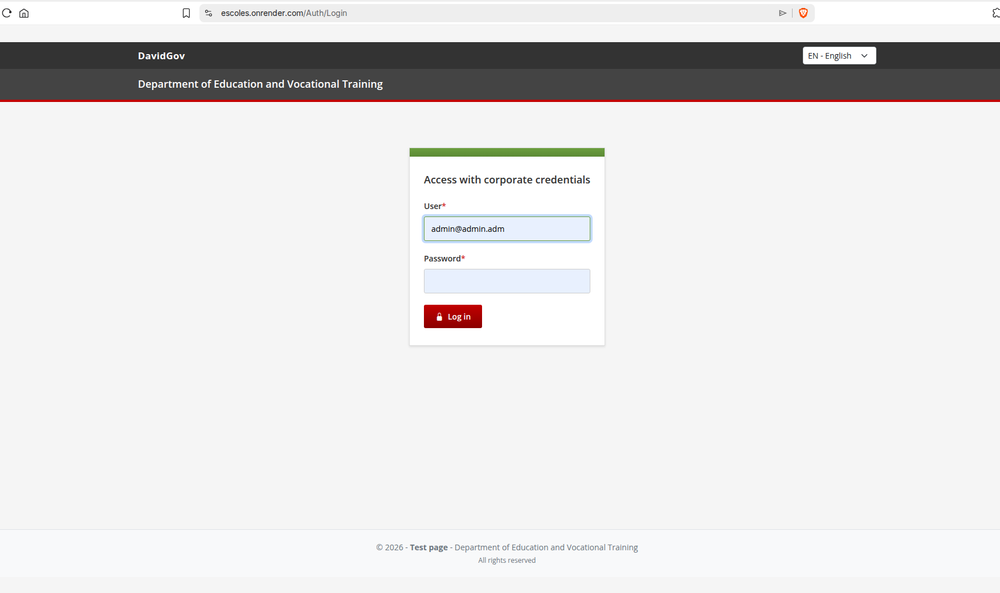
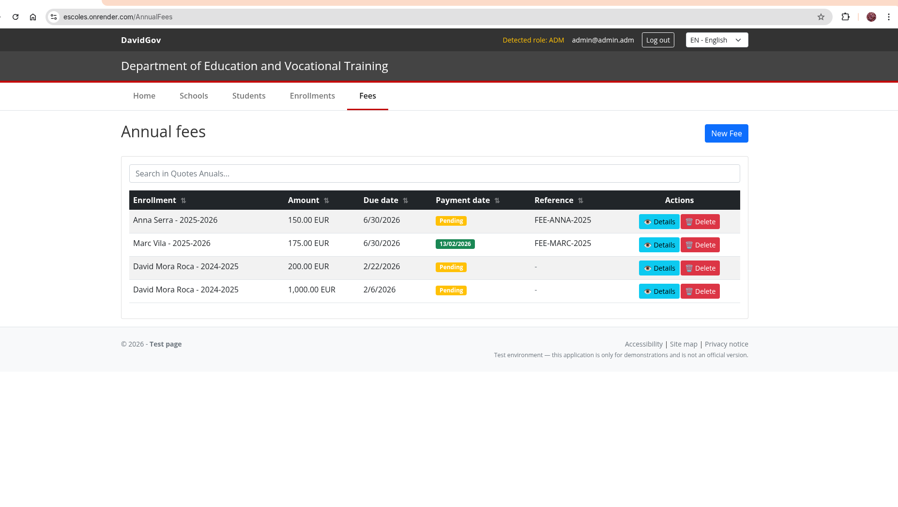

# 用户手册 (ZH)

## 1. 介绍
本手册说明如何使用 “Escoles Publiques” Web 应用。

适用对象：
- 管理员（`ADM`）
- 最终用户（`USER`，权限受限）

使用要求：
- 现代浏览器
- 有效账号凭据

## 1.1 数据保护（重要）
- 文档中不要包含真实个人数据（姓名/邮箱/ID）。
- 截图请使用测试数据，分享前对敏感信息做模糊或打码处理。
- 此仓库不应包含带有真实数据的截图。

## 2. 登录
1. 打开登录页面。
2. 输入邮箱和密码。
3. 点击“登录”。

截图：

## 3. 导航
管理员主菜单：
- 首页、学校、学生、注册、年度费用

语言选择器：
- 在顶部栏选择语言（通过 cookie 持久化）

## 4. 学校（ADM）
- 列表/搜索/排序
- 新增/编辑/删除
- 收藏与范围（scope）分配

## 5. 学生（ADM）
- 新增/编辑/删除
- 可按邮箱复用已有用户

## 6. 注册（ADM）
- 新增/编辑/删除注册（学年、课程、状态）

## 7. 年度费用（ADM）
创建流程：
1. 进入“年度费用”。
2. 点击“新建”（打开模态框）。
3. 选择注册记录，输入金额与到期日。
4. 勾选隐私确认并保存。

小数格式：
- 金额支持 `1000,25` 和 `1000.25`

截图：

## 附录：截图索引（顺序）
1. `docs/codex_images_real/en/login-admin.png`
2. `docs/codex_images_real/en/inici-top.png`
3. `docs/codex_images_real/en/inici-down.png`
4. `docs/codex_images_real/en/escoles.png`
5. `docs/codex_images_real/en/escoles-crear.png`
6. `docs/codex_images_real/en/escoles-detall.png`
7. `docs/codex_images_real/en/escoles-edit.png`
8. `docs/codex_images_real/en/estudiants.png`
9. `docs/codex_images_real/en/inscripcions.png`
10. `docs/codex_images_real/en/quotes-anuals.png`
11. `docs/codex_images_real/en/quotes-anuals-crear.png`
12. `docs/codex_images_real/en/quotes-anuals-edit.png`

## 8. FAQ
- 未授权：会话已过期，请重新登录
- 必填字段缺失：请补全必填项
