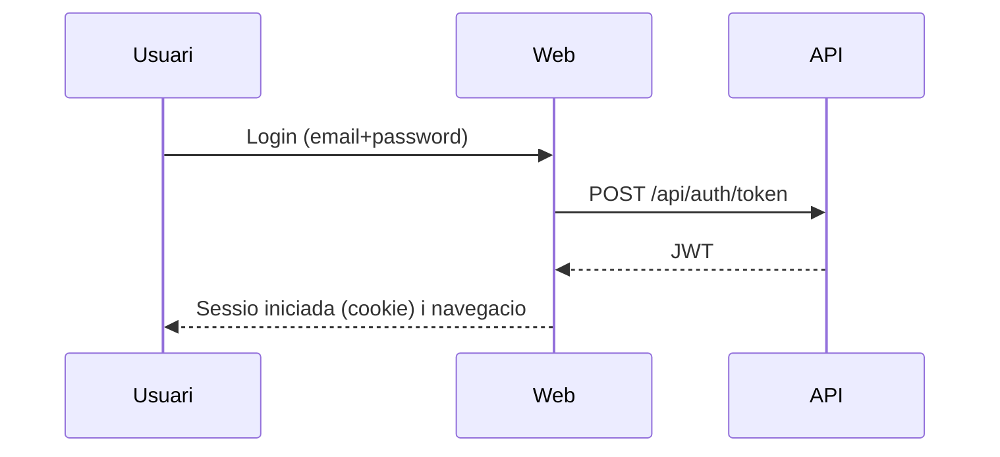

# Document funcional (CA)

## 1. Resum executiu
L'aplicacio "Escoles Publiques" permet gestionar un conjunt d'entitats relacionades amb escoles i alumnat:
- escoles
- alumnes
- inscripcions (per curs/any academic)
- quotes anuals associades a una inscripcio
- ambits (scopes): Infantil, Primaria, Secundaria, FP

El sistema es composa d'una web (interficie d'usuari) i una API (serveis). La web consumeix l'API.

Abast:
- gestio CRUD (crear, editar, eliminar) d'escoles, alumnes, inscripcions i quotes anuals
- cerca i filtratge per ambit
- autenticacio i control d'acces per rols
- multiidioma i disseny responsive

Fora d'abast (a data d'aquest document):
- gestio avancada de permisos (mes enlla de `ADM`/`USER`)
- integracions externes (correu, notificacions push, etc.)
- importacions massives de dades oficials

## 1.1 Diagrames
### 1.1.1 Context del sistema
```mermaid
flowchart LR
  U[Usuari] -->|Navegador| W[Web (MVC/Razor)]
  W -->|HTTP + JWT| A[API (REST)]
  A -->|EF Core| DB[(PostgreSQL)]
```

### 1.1.2 Flux de login (alt nivell)


## 2. Actors i rols
### 2.1 Rol `ADM` (administrador)
Pot accedir a tot el sistema:
- administracio d'escoles, alumnes, inscripcions i quotes
- accions de manteniment (p. ex. seeding en entorns controlats)

### 2.2 Rol `USER` (usuari)
Usuari final associat a un alumne. En general:
- accedeix al seu dashboard i informacio relacionada
- no te acces a operacions administratives

## 3. Fluxos principals (casos d'us)
### 3.1 Autenticacio
1. L'usuari entra a la pagina de login.
2. Introdueix correu i contrasenya.
3. El sistema valida credencials i inicia sessio.
4. El rol de l'usuari condiciona la navegacio i funcionalitats visibles.

### 3.2 Canvi d'idioma
1. L'usuari selecciona idioma al selector superior.
2. La pagina es recarrega amb el nou idioma.
3. La seleccio es persisteix (cookie) per a les seguents navegacions.

Idiomes disponibles:
- catala, espanyol, angles, alemany, frances, rus, xines

### 3.3 Gestio d'escoles (ADM)
Funcions:
- llistar, cercar i ordenar escoles
- crear escola
- editar escola
- eliminar escola
- marcar com a favorita
- assignar ambit (scope)

Dades principals d'una escola:
- codi (obligatori)
- nom (obligatori)
- ciutat (opcional)
- favorita (boolea)
- ambit (opcional)

### 3.4 Gestio d'alumnes (ADM)
Funcions:
- llistar, cercar i ordenar alumnes
- crear alumne (crea o reutilitza un usuari per email)
- editar alumne i/o usuari associat
- eliminar alumne

Relacio alumne <-> usuari:
- un alumne pot tenir un usuari associat (per login)
- un usuari pot estar associat a un unic alumne

### 3.5 Inscripcions (ADM)
Funcions:
- crear inscripcio per un alumne (any academic, curs opcional, estat, data d'inscripcio)
- editar inscripcio
- eliminar inscripcio

### 3.6 Quotes anuals (ADM)
Funcions:
- crear quota anual per una inscripcio
- editar quota anual
- eliminar quota anual
- marcar com a pagada (assigna data de pagament)

### 3.7 Cerca (ADM)
Des de l'inici es pot:
- cercar per text (escoles/alumnes/inscripcions/quotes segons implementacio)
- filtrar per ambit (scope) clicant a les targetes d'ambit

## 4. Regles de negoci (resum)
### 4.1 Validacions i obligatorietats
- Escola: `Code` i `Name` obligatoris
- Usuari: `Email` unic
- Inscripcio: `StudentId`, `AcademicYear`, `Status`, `SchoolId` obligatoris
- Quota anual: `EnrollmentId`, `Amount`, `Currency`, `DueDate` obligatoris
- Interficie de quotes: cal acceptar condicions de privacitat per enviar formularis (checkbox)

### 4.2 Regles de pagament
- Si una quota es marca com a pagada, es guarda la data de pagament (`PaidAt`)
- La referencia de pagament es opcional

### 4.3 Seguretat
- Totes les pantalles requereixen autenticacio
- Algunes operacions de manteniment requereixen rol `ADM`

## 5. Requisits no funcionals (breu)
- Multiidioma (CA/ES/EN/DE/FR/RU/ZH)
- Disseny responsive per mobil i tablet
- Logs d'operacio (per troubleshooting)
- Persistencia: PostgreSQL

## 6. Criteris d'acceptacio (checklist)
- Login amb usuari admin funciona
- Llistats: escoles/alumnes/inscripcions/quotes carreguen sense errors
- CRUD d'escoles funciona
- CRUD d'alumnes funciona i respecta email unic
- CRUD d'inscripcions funciona
- CRUD de quotes anuals funciona i accepta decimals (`1,25` i `1.25`)
- Selector d'idioma canvia textos correctament
- Navegacio i taules es veuen be en mobil (sense trencar layout)
