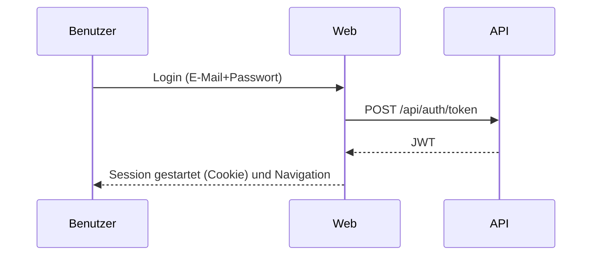

# Fachliches Dokument (DE)

## 1. Zusammenfassung
"Escoles Publiques" verwaltet:
- Schulen
- Schuler/innen
- Einschreibungen (pro Schuljahr/Kurs)
- Jahresgebuhren, die einer Einschreibung zugeordnet sind
- Bereiche (Scopes): Infantil, Primaria, Secundaria, FP

Das System besteht aus Web-UI und API. Die Web-UI nutzt die API.

Im Umfang:
- CRUD fur Schulen, Schuler/innen, Einschreibungen und Jahresgebuhren
- Suche und Filter nach Bereich (Scope)
- Authentifizierung und Rollen (`ADM`/`USER`)
- Mehrsprachigkeit und responsives Design

## 1.1 Diagramme
### 1.1.1 Systemkontext
```mermaid
flowchart LR
  U[Benutzer] -->|Browser| W[Web (MVC/Razor)]
  W -->|HTTP + JWT| A[API (REST)]
  A -->|EF Core| DB[(PostgreSQL)]
```

### 1.1.2 Login-Flow (High Level)


## 2. Rollen
- `ADM`: Administrator, voller Zugriff
- `USER`: Endnutzer, eingeschrankter Zugriff (Dashboard und eigene Daten)

## 3. Anwendungsfalle
### 3.1 Anmeldung
Login mit E-Mail und Passwort.

### 3.2 Sprache wechseln
Sprache in der oberen Leiste auswahlen (per Cookie gespeichert).

### 3.3 Schulen (ADM)
Listen, suchen, sortieren, erstellen, bearbeiten, loschen, Favoriten, Bereich zuordnen.

### 3.4 Schuler/innen (ADM)
Erstellen/bearbeiten/loschen; Benutzer kann uber E-Mail wiederverwendet werden.

### 3.5 Einschreibungen (ADM)
Erstellen/bearbeiten/loschen (Schuljahr, Kurs, Status).

### 3.6 Jahresgebuhren (ADM)
Erstellen/bearbeiten/loschen; als bezahlt markieren (Zahlungsdatum).

## 4. Fachliche Regeln (Kurzfassung)
- Schule: Code und Name sind Pflicht
- Benutzer: E-Mail eindeutig
- Einschreibung: Student, Schuljahr, Status und Schule sind Pflicht
- Jahresgebuhr: Einschreibung, Betrag, Wahrung, Falligkeit sind Pflicht
- Einige Formulare erfordern Zustimmung zur Datenschutz-Checkbox

## 5. Nicht-funktionale Anforderungen
- i18n (CA/ES/EN/DE/FR/RU/ZH)
- Responsive (Mobil/Tablet)
- Logging fur Betrieb/Support
- PostgreSQL Persistenz

## 6. Abnahmekriterien (Checkliste)
- Admin-Login funktioniert
- Listen laden ohne Fehler
- CRUD fur alle Entitaten funktioniert
- Betrag akzeptiert Dezimal mit `,` oder `.`
