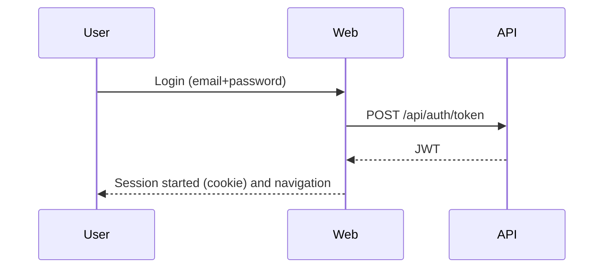

# Functional document (EN)

## 1. Executive summary
"Escoles Publiques" manages:
- schools
- students
- enrollments (by academic year / course)
- annual fees linked to an enrollment
- scopes (Infantil, Primaria, Secundaria, FP)

The system is split into a Web UI and an API. The Web consumes the API.

In scope:
- CRUD for schools, students, enrollments and annual fees
- search and filtering by scope
- authentication and role-based access (`ADM` / `USER`)
- multi-language UI and responsive design

Out of scope (at the time of writing):
- advanced permission model beyond `ADM`/`USER`
- external integrations (email/push notifications)
- massive imports from official datasets

## 1.1 Diagrams
### 1.1.1 System context
```mermaid
flowchart LR
  U[User] -->|Browser| W[Web (MVC/Razor)]
  W -->|HTTP + JWT| A[API (REST)]
  A -->|EF Core| DB[(PostgreSQL)]
```

### 1.1.2 Login flow (high level)


## 2. Actors and roles
### 2.1 `ADM` (administrator)
Full access to management screens and maintenance operations.

### 2.2 `USER` (user)
End-user linked to a student; typically limited access (dashboard and related information).

## 3. Main user flows (use cases)
### 3.1 Authentication
1. Open login page.
2. Enter email and password.
3. System validates credentials and starts a session.
4. Role determines available menus and actions.

### 3.2 Language switch
Select a language in the top bar; selection is persisted via cookie.

### 3.3 Schools management (ADM)
- List/search/sort
- Create/edit/delete
- Favorites
- Assign scope

### 3.4 Students management (ADM)
- Create/edit/delete
- Student can link to an existing user by email
- User-to-student relationship is one-to-one (optional)

### 3.5 Enrollments (ADM)
- Create/edit/delete enrollment
- Status: Active/Pending/Cancelled (depending on configuration)

### 3.6 Annual fees (ADM)
- Create/edit/delete annual fee for an enrollment
- Mark as paid (stores payment date)

### 3.7 Search (ADM)
Search by text and filter by scope (scope cards on the home page).

## 4. Business rules (summary)
- School: code and name are required
- User: email must be unique
- Enrollment: student, academic year, status, school are required
- Annual fee: enrollment, amount, currency, due date are required
- Some forms require accepting the privacy checkbox before submitting

## 5. Non-functional requirements (brief)
- i18n (CA/ES/EN/DE/FR/RU/ZH)
- responsive UI (mobile/tablet)
- operational logs for troubleshooting
- persistence: PostgreSQL

## 6. Acceptance checklist
- Admin login works
- All lists load (schools/students/enrollments/annual fees)
- CRUD works for all entities
- Amount supports decimals with comma or dot (e.g. `1,25` and `1.25`)
- Language selector works
- UI looks correct on mobile (no broken layout)
