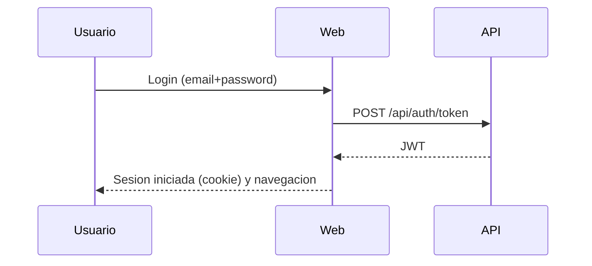

# Documento funcional (ES)

## 1. Resumen ejecutivo
La aplicacion "Escoles Publiques" permite gestionar entidades relacionadas con centros educativos:
- escuelas
- alumnos
- inscripciones (por curso/ano academico)
- cuotas anuales asociadas a una inscripcion
- ambitos (scopes): Infantil, Primaria, Secundaria, FP

El sistema se compone de una web (interfaz) y una API (servicios). La web consume la API.

Incluye:
- CRUD (crear/editar/eliminar) de escuelas, alumnos, inscripciones y cuotas
- busqueda y filtrado por ambito
- autenticacion y control de acceso por roles
- multiidioma y diseno responsive

Fuera de alcance (a la fecha de este documento):
- permisos avanzados mas alla de `ADM`/`USER`
- integraciones externas (correo, notificaciones, etc.)
- importaciones masivas desde fuentes oficiales

## 1.1 Diagramas
### 1.1.1 Contexto del sistema
```mermaid
flowchart LR
  U[Usuario] -->|Navegador| W[Web (MVC/Razor)]
  W -->|HTTP + JWT| A[API (REST)]
  A -->|EF Core| DB[(PostgreSQL)]
```

### 1.1.2 Flujo de login (alto nivel)


## 2. Roles
- `ADM`: administrador, acceso completo
- `USER`: usuario final, acceso limitado (dashboard y datos relacionados)

## 3. Casos de uso
### 3.1 Autenticacion
1. El usuario abre el login.
2. Introduce email y contrasena.
3. El sistema valida e inicia sesion.
4. El rol determina menus y acciones disponibles.

### 3.2 Cambio de idioma
Selector de idioma en la barra superior (se guarda por cookie).

### 3.3 Escuelas (ADM)
Listar/buscar/ordenar, crear, editar, borrar, marcar favorita y asignar ambito.

### 3.4 Alumnos (ADM)
Crear/editar/borrar. El usuario puede reutilizarse por email. Relacion opcional uno a uno usuario<->alumno.

### 3.5 Inscripciones (ADM)
Crear/editar/borrar (ano academico, curso opcional, estado).

### 3.6 Cuotas anuales (ADM)
Crear/editar/borrar y marcar como pagada (fecha de pago).

### 3.7 Busqueda (ADM)
Busqueda por texto y filtrado por ambito (tarjetas de ambito en inicio).

## 4. Reglas de negocio (resumen)
- Escuela: `Code` y `Name` obligatorios
- Usuario: email unico
- Inscripcion: alumno, ano academico, estado y escuela obligatorios
- Cuota anual: inscripcion, importe, moneda y vencimiento obligatorios
- Algunos formularios requieren aceptar checkbox de privacidad

## 5. Requisitos no funcionales
- i18n (CA/ES/EN/DE/FR/RU/ZH)
- responsive (movil/tablet)
- logs para soporte
- persistencia: PostgreSQL

## 6. Checklist de aceptacion
- Login admin funciona
- Listados cargan sin errores
- CRUD completo
- Importes aceptan decimales con `,` y `.`
- Selector de idioma funciona
- UI correcta en movil
