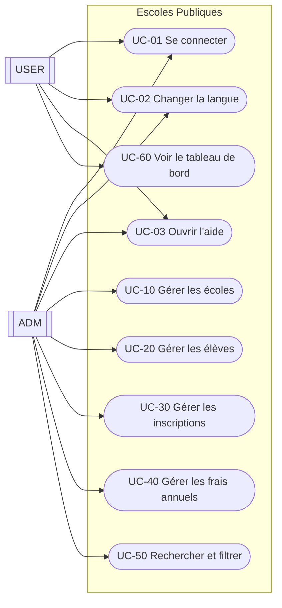
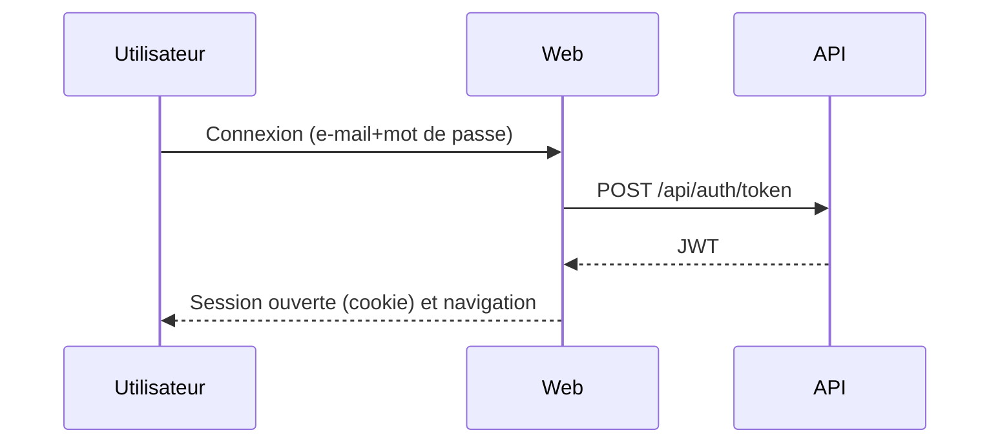

# Document fonctionnel (FR)

## 1. Résumé exécutif
« Escoles Publiques » permet de gérer :
- écoles
- élèves
- inscriptions (par année scolaire et cours)
- frais annuels (liés à une inscription)
- périmètres (scopes) pour classifier les écoles

Le système est divisé en une interface Web et une API. Le Web consomme l'API.

## 2. Portée
Dans le périmètre :
- CRUD des écoles, élèves, inscriptions et frais annuels
- attribution et filtrage par périmètre
- recherche sur l'accueil (texte + périmètre)
- authentification et accès par rôle (`ADM`/`USER`)
- sélecteur de langue et interface responsive
- centre d'aide (manuel utilisateur, fonctionnel, technique)

Hors périmètre (à la date de rédaction) :
- modèle d'autorisations avancé au-delà de `ADM`/`USER`
- intégrations externes (e-mail/notifications push)
- imports massifs depuis des jeux de données officiels

## 3. Acteurs et rôles
Acteurs :
- `ADM` (administrateur)
- `USER` (utilisateur final)

Rôles :
- `ADM` : accès complet aux fonctionnalités de gestion
- `USER` : accès limité (tableau de bord et informations associées)

## 4. Domaine (entités principales)
Entités :
- `School`
- `Student`
- `Enrollment`
- `AnnualFee`
- `Scope`
- `User`

Relations de haut niveau :
- une `School` a 0..N `Student`
- un `Student` a 0..N `Enrollment`
- un `Enrollment` a 0..N `AnnualFee`
- un `Scope` classe 0..N `School`
- un `User` peut être lié à 0..1 `Student` (1:1 optionnel)

## 5. Diagrammes

### 5.1 Contexte système
```mermaid
flowchart LR
  U[Utilisateur] -->|Navigateur| W[Web (MVC/Razor)]
  W -->|HTTP + JWT| A[API (REST)]
  A -->|EF Core| DB[(PostgreSQL)]
```

### 5.2 Cas d'utilisation (style UML)


### 5.3 Flux de connexion (haut niveau)


## 6. Catalogue de cas d'utilisation

### UC-01 Se connecter
Acteurs :
- `ADM`, `USER`

Flux principal :
1. Ouvrir la page de connexion.
2. Saisir e-mail et mot de passe.
3. Le système valide les identifiants.
4. La session démarre et l'utilisateur est redirigé selon son rôle.

### UC-02 Changer la langue
1. Sélectionner une langue dans la barre supérieure.
2. La page se recharge.
3. Le choix est persistant via cookie.

Langues :
- documentées : CA, ES, EN, DE, FR, RU, ZH

### UC-03 Ouvrir l'aide
1. Cliquer sur le bouton « Aide ».
2. Sélectionner un document : manuel utilisateur, fonctionnel ou technique.
3. Le système affiche le document dans la langue active.

### UC-10 Gérer les écoles (ADM)
Inclut : liste/recherche/tri, créer/modifier/supprimer, favoris, attribution de périmètre.

### UC-20 Gérer les élèves (ADM)
Inclut : CRUD ; réutilisation d'utilisateur par e-mail ; lien optionnel 1:1 user<->student.

### UC-30 Gérer les inscriptions (ADM)
Inclut : CRUD ; année scolaire et statut.

### UC-40 Gérer les frais annuels (ADM)
Inclut : CRUD ; marquer comme payé (enregistre la date de paiement).

Règles :
- certains formulaires exigent l'acceptation de la confidentialité
- le montant accepte les décimales avec virgule ou point

### UC-50 Rechercher et filtrer (ADM)
Recherche texte et filtrage par périmètre depuis l'accueil.

### UC-60 Voir le tableau de bord (USER)
Visualiser les informations spécifiques à l'utilisateur (inscriptions/frais liés).

## 7. Règles métier (résumé)
- École : code et nom obligatoires
- Utilisateur : e-mail unique
- Inscription : élève, école, année scolaire et statut
- Frais annuels : inscription, montant et date d'échéance

## 8. Exigences non fonctionnelles (bref)
- interface multilingue
- responsive (mobile/tablette)
- logs opérationnels pour diagnostic
- persistance : PostgreSQL

## 9. Critères d'acceptation (checklist)
- connexion admin et utilisateur fonctionnelle
- CRUD opérationnel pour toutes les entités
- recherche et filtre par périmètre fonctionnels
- montants acceptent `,` et `.`
- langue persistée et aide alignée sur la langue active
