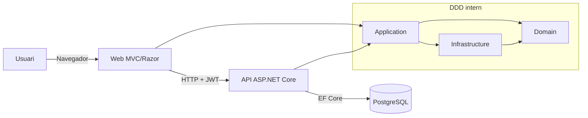
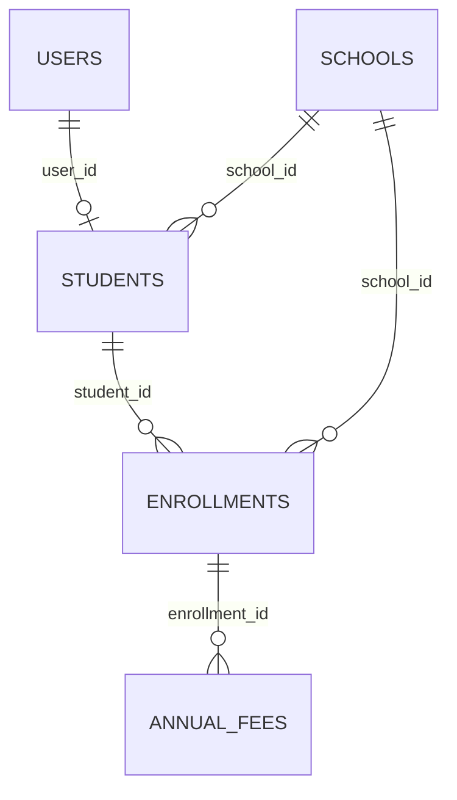

# Document tecnic (CA)

## 1. Introduccio
Aquest document descriu en profunditat com esta construida l'aplicacio **Escoles Publiques** a nivell tecnic.

Objectius:
- explicar arquitectura i estructura DDD
- documentar com hem muntat Web i API
- deixar traçabilitat de patrons, llibreries i decisions
- descriure model de dades, relacions i sistema d'autenticacio
- explicar utilitats transversals (helpers, JS, CSS)

Credencials de prova (entorn demo):
- usuari: `admin@admin.adm`
- contrasenya: `admin123`

## 2. Esquema general de l'app (Web + API + DDD)



Flux funcional principal:
1. Login a Web (`CookieAuth`)
2. Web demana token a API (`POST /api/auth/token`)
3. Token JWT es desa a sessio
4. Web consumeix API amb `Authorization: Bearer <token>`

## 3. Estructura DDD (com ho hem organitzat)

Projectes i responsabilitats:
- `src/Domain`
  - entitats i regles de domini
  - interfaces de repositori (`I*Repository`)
  - value objects / excepcions de domini
- `src/Application`
  - casos d'us (`*Service`)
  - contracts d'aplicacio (`I*Service`)
  - queries (p. ex. cerca agregada)
- `src/Infrastructure`
  - persistencia EF Core
  - implementacions de repositori
  - migrations
- `src/Api`
  - capa d'entrada REST (controllers API)
  - auth JWT, Swagger, CORS, seed
- `src/Web`
  - capa d'entrada MVC/Razor
  - UI, localitzacio, clients HTTP cap a API

Arbre resum de la solucio (vista tecnica):
```text
src/
├── Domain/          # nucli de domini (entitats, value objects, contracts)
├── Application/     # casos d'us, serveis d'aplicacio, queries
├── Infrastructure/  # EF Core, repositories, migrations, persistencia
├── Api/             # endpoints REST, JWT, Swagger, CORS, seed
├── Web/             # MVC/Razor, i18n, Help, JS/CSS, clients API
└── UnitTest/        # tests unitaris i d'integracio
```

Regla clau de dependencies:
- `Domain` no depen de cap altra capa
- `Application` depen de `Domain`
- `Infrastructure` implementa contracts de `Domain`/`Application`
- `Web` i `Api` orquestren i fan DI

## 4. Com hem muntat la Web

Base tecnica:
- ASP.NET Core MVC + Razor Views (`src/Web/Views`)
- autenticacio per cookie (`CookieAuth`)
- sessio server-side per guardar el JWT de l'API
- localitzacio per `resx` + selector d'idioma a capcalera
- clients typed `HttpClient` per consumir API

Peces destacades:
- Controllers MVC: `src/Web/Controllers/*`
- Handler auth API: `src/Web/Services/Api/ApiAuthTokenHandler.cs`
- Binder decimal flexible: `src/Web/ModelBinders/FlexibleDecimalModelBinder.cs`
- Ajuda web (manual/funcional/tecnic): `src/Web/Controllers/HelpController.cs`

## 5. Com hem muntat la API (incloent Swagger)

Base tecnica:
- ASP.NET Core Web API (`src/Api`)
- autenticacio `JwtBearer`
- autoritzacio per rol/claims
- CORS configurable per entorn
- EF Core amb migrations auto a startup

Swagger:
- paquet `Swashbuckle.AspNetCore`
- UI a `/api` quan `Swagger__Enabled=true`
- JSON OpenAPI a `/swagger/v1/swagger.json`
- esquema `Bearer` configurat per provar endpoints protegits

Exemple d'endpoint de login:
- `POST /api/auth/token` retorna JWT

## 6. Patrons utilitzats (amb exemples i lectura line-by-line)

### 6.1 Repository + Service
Idea:
- repositori: accés a dades
- servei aplicacio: regles i orquestracio

Exemple repositori (`StudentRepository`):
```csharp
1  public async Task<IEnumerable<Student>> GetAllAsync()
2  {
3      return await _context.Students
4          .Include(s => s.School)
5          .Include(s => s.User)
6          .ToListAsync();
7  }
```
Lectura:
1. signatura async
2. bloc mètode
3. query base d'alumnes
4. eager-load escola
5. eager-load usuari
6. executa a DB
7. fi mètode

Exemple servei (`StudentService`):
```csharp
1  using var scope = new TransactionScope(TransactionScopeAsyncFlowOption.Enabled);
2  var createdUser = await _userService.CreateUserAsync(user, password);
3  student.UserId = createdUser.Id;
4  student.CreatedAt = DateTime.UtcNow;
5  var createdStudent = await _studentRepository.AddAsync(student);
6  scope.Complete();
7  return createdStudent;
```
Lectura:
1. obre transaccio
2. crea usuari primer
3. assigna FK a alumne
4. set timestamp
5. desa alumne
6. confirma transaccio
7. retorna resultat

### 6.2 API Gateway intern via `HttpClient` + `DelegatingHandler`
Exemple (`ApiAuthTokenHandler`):
```csharp
1  var token = _httpContextAccessor.HttpContext?.Session.GetString(SessionKeys.ApiToken);
2  if (!string.IsNullOrWhiteSpace(token) && request.Headers.Authorization == null)
3      request.Headers.Authorization = new AuthenticationHeaderValue("Bearer", token);
4  var response = await base.SendAsync(request, cancellationToken);
5  if (response.StatusCode == HttpStatusCode.Unauthorized || response.StatusCode == HttpStatusCode.Forbidden)
6  {
7      ctx.Session.Remove(SessionKeys.ApiToken);
8      await ctx.SignOutAsync("CookieAuth");
9      throw new UnauthorizedAccessException(...);
10 }
```
Lectura:
1. llegeix token de sessio
2-3. adjunta capcalera auth
4. continua pipeline HTTP
5. captura 401/403
6-9. neteja sessio + logout + excepcio controlada

### 6.3 Model Binder personalitzat (resoldre `,` i `.`)
Exemple (`FlexibleDecimalModelBinder`):
```csharp
1  var normalized = Normalize(raw);
2  if (decimal.TryParse(normalized, NumberStyles.Number, CultureInfo.InvariantCulture, out var value))
3      bindingContext.Result = ModelBindingResult.Success(value);
4  else
5      bindingContext.ModelState.TryAddModelError(...);
```
Lectura:
1. normalitza entrada usuari
2. parse invariant
3. model valid
4-5. error de validacio

### 6.4 Pattern "Fail Fast" en startup
A API, si no hi ha CORS a produccio -> l'app falla a startup per evitar desplegament insegur.

## 7. Llibreries externes usades

### 7.1 API
- `Microsoft.AspNetCore.Authentication.JwtBearer`
- `Npgsql.EntityFrameworkCore.PostgreSQL`
- `Swashbuckle.AspNetCore`

### 7.2 Application
- `AutoMapper`
- `AutoMapper.Extensions.Microsoft.DependencyInjection`

### 7.3 Infrastructure
- `Microsoft.EntityFrameworkCore`
- `Microsoft.EntityFrameworkCore.Design`
- `Npgsql.EntityFrameworkCore.PostgreSQL`

### 7.4 Web
- `FluentValidation.AspNetCore`
- `Markdig`
- `DocumentFormat.OpenXml` (export DOCX des d'ajuda)
- `Serilog.AspNetCore`
- `Serilog.Sinks.File`

## 8. Base de dades (taules, camps, indexos, constraints)

Motor: PostgreSQL

### 8.1 `schools`
Camps:
- `id` bigint PK
- `name` text NOT NULL
- `code` text NOT NULL
- `city` text NULL
- `is_favorite` boolean NOT NULL
- `scope` text NULL (legacy)
- `created_at` timestamp NOT NULL

Indexos:
- PK sobre `id`

Constraints:
- PK `PK_schools`

### 8.2 `scope_mnt`
Camps:
- `id` bigint PK
- `name` text NOT NULL
- `description` text NULL
- `is_active` boolean NOT NULL
- `created_at` timestamp NOT NULL
- `updated_at` timestamp NOT NULL

### 8.3 `users`
Camps:
- `id` bigint PK
- `first_name` text NOT NULL
- `last_name` text NOT NULL
- `email` text NOT NULL
- `password_hash` text NOT NULL
- `role` text NOT NULL
- `birth_date` date NULL
- `is_active` boolean NOT NULL
- `created_at` timestamp NOT NULL
- `updated_at` timestamp NOT NULL
- `last_login_at` timestamp NULL

Indexos:
- `IX_users_email` UNIQUE

### 8.4 `students`
Camps:
- `id` bigint PK
- `school_id` bigint NOT NULL
- `user_id` bigint NULL
- `created_at` timestamp NOT NULL

Indexos:
- `IX_students_school_id`
- `IX_students_user_id` UNIQUE

FK:
- `fk_students_schools_school_id` (`school_id` -> `schools.id`) ON DELETE CASCADE
- `fk_students_users_user_id` (`user_id` -> `users.id`) sense cascade

### 8.5 `enrollments`
Camps:
- `id` bigint PK
- `student_id` bigint NOT NULL
- `academic_year` text NOT NULL
- `course_name` text NULL
- `status` text NOT NULL
- `enrolled_at` timestamp NOT NULL
- `school_id` bigint NOT NULL

Indexos:
- `IX_enrollments_student_id`
- `ix_enrollments_school_id`

FK:
- `fk_enrollments_students_student_id` ON DELETE CASCADE
- `fk_enrollments_schools_school_id` ON DELETE RESTRICT

### 8.6 `annual_fees`
Camps:
- `id` bigint PK
- `enrollment_id` bigint NOT NULL
- `amount` numeric NOT NULL
- `currency` text NOT NULL
- `due_date` date NOT NULL
- `paid_at` timestamp NULL
- `payment_ref` text NULL

Indexos:
- `IX_annual_fees_enrollment_id`

FK:
- `fk_annualfees_enrollments_enrollment_id` ON DELETE CASCADE

### 8.7 `__EFMigrationsHistory`
Taula interna d'EF Core per traçar migrations aplicades.

## 9. Esquema relacional



## 10. Sistema de login utilitzat

A Web:
- cookie auth (`CookieAuth`)
- sessio server-side per token API
- login form a `/Auth/Login`

A API:
- validacio credencials
- emissio JWT signat (`Jwt__Key`, `Jwt__Issuer`, `Jwt__Audience`)

Cicle de vida:
1. usuari fa login a Web
2. Web demana JWT a API
3. token guardat en sessio
4. handler l'inclou a totes les peticions
5. 401/403 => logout automatic

## 11. Helpers (què fan)

`src/Web/Helpers/ModalConfigFactory.cs`
- centralitza configuracio de modals CRUD
- evita duplicacio de configuracio entre controllers/vistes

Helpers transversals no encapsulats en carpeta "Helpers":
- `NormalizePg(...)` a `Program.cs` (Web i API): adapta URL `postgres://...` a connection string Npgsql valida
- `ToSnakeCase(...)` a `SchoolDbContext`: convencio global de noms

## 12. JavaScript i CSS (què cobreixen)

### 12.1 JS (`src/Web/wwwroot/js`)
- `entity-modal.js`: comportament generic de modals
- `generic-table.js`: cerca/ordenacio/paginacio client-side
- `signalr-connection.js`: connexio SignalR per actualitzacions
- `save-cancel-buttons.js`: UX consistent de formularis
- `i18n.js`: lookup client-side de textos localitzats
- scripts específics per mòdul (`schools-details.js`, `students-create.js`, etc.)

### 12.2 CSS (`src/Web/wwwroot/css`)
- `davidgov-theme.css`: layout global, header, navegacio, colors
- `login.css`: estil pantalla login
- `search-results.css`: resultats de cerca
- `generic-table.css`: estil reutilitzable de taules
- `user-dashboard.css`: estils dashboard rol USER

## 13. Altres punts tecnics rellevants

- Logging: Serilog a fitxer + consola
- Localitzacio: `Resources/*.resx` per vista
- Ajuda web: render Markdown->HTML amb Markdig + export DOCX
- Desplegament: Docker + Render
- Build: `dotnet build` sobre solucio modular
