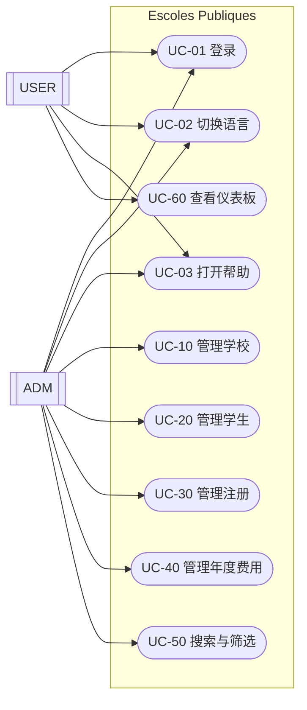
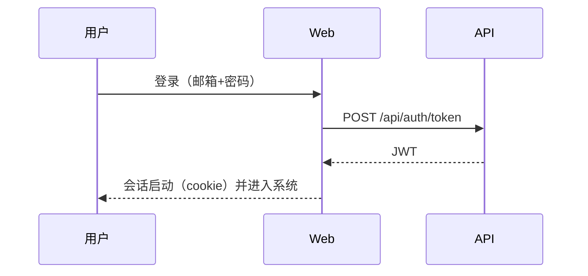

# 功能文档 (ZH)

## 1. 执行摘要
“Escoles Publiques” 支持管理：
- 学校
- 学生
- 注册（按学年与课程）
- 年度费用（关联到注册）
- 用于分类学校的范围（scope）

系统由 Web UI 与 API 组成，Web 端消费 API。

## 2. 范围
范围内：
- 学校、学生、注册、年度费用的 CRUD
- 范围分配与筛选
- 首页搜索（文本 + 范围）
- 认证与基于角色的访问（`ADM`/`USER`）
- 语言切换与响应式界面
- 帮助中心（用户手册、功能文档、技术文档）

范围外（当前版本）：
- 超出 `ADM`/`USER` 的高级权限模型
- 外部集成（邮件/推送通知）
- 从官方数据集的大规模导入

## 3. 参与者与角色
参与者：
- `ADM`（管理员）
- `USER`（终端用户）

角色：
- `ADM`：拥有全部管理功能
- `USER`：权限受限（仪表板及相关信息）

## 4. 领域（主要实体）
实体：
- `School`
- `Student`
- `Enrollment`
- `AnnualFee`
- `Scope`
- `User`

高层关系：
- 一个 `School` 拥有 0..N 个 `Student`
- 一个 `Student` 拥有 0..N 个 `Enrollment`
- 一个 `Enrollment` 拥有 0..N 个 `AnnualFee`
- 一个 `Scope` 分类 0..N 个 `School`
- 一个 `User` 可关联 0..1 个 `Student`（可选 1:1）

## 5. 图表

### 5.1 系统上下文
```mermaid
flowchart LR
  U[用户] -->|浏览器| W[Web (MVC/Razor)]
  W -->|HTTP + JWT| A[API (REST)]
  A -->|EF Core| DB[(PostgreSQL)]
```

### 5.2 用例图（UML 风格）


### 5.3 登录流程（高层）


## 6. 用例目录

### UC-01 登录
参与者：
- `ADM`，`USER`

主流程：
1. 打开登录页面。
2. 输入邮箱和密码。
3. 系统校验凭据。
4. 会话建立，并按角色重定向。

### UC-02 切换语言
1. 在顶部栏选择语言。
2. 页面刷新。
3. 选择通过 cookie 持久化。

语言：
- 已文档化：CA、ES、EN、DE、FR、RU、ZH

### UC-03 打开帮助
1. 点击“帮助”按钮。
2. 选择文档：用户手册、功能文档或技术文档。
3. 系统显示当前语言版本。

### UC-10 管理学校（ADM）
包含：列表/搜索/排序、新增/编辑/删除、收藏、范围分配。

### UC-20 管理学生（ADM）
包含：CRUD；按邮箱复用用户；可选 1:1 user<->student 关联。

### UC-30 管理注册（ADM）
包含：CRUD；学年与状态管理。

### UC-40 管理年度费用（ADM）
包含：CRUD；标记为已支付（保存支付日期）。

规则：
- 某些表单要求勾选隐私确认
- 金额支持逗号或点号作为小数分隔

### UC-50 搜索与筛选（ADM）
在首页执行文本搜索与范围筛选。

### UC-60 查看仪表板（USER）
查看用户相关信息（关联注册/费用）。

## 7. 业务规则（摘要）
- 学校：代码与名称必填
- 用户：邮箱必须唯一
- 注册：需指定学生、学校、学年与状态
- 年度费用：需指定注册、金额与到期日

## 8. 非功能需求（简述）
- 多语言界面
- 响应式（手机/平板）
- 运维日志便于排障
- 持久化：PostgreSQL

## 9. 验收标准（检查清单）
- 管理员和用户登录正常
- 所有实体 CRUD 正常
- 搜索和范围筛选正常
- 金额支持 `,` 与 `.`
- 语言可持久化，帮助文档跟随当前语言
